# Welcome to the Course

Introduction course on Deep Learning with TensorFlow for software developers

- Machine learning can very math-heavy

- TensorFlow and Keras, high level API of Deep Learning which encapsulate much of the complexity

- Keep things as simple as possible without going into the details behind machine learning (underlying math and technical details)

- Understand how deep learning neural networks work

- Build and train your own deep neural network with TensorFlow and Keras

- How to deploy your model on different platform

## Artificial intelligence, machine learning, neural network, and deep learning

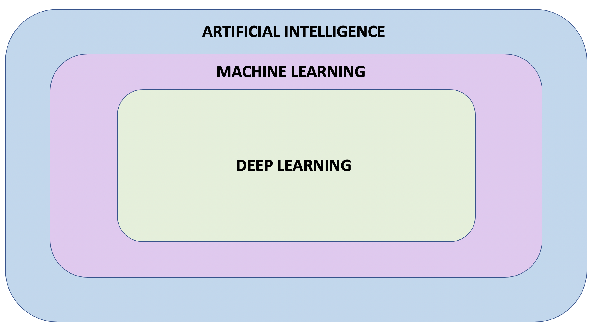

**Artificial Intelligence:** A field of computer science that aims to make computers achieve human-style intelligence. There are many approaches to reaching this goal, including machine learning and deep learning.

- **Machine Learning:** A set of related techniques in which computers are trained to perform a particular task rather than by explicitly programming them.

- **Neural Network:** A construct in Machine Learning inspired by the network of neurons (nerve cells) in the biological brain. Neural networks are a fundamental part of deep learning

- **Deep Learning:** A subfield of machine learning that uses multi-layered neural networks. Often, “machine learning” and “deep learning” are used interchangeably.

Machine learning and deep learning also have many subfields, branches, and special techniques. A notable example of this diversity is the separation of **Supervised Learning** and **Unsupervised Learning**.

## Application of Machine Learning

- Detect skin cancer (trained on hundreds of thousands of skin images)
- Autonomous vehicles that can drive themself using only the data from various sensors
- Teach computer how to play games
- Writing software that can potentially change the lives of people all over the world

## Prerequisites

Programming language: Python (numpy)

Develop environment: Google's Colab (Colab is a virtual machine)[examples/courses/udacity_intro_to_tensorflow_for_deep_learning/l01c01_introduction_to_colab_and_python.ipynb at master · tensorflow/examples · GitHub](https://github.com/tensorflow/examples/blob/master/courses/udacity_intro_to_tensorflow_for_deep_learning/l01c01_introduction_to_colab_and_python.ipynb)

# Introduction to Machine Learning

## Interview with Sebastin

- Co-funded Udacity, founded Google-X, professor at Stanford

- Stay open-minded

- Machine learning is actually simpler than programming computers

- Train the computer using examples and computer finds its own rules

## What is Machine Learning?

Figure out the relationship between particular inputs and outputs

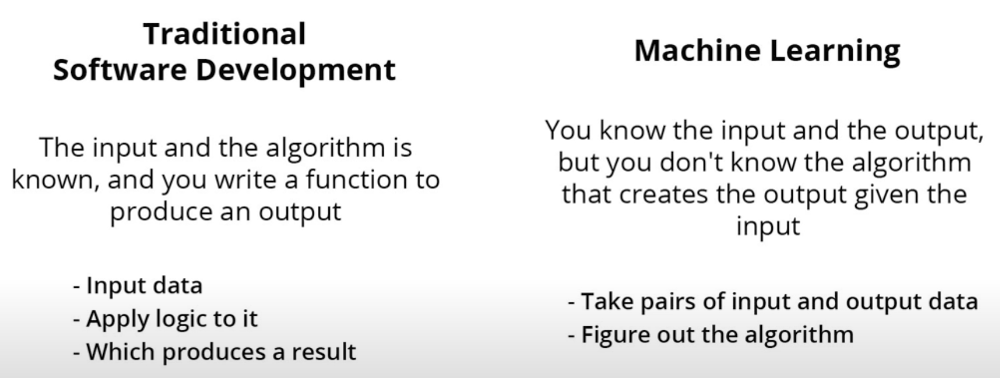

In Machine learning, the algorithm has to be learned

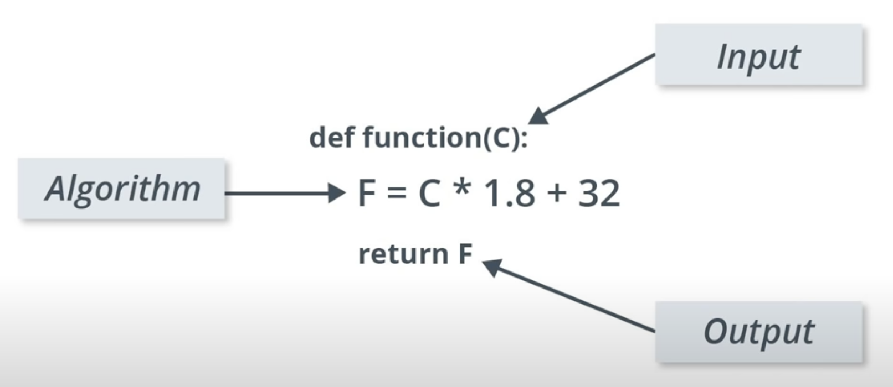

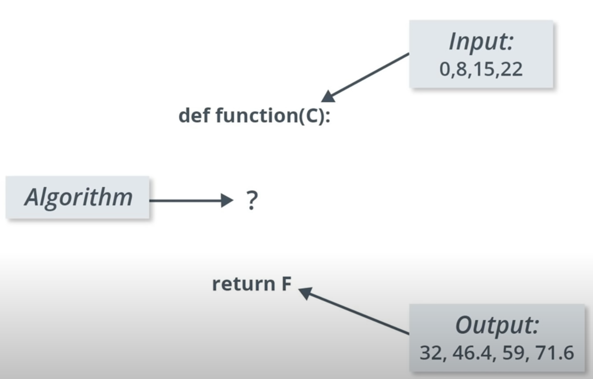

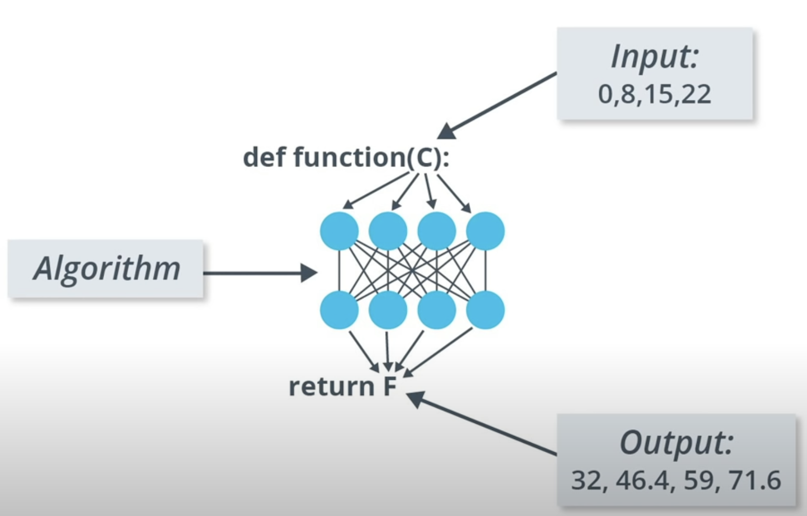

Machine Learning uses neural network to learn the relation between these inputs and outputs

Neural network: 

- A stack of layers where each layer consists of some predefined Math and internal variables

- Tuning the internal variables in the layers until the network learns to produce the output givens the inputs through thousands or even millions of iterations over the input and output data

- There are many types of neural network architectures. However, no matter what architecture you choose, <u>the math it contains (what calculations are being performed, and in what order) is not modified during training. Instead, it is the internal variables (“weights” and “biases”) which are updated during training</u>.

You can think of Machine learning algorithm as a function that can tune variables in order to correctly map some inputs and some outputs

## Colab: Converting Celsius to Fahrenheit

[examples/courses/udacity_intro_to_tensorflow_for_deep_learning/l02c01_celsius_to_fahrenheit.ipynb at master · tensorflow/examples · GitHub](https://github.com/tensorflow/examples/blob/master/courses/udacity_intro_to_tensorflow_for_deep_learning/l02c01_celsius_to_fahrenheit.ipynb)

### Import dependencies

```python
import tensorflow as tf
import numpy as np
import logging
```

### Some Machine Learning terminology

- **Feature** — The input(s) to our model.

- **Labels** — The output our model predicts.

- **Example** — A pair of inputs/outputs used during training.

### Create the model

We will use the simplest possible model we can, a <u>Dense network</u>. Since the problem is straightforward, this network will require only a <u>single layer</u>, with a <u>single neuron</u>.

#### Build a layer

`input_shape=[1]` — This specifies that the input to this layer is a single value.

`units=1` — This specifies the number of neurons in the layer. The number of neurons defines how many internal variables the layer has to try to learn how to solve the problem. (In a multi-layered network, the size and shape of the layer would need to match the `input_shape` of the next layer.)

```python
l0 = tf.keras.layers.Dense(units=1, input_shape=[1])
```

#### Assemble layers into the model

The Sequential model definition takes a list of layers as an argument, specifying the calculation order from the input to the output.

```python
model = tf.keras.Sequential([l0])
```

### Compile the model, with loss and optimizer functions

Before training, the model has to be compiled. When compiled for training, the model is given:

- **Loss function** — A way of measuring how far off predictions are from the desired outcome. (The measured difference is called the "loss".)

- **Optimizer function** — A way of adjusting internal values in order to reduce the loss.

These are used during training (`model.fit()`, below) to first calculate the loss at each point, and then improve it.

```python
model.compile(loss='mean_squared_error',
              optimizer=tf.keras.optimizers.Adam(0.1))
```

The loss function ([mean squared error](https://en.wikipedia.org/wiki/Mean_squared_error)) and the optimizer ([Adam](https://machinelearningmastery.com/adam-optimization-algorithm-for-deep-learning/)) used here are standard for simple models like this one, but many others are available. It is not important to know how these specific functions work at this point.

Learning rate (`0.1` in the code above) is the step size taken when adjusting values in the model. 

- If the value is too small, it will take too many iterations to train the model. 

- Too large, and accuracy goes down.

- Finding a good value often involves some trial and error, but the range is usually within 0.001 (default), and 0.1

### Train the model

During training, the model takes in Celsius values, performs a calculation using the current internal variables (called "weights") and outputs values which are meant to be the Fahrenheit equivalent. Since <u>the weights are initially set randomly</u>, the output will not be close to the correct value. The difference between the actual output and the desired output is calculated using the **loss function**, and the **optimizer function** directs how the weights should be adjusted.

- The first argument is the inputs

- the second argument is the desired outputs.

- The `epochs` argument specifies <u>how many times this cycle should be run.</u>

- the `verbose` argument controls how much output the method produces.

```python
history = model.fit(celsius_q, fahrenheit_a, epochs=500, verbose=False)
print("Finished training the model")
```

### Display training statistics

The `fit` method returns a history object. We can use this object to plot how the loss of our model goes down after each training epoch. A high loss means that the Fahrenheit degrees the model predicts is far from the corresponding value in `fahrenheit_a`.

```python
import matplotlib.pyplot as plt
plt.xlabel('Epoch Number')
plt.ylabel("Loss Magnitude")
plt.plot(history.history['loss'])
```

As you can see, our model improves very quickly at first, and then has a steady, slow improvement until it is very near "perfect" towards the end.

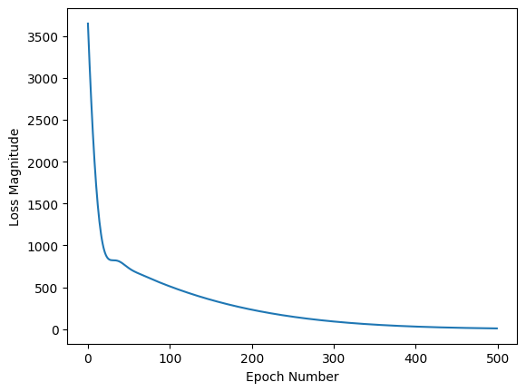

### Use the model to predict values

Summary

- We created a model with a Dense layer
- **We trained it with 3500 examples (7 pairs, over 500 epochs).**

Our model tuned the variables (weights) in the Dense layer until it was able to return the correct Fahrenheit value for any Celsius value. (Remember, 100 Celsius was not part of our training data.)

```python
print(model.predict([100.0]))
```

### Looking at the layer weights

Since the form is the same, the variables should converge on the standard values of 1.8 and 32, which is exactly what happened.

With additional neurons, additional inputs, and additional outputs, the formula becomes much more complex, but the idea is the same.

```python
print("These are the layer variables: {}".format(l0.get_weights()))

## Output:
## These are the layer variables: [array([[1.8235865]], dtype=float32), array([28.957005], dtype=float32)]
```

### More Dense layers with different units

```python
l0 = tf.keras.layers.Dense(units=4, input_shape=[1])
l1 = tf.keras.layers.Dense(units=4)
l2 = tf.keras.layers.Dense(units=1)
model = tf.keras.Sequential([l0, l1, l2])
model.compile(loss='mean_squared_error', optimizer=tf.keras.optimizers.Adam(0.1))
model.fit(celsius_q, fahrenheit_a, epochs=500, verbose=False)
print("Finished training the model")
print(model.predict([100.0]))
print("Model predicts that 100 degrees Celsius is: {} degrees Fahrenheit".format(model.predict([100.0])))
print("These are the l0 variables: {}".format(l0.get_weights()))
print("These are the l1 variables: {}".format(l1.get_weights()))
print("These are the l2 variables: {}".format(l2.get_weights()))
```

## Recap

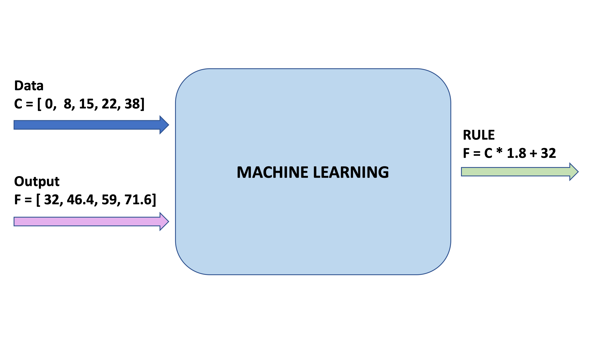

```python
l0 = tf.keras.layers.Dense(units=1, input_shape=[1]) 
model = tf.keras.Sequential([l0])
model.compile(loss='mean_squared_error', optimizer=tf.keras.optimizers.Adam(0.1))
history = model.fit(celsius_q, fahrenheit_a, epochs=500, verbose=False)
model.predict([100.0])
```

### The Training Process

The training process (happening in `model.fit(...)`) is really about <u>tuning the internal variables of the networks to the best possible values</u>, so that they can map the input to the output. This is achieved through an <u>optimization process</u> called **Gradient Descent,** which uses Numeric Analysis to find the best possible values to the internal variables of the model.

To do machine learning, you don't really need to understand these details. But for the curious: <u>gradient descent iteratively adjusts parameters, nudging them in the correct direction a bit at a time until they reach the best values</u>. In this case “best values” means that nudging them any more would make the model perform worse. The function that measures how good or bad the model is during each iteration is called the “loss function”, and the goal of each nudge is to “minimize the loss function.”

The training process starts with a forward pass, where the input data is fed to the neural network (see Fig.1). Then the model applies its internal math on the input and internal variables to predict an answer ("Model Predicts a Value" in Fig. 1).

In our example, the input was the degrees in Celsius, and the model predicted the corresponding degrees in Fahrenheit.

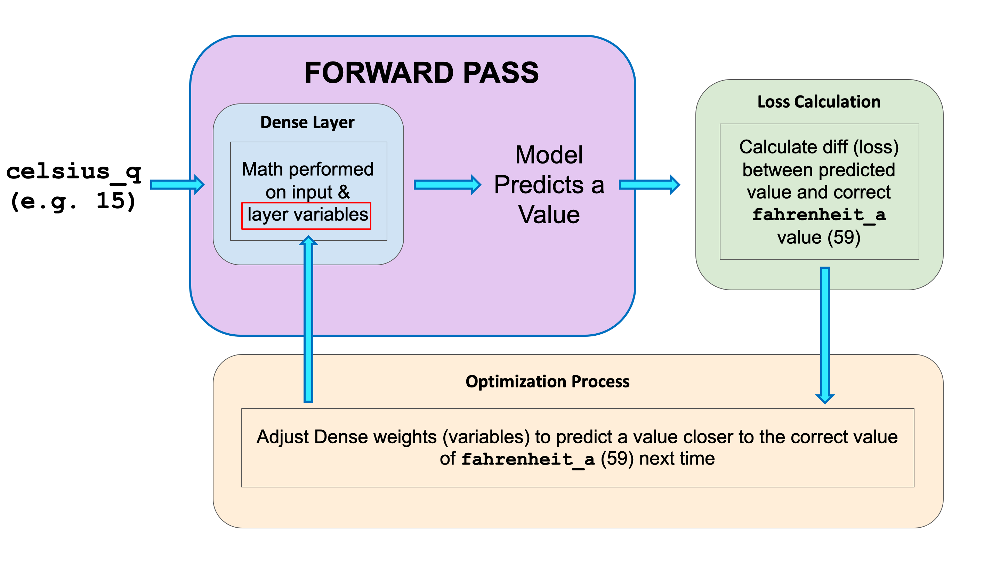

Once a value is predicted, the difference between that predicted value and the correct value is calculated. This difference is called the loss, and it's a measure of how well the model performed the mapping task. The value of the loss is calculated using a loss function, which we specified with the loss parameter when calling `model.compile()`.

After the loss is calculated, the internal variables (weights and biases) of all the layers of the neural network are adjusted, so as to minimize this loss — that is, to make the output value closer to the correct value (see Fig. 2).

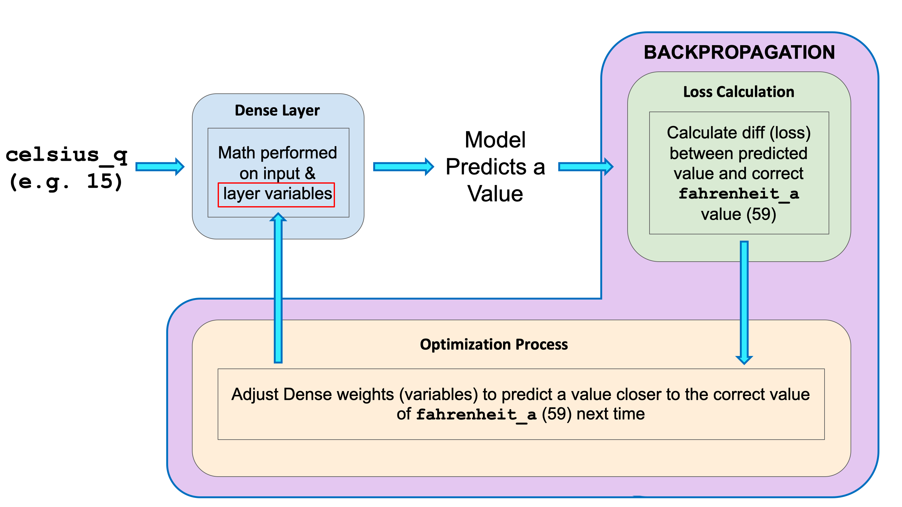

**This optimization process is called Gradient Descent**. The specific algorithm used to calculate the new value of each internal variable is specified by the optimizer parameter when calling `model.compile(...)`. In this example we used the `Adam` optimizer.

It is not required for this course, but if you're interested in learning more details about how the training process works, you can look at the [lesson on reducing loss in Google’s machine learning crash course](https://developers.google.com/machine-learning/crash-course/reducing-loss/video-lecture).

By now you should know what the following terms are:

- **Feature:** The input(s) to our model
- **Examples:** <u>An input/output pair used for training</u>
- **Labels:** The output of the model
- **Layer:** A collection of nodes connected together within a neural network.
- **Model:** The representation of your neural network
- **Dense and Fully Connected (FC):** Each node in one layer is connected to each node in the previous layer.
- **Weights and biases:** The internal variables of model
- **Loss:** The discrepancy between the desired output and the actual output
- **MSE:** Mean squared error, a type of loss function that counts a small number of large discrepancies as worse than a large number of small ones.
- **Gradient Descent:** An algorithm that changes the internal variables a bit at a time to gradually reduce the loss function.
- **Optimizer:** **A specific implementation of the gradient descent algorithm**. (There are many algorithms for this. In this course we will only use the “Adam” Optimizer, which stands for *ADAptive with Momentum*. It is considered the best-practice optimizer.)
- **Learning rate:** The “step size” for loss improvement during gradient descent.
- **Batch:** The set of examples used during training of the neural network
- **Epoch:** A full pass over the entire training dataset
- **Forward pass:** The computation of output values from input
- **Backward pass (backpropagation):** The calculation of internal variable adjustments according to the optimizer algorithm, starting from the output layer and working back through each layer to the input.

## Dense Layers

A neural network is a stack of layers, where each layer is made up of units (neurons). The neurons in each layer can be connected to neurons in the following layer.

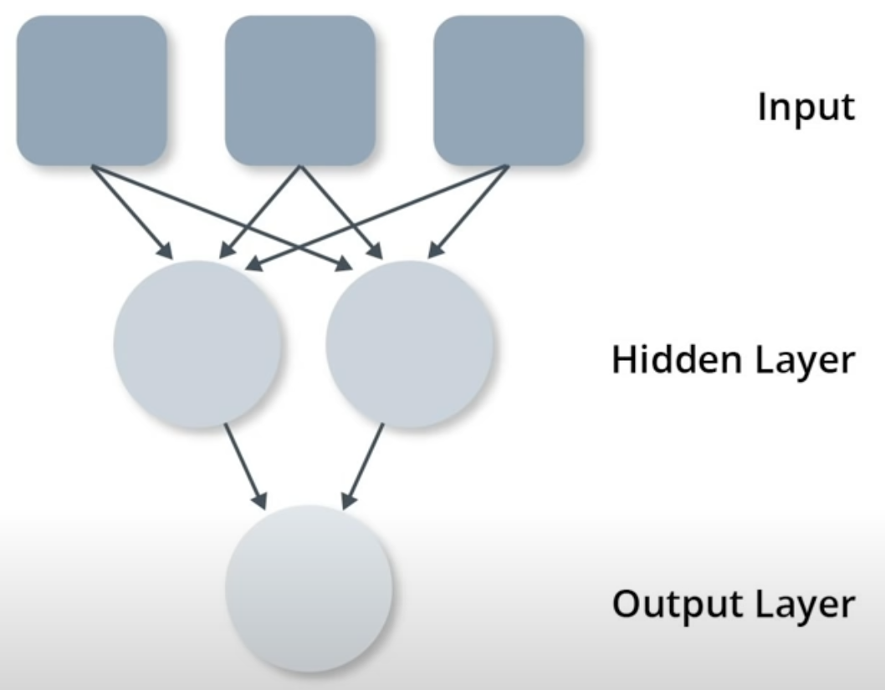

```python
hidden = keras.layer.Dense(unit=2, input_shape=[3])
output = keras.layer.Dense(unit=1)
model = tf.keras.Sequential( [ hidden, output ] )
```

A layer has math that's applied to internal variables (weights and biases) in it. The internal variables are. The internal variables get adjusted durning the training process to enable the model to best match the inputs and outputs. **What's important to note however, is that the math never changes.** The training process only changes `w` and `b` variables to be able to match the input and output.

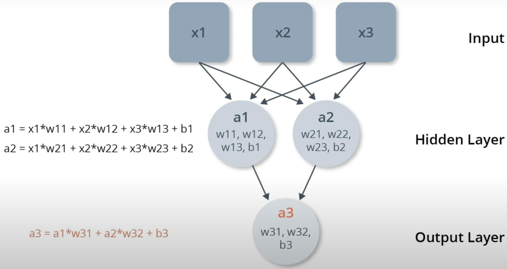

We can never match the variables against the target algorithm. How could we? We don't even know the target algorithm. That's why we use machine learning in the first place. Otherwise, we could just hard code the algorithm as a function. Without knowing the target algorithm, we would just give a model a number of layers and weights to tune. Then, we just hope the model will be able to figure out how to tune the model algorithm to match the input and output.

In general, when we do machine learning, we typically just try different neural networks with different numbers of layers and neurons in a trial and error away and see if the model is able to solve the problem during the training phase.

===========================================

=============== Section 1 end ================

===========================================

# Your First Model - Fashion MNIST

## Interview with Sebastin

- More general intelligence training in network to do more than one task

- Bring it to market

- The great vision of machine learning it that it allows computer to observe experts with their work, and pick up the patterns and help other people to be as good as the best experts. Could be in law, in medicine, in driving cars

- Deep learning is another tool can help you accomplish a task

- Every network can be connected differently

## Introduction

- Create a neural network that can recognize items of clothing and images

- **Input data** is called **Features**. (input image)

- **Output** data is called **Labels**. (correct output that specifies the piece of clothing the image depicts)

- We need lots of examples (feature-label pairs) to train neural network to recognize the articles of clothing

- **Fashion MNIST** dataset

## Fashion MNIST Dataset

- **Fashion MNIST** dataset consists of 28 * 28 pixel grey-scale images of clothing
- All 10 different items of clothing
- In total, Fashion MNIST dataset contains 70,000 images

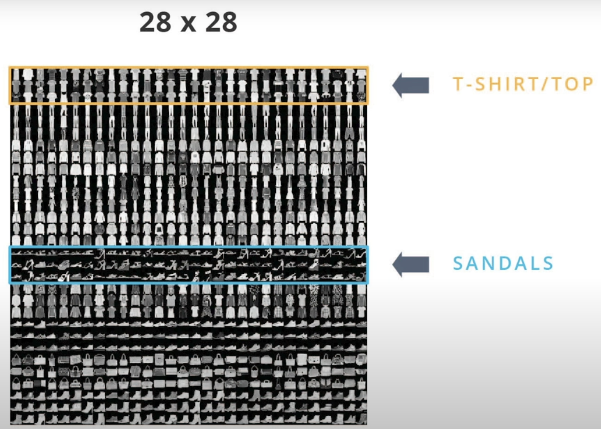

We'll use 60,000 images to train the neural networks **(Training Data)**. Then, we'll use the remaining 10,000 images to test how well our neural network can recognize the items of clothing **(Test Data)**.

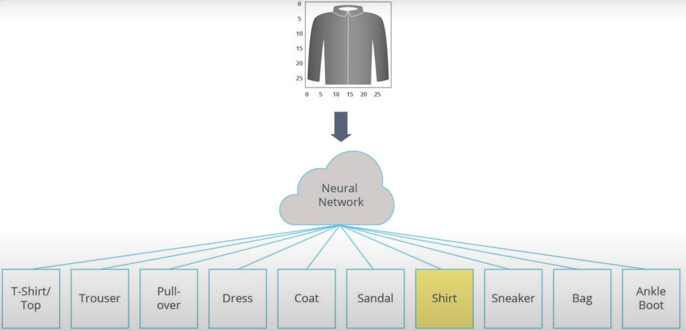

## Neural Network

- **Input** is an array of length 784 because each image in dataset is 28 pixels in height and 28 pixels in width. Since neural network takes in a vector as input, these 28 by 28 images are converted into a one dimensional array of 28 by 28, so 784 **units**.

- The process of converting a 2D image into a vector is called flattening and code. This is perform through a flattened layer. This layer transforms each image from a 2D array of 28 by 28 pixels, each having a single byte for the grey-scale, to a 1D array of 784 pixels

- The input will be fully connected to the first dense layer of the network where we've chosen 128 units. We use the Rectified Linear Unit (ReLU) here because the problem is more difficult to solve than converting Celsius to Fahrenheit ReLU is a mathematical function which give network more power. In essence, it's a small mathematical extension to our dense layer that allows network to solve more complex problem

- Finally, the last layer also known as output layer, contains 10 units (10 types of article of clothing). Each of these output values will specify the probability that the images of that specific type of clothing. These number describe the confidence the model has that an input image is one of 10 different articles of clothing. For example, the model has 85% certain that this is a shirt. Since these 10 output values refer to probabilities, if you sum them up, the result will be one. These 10 numbers are also called probability distribution or a distribution of probabilities for each of the output classes of clothing.

- We need the output layer to create these probability values for each of our classes.

- Create these probabilities using **softmax** statement

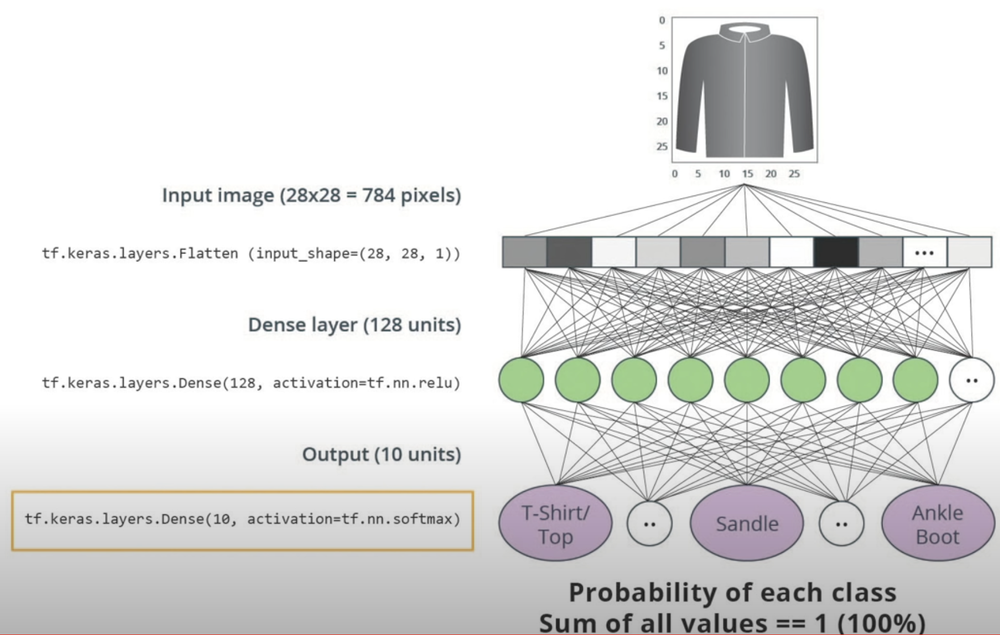 The ReLU function gives an output of 0 if the input is negative or zero, and if input is positive, then the output will be equal to the input.

ReLU gives the network the ability to solve nonlinear problems.

ReLU is a type of activation function. There several of these functions (ReLU, Sigmoid, tanh, ELU), but ReLU is used most commonly and serves as a good default. To build and use models that include ReLU, you don’t have to understand its internals. But, if you want to know more, see [this article on ReLU in Deep Learning](https://www.kaggle.com/dansbecker/rectified-linear-units-relu-in-deep-learning).

Let’s review some of the new terms that were introduced in this lesson:

- **Flattening:** The process of converting a 2d image into 1d vector
- **ReLU:** An activation function that allows a model to solve nonlinear problems
- **Softmax:** A function that provides probabilities for each possible output class
- **Classification:** A machine learning model used for distinguishing among two or more output categories

## Training and Testing

When training a Machine Learning model, you always need to split your dataset into at least two different partitions

- The data you use for training

- The data you use for testing

Once the neural network has been trained, we want to test on data that it hasn't seen before to see how well it performs. (Not to memory but have learned the general way)

You show some data that is representative of the problem you're trying to solve. we want to test its performance on images it has never seen before. If we don't do this, we wouldn't know if the neural network has decided to memorize the images it saw during training, or it has truly been able to understand the difference between these items of clothing

[TensorFlow Datasets](https://medium.com/tensorflow/introducing-tensorflow-datasets-c7f01f7e19f3) provides a collection of datasets ready to use with TensorFlow.

Datasets are typically split into different subsets to be used at various stages of training and evaluation of the neural network. In this section we talked about:

- **Training Set:** The data used for training the neural network.
- **Test set:** The data used for testing the final performance of our neural network.

The test dataset was used to try the network on data it has never seen before. This enables us to see how the model generalizes beyond what it has seen during training, and that it has not simply memorized the training examples.

In the same way, it is common to use what is called a **Validation dataset**. <u>This dataset is not used for training. Instead, it it used to test the model during training.</u> This is done after some set number of training steps, and gives us an indication of how the training is progressing. For example, if the loss is being reduced during training, but accuracy deteriorates on the validation set, that is an indication that the model is memorizing the test set.

<u>The validation set is used again when training is complete to measure the final accuracy of the model.</u>

You can read more about all this in the [Training and Test Sets lesson of Google’s Machine Learning Crash Course](https://developers.google.com/machine-learning/crash-course/training-and-test-sets/video-lecture).

## Colab: Fashion MNIST

[examples/courses/udacity_intro_to_tensorflow_for_deep_learning/l03c01_classifying_images_of_clothing.ipynb at master · tensorflow/examples · GitHub](https://github.com/tensorflow/examples/blob/master/courses/udacity_intro_to_tensorflow_for_deep_learning/l03c01_classifying_images_of_clothing.ipynb)

### Install and import dependencies

```shell
!pip install -U tensorflow_datasets


## Local
pip3 install -U tensorflow_datasets
```

```python
import tensorflow as tf
```

```python
# Import TensorFlow Datasets
import tensorflow_datasets as tfds
tfds.disable_progress_bar()

# Helper libraries
import math
import numpy as np
import matplotlib.pyplot as plt
```

```python
import logging
logger = tf.get_logger()
logger.setLevel(logging.ERROR)
```

### Import the Fashion MNIST dataset

This guide uses the [Fashion MNIST](https://github.com/zalandoresearch/fashion-mnist) dataset, which contains 70,000 grayscale images in 10 categories. The images show individual articles of clothing at low resolution (28 × 28 pixels).


Loading the dataset returns metadata as well as a *training dataset* and *test dataset*.

- The model is trained using `train_dataset`.
- The model is tested against `test_dataset`.

```python
dataset, metadata = tfds.load('fashion_mnist', as_supervised=True, with_info=True)
train_dataset, test_dataset = dataset['train'], dataset['test']
```

The images are 28 × 28 arrays, with pixel values in the range `[0, 255]`. The *labels* are an array of integers, in the range `[0, 9]`. These correspond to the *class* of clothing the image represents:

| Label | Class       |
| ----- | ----------- |
| 0     | T-shirt/top |
| 1     | Trouser     |
| 2     | Pullover    |
| 3     | Dress       |
| 4     | Coat        |
| 5     | Sandal      |
| 6     | Shirt       |
| 7     | Sneaker     |
| 8     | Bag         |
| 9     | Ankle boot  |

Each image is mapped to a single label. Since the *class names* are not included with the dataset, store them here to use later when plotting the images:

```python
class_names = metadata.features['label'].names
print("Class names: {}".format(class_names))

# Class names: ['T-shirt/top', 'Trouser', 'Pullover', 'Dress', 'Coat', 'Sandal', 'Shirt', 'Sneaker', 'Bag', 'Ankle boot']
```

```python
num_train_examples = metadata.splits['train'].num_examples
num_test_examples = metadata.splits['test'].num_examples
print("Number of training examples: {}".format(num_train_examples))
print("Number of test examples:     {}".format(num_test_examples))

# Number of training examples: 60000
# Number of test examples:     10000
```

### Preprocess the data

The value of each pixel in the image data is an integer in the range `[0,255]`. For the model to work properly, these values need to be normalized to the range `[0,1]`. So here we create a normalization function, and then apply it to each image in the test and train datasets.

```python
def normalize(images, labels):
  images = tf.cast(images, tf.float32)
  images /= 255
  return images, labels

# The map function applies the normalize function to each element in the train
# and test datasets
train_dataset =  train_dataset.map(normalize)
test_dataset  =  test_dataset.map(normalize)

# The first time you use the dataset, the images will be loaded from disk
# Caching will keep them in memory, making training faster
train_dataset =  train_dataset.cache()
test_dataset  =  test_dataset.cache()
```

### Explore the processed data

```python
# Take a single image, and remove the color dimension by reshaping
for image, label in test_dataset.take(1):
  break
image = image.numpy().reshape((28,28))

# Plot the image - voila a piece of fashion clothing
plt.figure()
plt.imshow(image, cmap=plt.cm.binary)
plt.colorbar()
plt.grid(False)
plt.show()
```

Display the first 25 images from the *training set* and display the class name below each image. Verify that the data is in the correct format and we're ready to build and train the network.

```python
plt.figure(figsize=(10,10))
for i, (image, label) in enumerate(train_dataset.take(25)):
    image = image.numpy().reshape((28,28))
    plt.subplot(5,5,i+1)
    plt.xticks([])
    plt.yticks([])
    plt.grid(False)
    plt.imshow(image, cmap=plt.cm.binary)
    plt.xlabel(class_names[label])
plt.show()
```

### Build the model

#### Setup the layers

This network has three layers:

- **input** `tf.keras.layers.Flatten` — This layer transforms the images from a 2d-array of 28 × 28 pixels, to a 1d-array of 784 pixels (28*28). Think of this layer as unstacking rows of pixels in the image and lining them up. This layer has no parameters to learn, as it only reformats the data.

- **"hidden"** `tf.keras.layers.Dense`— A densely connected layer of 128 neurons. Each neuron (or node) takes input from all 784 nodes in the previous layer, weighting that input according to hidden parameters which will be learned during training, and outputs a single value to the next layer.

- **output** `tf.keras.layers.Dense` — A 128-neuron, followed by 10-node *softmax* layer. Each node represents a class of clothing. As in the previous layer, the final layer takes input from the 128 nodes in the layer before it, and outputs a value in the range `[0, 1]`, representing the probability that the image belongs to that class. The sum of all 10 node values is 1.

```python
model = tf.keras.Sequential([
    tf.keras.layers.Flatten(input_shape=(28, 28, 1)),
    tf.keras.layers.Dense(128, activation=tf.nn.relu),
    tf.keras.layers.Dense(10, activation=tf.nn.softmax)
])
```

#### Compile the model

Before the model is ready for training, it needs a few more settings. These are added during the model's *compile* step:

- *Loss function* — An algorithm for measuring how far the model's outputs are from the desired output. The goal of training is this measures loss.
- *Optimizer* —An algorithm for adjusting the inner parameters of the model in order to minimize loss.
- *Metrics* —Used to monitor the training and testing steps. The following example uses *accuracy*, the fraction of the images that are correctly classified.

```python
model.compile(optimizer='adam',
              loss=tf.keras.losses.SparseCategoricalCrossentropy(),
              metrics=['accuracy'])
```

#### Train the model

First, we define the iteration behavior for the train dataset:

1. Repeat forever by specifying `dataset.repeat()` (the `epochs` parameter described below limits how long we perform training).
2. The `dataset.shuffle(60000)` randomizes the order so our model cannot learn anything from the order of the examples.
3. And `dataset.batch(32)` tells `model.fit` to <u>use batches of 32 images and labels when updating the model variables.</u>

Training is performed by calling the `model.fit` method:

1. Feed the training data to the model using `train_dataset`.
2. The model learns to associate images and labels.
3. The `epochs=5` parameter limits training to 5 full iterations of the training dataset, so a total of 5 * 60000 = 300000 examples.

```python
BATCH_SIZE = 32
train_dataset = train_dataset.cache().repeat().shuffle(num_train_examples).batch(BATCH_SIZE)
test_dataset = test_dataset.cache().batch(BATCH_SIZE)
```

```python
model.fit(train_dataset, epochs=5, steps_per_epoch=math.ceil(num_train_examples/BATCH_SIZE))

# steps_per_epoch: Total number of steps (batches of samples) before declaring one epoch finished and starting the next epoch.

# Epoch 1/5
# 1875/1875 [==============================] - 6s 3ms/step - loss: 0.2728 - accuracy: 0.9003
# Epoch 2/5
# 1875/1875 [==============================] - 6s 3ms/step - loss: 0.2676 - accuracy: 0.9017
# Epoch 3/5
# 1875/1875 [==============================] - 6s 3ms/step - loss: 0.2564 - accuracy: 0.9044
# Epoch 4/5
# 1875/1875 [==============================] - 6s 3ms/step - loss: 0.2417 - accuracy: 0.9086
# Epoch 5/5
# 1875/1875 [==============================] - 6s 3ms/step - loss: 0.2392 - accuracy: 0.9117
# <keras.callbacks.History at 0x7f13d0766fe0> 
```

As the model trains, the loss and accuracy metrics are displayed.

#### Evaluate accuracy

Compare how the model performs on the test dataset

```python
test_loss, test_accuracy = model.evaluate(test_dataset, steps=math.ceil(num_test_examples/32))
print('Accuracy on test dataset:', test_accuracy)
```

As it turns out, the accuracy on the test dataset is smaller than the accuracy on the training dataset. This is completely normal, since the model was trained on the `train_dataset`. When the model sees images it has never seen during training, (that is, from the `test_dataset`), we can expect performance to go down.

#### Make predictions and explore

```python
for test_images, test_labels in test_dataset.take(1): # take the first batch
  test_images = test_images.numpy()
  test_labels = test_labels.numpy()
  predictions = model.predict(test_images)
```

```python
predictions.shape

# (32, 10)
```

```python
predictions[0]

# array([1.9581352e-05, 7.3813733e-09, 1.9421440e-02, 1.8915347e-05,
#       9.5107049e-01, 6.7366539e-09, 2.9468466e-02, 1.0025023e-14,
#       1.0883246e-06, 7.5907652e-10], dtype=float32)
```

A prediction is an array of 10 numbers. These describe the "confidence" of the model that the image corresponds to each of the 10 different articles of clothing. <u>We can see which label has the highest confidence value</u>:

```python
np.argmax(predictions[0])

# 4
```

```python
test_labels[0]

# 4
```

We can graph this to look at the full set of 10 class predictions

```python
def plot_image(i, predictions_array, true_labels, images):
  predictions_array, true_label, img = predictions_array[i], true_labels[i], images[i]
  plt.grid(False)
  plt.xticks([])
  plt.yticks([])

  plt.imshow(img[...,0], cmap=plt.cm.binary)

  predicted_label = np.argmax(predictions_array)
  if predicted_label == true_label:
    color = 'blue'
  else:
    color = 'red'

  plt.xlabel("{} {:2.0f}% ({})".format(class_names[predicted_label],
                                100*np.max(predictions_array),
                                class_names[true_label]),
                                color=color)

def plot_value_array(i, predictions_array, true_label):
  predictions_array, true_label = predictions_array[i], true_label[i]
  plt.grid(False)
  plt.xticks([])
  plt.yticks([])
  thisplot = plt.bar(range(10), predictions_array, color="#777777")
  plt.ylim([0, 1]) 
  predicted_label = np.argmax(predictions_array)

  thisplot[predicted_label].set_color('red')
  thisplot[true_label].set_color('blue')
```

Let's look at the 0th image, predictions, and prediction array.

```python
i = 0
plt.figure(figsize=(6,3))
plt.subplot(1,2,1)
plot_image(i, predictions, test_labels, test_images)
plt.subplot(1,2,2)
plot_value_array(i, predictions, test_labels)
```

Let's plot several images with their predictions. Correct prediction labels are blue and incorrect prediction labels are red. The number gives the percent (out of 100) for the predicted label. Note that it can be wrong even when very confident.

```python
# Plot the first X test images, their predicted label, and the true label
# Color correct predictions in blue, incorrect predictions in red
num_rows = 5
num_cols = 3
num_images = num_rows*num_cols
plt.figure(figsize=(2*2*num_cols, 2*num_rows))
for i in range(num_images):
  plt.subplot(num_rows, 2*num_cols, 2*i+1)
  plot_image(i, predictions, test_labels, test_images)
  plt.subplot(num_rows, 2*num_cols, 2*i+2)
  plot_value_array(i, predictions, test_labels)
```

## Celsius vs MNIST

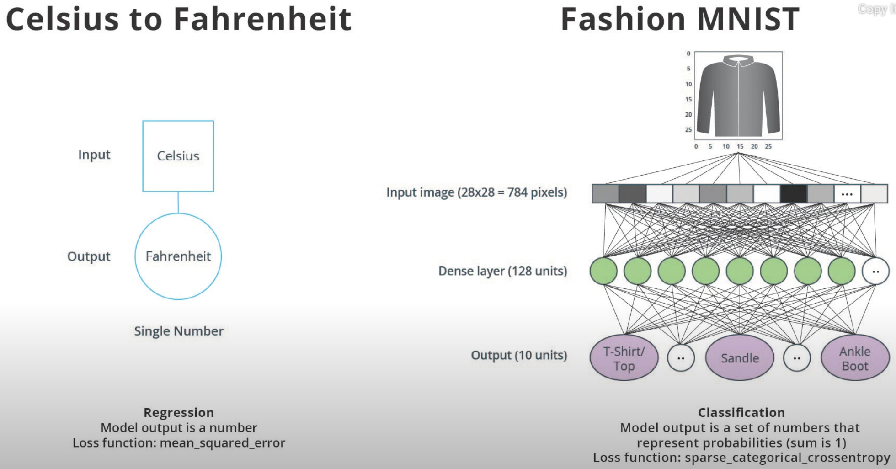

Different kind of neural network can solve different kind of problems

- Regression: Predict single number from an input e.g. converting Celsius to Fahrenheit

- Classification: Given the input, the model will give us output a probability distribution, specifying the confidence the input is of a certain class

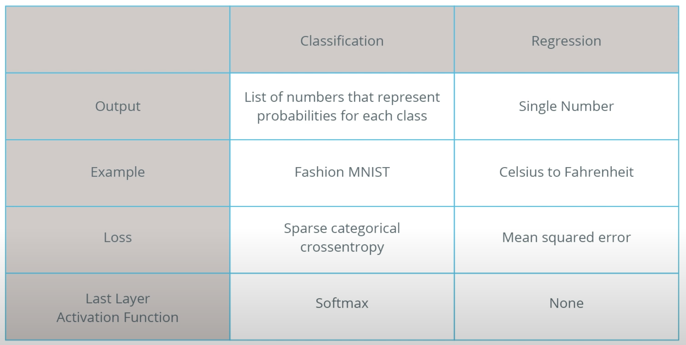

All of the main takeaway point is that all of our machine learning models is one of these categories. A regression or classification model.

## Summary

In this lesson we trained a neural network to classify images of articles of clothing. To do this we used the Fashion MNIST dataset, which contains 70,000 greyscale images of articles of clothing. We used 60,000 of them to train our network and 10,000 of them to test its performance. In order to feed these images into our neural network we had to flatten the 28 × 28 images into 1d vectors with 784 elements. Our network consisted of a fully connected layer with 128 units (neurons) and an output layer with 10 units, corresponding to the 10 output labels. These 10 outputs represent probabilities for each class. The softmax activation function calculated the probability distribution.

We also learned about the differences between regression and classification problems.

- **Regression:** A model that outputs a single value. For example, an estimate of a house’s value.
- **Classification:** A model that outputs a probability distribution across several categories. For example, in Fashion MNIST, the output was 10 probabilities, one for each of the different types of clothing. Remember, we use Softmax as the activation function in our last Dense layer to create this probability distribution.
