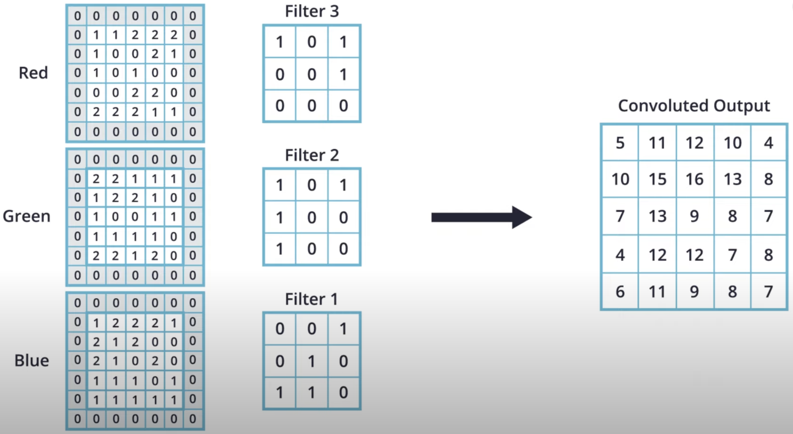
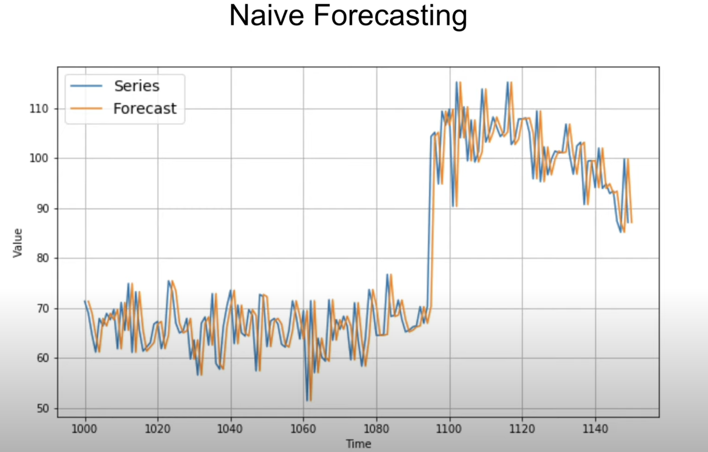
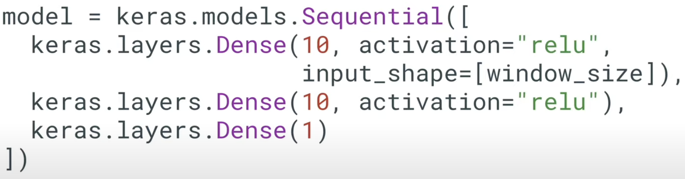
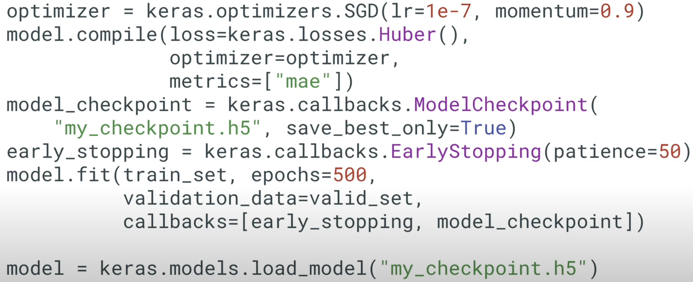

# Welcome to the Course

Introduction course on Deep Learning with TensorFlow for software developers

- Machine learning can very math-heavy

- TensorFlow and Keras, high level API of Deep Learning which encapsulate much of the complexity

- Keep things as simple as possible without going into the details behind machine learning (underlying math and technical details)

- Understand how deep learning neural networks work

- Build and train your own deep neural network with TensorFlow and Keras

- How to deploy your model on different platform

## Artificial intelligence, machine learning, neural network, and deep learning


**Artificial Intelligence:** A field of computer science that aims to make computers achieve human-style intelligence. There are many approaches to reaching this goal, including machine learning and deep learning.

- **Machine Learning:** A set of related techniques in which computers are trained to perform a particular task rather than by explicitly programming them.

- **Neural Network:** A construct in Machine Learning inspired by the network of neurons (nerve cells) in the biological brain. Neural networks are a fundamental part of deep learning

- **Deep Learning:** A subfield of machine learning that uses multi-layered neural networks. Often, “machine learning” and “deep learning” are used interchangeably.

Machine learning and deep learning also have many subfields, branches, and special techniques. A notable example of this diversity is the separation of **Supervised Learning** and **Unsupervised Learning**.

## Application of Machine Learning

- Detect skin cancer (trained on hundreds of thousands of skin images)
- Autonomous vehicles that can drive themself using only the data from various sensors
- Teach computer how to play games
- Writing software that can potentially change the lives of people all over the world

## Prerequisites

Programming language: Python (numpy)

Develop environment: Google's Colab (Colab is a virtual machine)[examples/courses/udacity_intro_to_tensorflow_for_deep_learning/l01c01_introduction_to_colab_and_python.ipynb at master · tensorflow/examples · GitHub](https://github.com/tensorflow/examples/blob/master/courses/udacity_intro_to_tensorflow_for_deep_learning/l01c01_introduction_to_colab_and_python.ipynb)

# Introduction to Machine Learning

## Interview with Sebastin

- Co-funded Udacity, founded Google-X, professor at Stanford

- Stay open-minded

- Machine learning is actually simpler than programming computers

- Train the computer using examples and computer finds its own rules

## What is Machine Learning?

Figure out the relationship between particular inputs and outputs


In Machine learning, the algorithm has to be learned


Machine Learning uses neural network to learn the relation between these inputs and outputs

Neural network: 

- A stack of layers where each layer consists of some predefined Math and internal variables

- Tuning the internal variables in the layers until the network learns to produce the output givens the inputs through thousands or even millions of iterations over the input and output data

- There are many types of neural network architectures. However, no matter what architecture you choose, <u>the math it contains (what calculations are being performed, and in what order) is not modified during training. Instead, it is the internal variables (“weights” and “biases”) which are updated during training</u>.

You can think of Machine learning algorithm as a function that can tune variables in order to correctly map some inputs and some outputs

## Colab: Converting Celsius to Fahrenheit

[examples/courses/udacity_intro_to_tensorflow_for_deep_learning/l02c01_celsius_to_fahrenheit.ipynb at master · tensorflow/examples · GitHub](https://github.com/tensorflow/examples/blob/master/courses/udacity_intro_to_tensorflow_for_deep_learning/l02c01_celsius_to_fahrenheit.ipynb)

### Import dependencies

```python
import tensorflow as tf
import numpy as np
import logging
```

### Some Machine Learning terminology

- **Feature** — The input(s) to our model.

- **Labels** — The output our model predicts.

- **Example** — A pair of inputs/outputs used during training.

### Create the model

We will use the simplest possible model we can, a <u>Dense network</u>. Since the problem is straightforward, this network will require only a <u>single layer</u>, with a <u>single neuron</u>.

#### Build a layer

`input_shape=[1]` — This specifies that the input to this layer is a single value.

`units=1` — This specifies the number of neurons in the layer. The number of neurons defines how many internal variables the layer has to try to learn how to solve the problem. (In a multi-layered network, the size and shape of the layer would need to match the `input_shape` of the next layer.)

```python
l0 = tf.keras.layers.Dense(units=1, input_shape=[1])
```

#### Assemble layers into the model

The Sequential model definition takes a list of layers as an argument, specifying the calculation order from the input to the output.

```python
model = tf.keras.Sequential([l0])
```

### Compile the model, with loss and optimizer functions

Before training, the model has to be compiled. When compiled for training, the model is given:

- **Loss function** — A way of measuring how far off predictions are from the desired outcome. (The measured difference is called the "loss".)

- **Optimizer function** — A way of adjusting internal values in order to reduce the loss.

These are used during training (`model.fit()`, below) to first calculate the loss at each point, and then improve it.

```python
model.compile(loss='mean_squared_error',
              optimizer=tf.keras.optimizers.Adam(0.1))
```

The loss function ([mean squared error](https://en.wikipedia.org/wiki/Mean_squared_error)) and the optimizer ([Adam](https://machinelearningmastery.com/adam-optimization-algorithm-for-deep-learning/)) used here are standard for simple models like this one, but many others are available. It is not important to know how these specific functions work at this point.

Learning rate (`0.1` in the code above) is the step size taken when adjusting values in the model. 

- If the value is too small, it will take too many iterations to train the model. 

- Too large, and accuracy goes down.

- Finding a good value often involves some trial and error, but the range is usually within 0.001 (default), and 0.1

### Train the model

During training, the model takes in Celsius values, performs a calculation using the current internal variables (called "weights") and outputs values which are meant to be the Fahrenheit equivalent. Since <u>the weights are initially set randomly</u>, the output will not be close to the correct value. The difference between the actual output and the desired output is calculated using the **loss function**, and the **optimizer function** directs how the weights should be adjusted.

- The first argument is the inputs

- the second argument is the desired outputs.

- The `epochs` argument specifies <u>how many times this cycle should be run.</u>

- the `verbose` argument controls how much output the method produces.

```python
history = model.fit(celsius_q, fahrenheit_a, epochs=500, verbose=False)
print("Finished training the model")
```

### Display training statistics

The `fit` method returns a history object. We can use this object to plot how the loss of our model goes down after each training epoch. A high loss means that the Fahrenheit degrees the model predicts is far from the corresponding value in `fahrenheit_a`.

```python
import matplotlib.pyplot as plt
plt.xlabel('Epoch Number')
plt.ylabel("Loss Magnitude")
plt.plot(history.history['loss'])
```

As you can see, our model improves very quickly at first, and then has a steady, slow improvement until it is very near "perfect" towards the end.


### Use the model to predict values

Summary

- We created a model with a Dense layer
- **We trained it with 3500 examples (7 pairs, over 500 epochs).**

Our model tuned the variables (weights) in the Dense layer until it was able to return the correct Fahrenheit value for any Celsius value. (Remember, 100 Celsius was not part of our training data.)

```python
print(model.predict([100.0]))
```

### Looking at the layer weights

Since the form is the same, the variables should converge on the standard values of 1.8 and 32, which is exactly what happened.

With additional neurons, additional inputs, and additional outputs, the formula becomes much more complex, but the idea is the same.

```python
print("These are the layer variables: {}".format(l0.get_weights()))

## Output:
## These are the layer variables: [array([[1.8235865]], dtype=float32), array([28.957005], dtype=float32)]
```

### More Dense layers with different units

```python
l0 = tf.keras.layers.Dense(units=4, input_shape=[1])
l1 = tf.keras.layers.Dense(units=4)
l2 = tf.keras.layers.Dense(units=1)
model = tf.keras.Sequential([l0, l1, l2])
model.compile(loss='mean_squared_error', optimizer=tf.keras.optimizers.Adam(0.1))
model.fit(celsius_q, fahrenheit_a, epochs=500, verbose=False)
print("Finished training the model")
print(model.predict([100.0]))
print("Model predicts that 100 degrees Celsius is: {} degrees Fahrenheit".format(model.predict([100.0])))
print("These are the l0 variables: {}".format(l0.get_weights()))
print("These are the l1 variables: {}".format(l1.get_weights()))
print("These are the l2 variables: {}".format(l2.get_weights()))
```

## Recap


```python
l0 = tf.keras.layers.Dense(units=1, input_shape=[1]) 
model = tf.keras.Sequential([l0])
model.compile(loss='mean_squared_error', optimizer=tf.keras.optimizers.Adam(0.1))
history = model.fit(celsius_q, fahrenheit_a, epochs=500, verbose=False)
model.predict([100.0])
```

### The Training Process

The training process (happening in `model.fit(...)`) is really about <u>tuning the internal variables of the networks to the best possible values</u>, so that they can map the input to the output. This is achieved through an <u>optimization process</u> called **Gradient Descent,** which uses Numeric Analysis to find the best possible values to the internal variables of the model.

To do machine learning, you don't really need to understand these details. But for the curious: <u>gradient descent iteratively adjusts parameters, nudging them in the correct direction a bit at a time until they reach the best values</u>. In this case “best values” means that nudging them any more would make the model perform worse. The function that measures how good or bad the model is during each iteration is called the “loss function”, and the goal of each nudge is to “minimize the loss function.”

The training process starts with a forward pass, where the input data is fed to the neural network (see Fig.1). Then the model applies its internal math on the input and internal variables to predict an answer ("Model Predicts a Value" in Fig. 1).

In our example, the input was the degrees in Celsius, and the model predicted the corresponding degrees in Fahrenheit.


Once a value is predicted, the difference between that predicted value and the correct value is calculated. This difference is called the loss, and it's a measure of how well the model performed the mapping task. The value of the loss is calculated using a loss function, which we specified with the loss parameter when calling `model.compile()`.

After the loss is calculated, the internal variables (weights and biases) of all the layers of the neural network are adjusted, so as to minimize this loss — that is, to make the output value closer to the correct value (see Fig. 2).


**This optimization process is called Gradient Descent**. The specific algorithm used to calculate the new value of each internal variable is specified by the optimizer parameter when calling `model.compile(...)`. In this example we used the `Adam` optimizer.

It is not required for this course, but if you're interested in learning more details about how the training process works, you can look at the [lesson on reducing loss in Google’s machine learning crash course](https://developers.google.com/machine-learning/crash-course/reducing-loss/video-lecture).

By now you should know what the following terms are:

- **Feature:** The input(s) to our model
- **Examples:** <u>An input/output pair used for training</u>
- **Labels:** The output of the model
- **Layer:** A collection of nodes connected together within a neural network.
- **Model:** The representation of your neural network
- **Dense and Fully Connected (FC):** Each node in one layer is connected to each node in the previous layer.
- **Weights and biases:** The internal variables of model
- **Loss:** The discrepancy between the desired output and the actual output
- **MSE:** Mean squared error, a type of loss function that counts a small number of large discrepancies as worse than a large number of small ones.
- **Gradient Descent:** An algorithm that changes the internal variables a bit at a time to gradually reduce the loss function.
- **Optimizer:** **A specific implementation of the gradient descent algorithm**. (There are many algorithms for this. In this course we will only use the “Adam” Optimizer, which stands for *ADAptive with Momentum*. It is considered the best-practice optimizer.)
- **Learning rate:** The “step size” for loss improvement during gradient descent.
- **Batch:** The set of examples used during training of the neural network
- **Epoch:** A full pass over the entire training dataset
- **Forward pass:** The computation of output values from input
- **Backward pass (backpropagation):** The calculation of internal variable adjustments according to the optimizer algorithm, starting from the output layer and working back through each layer to the input.

## Dense Layers

A neural network is a stack of layers, where each layer is made up of units (neurons). The neurons in each layer can be connected to neurons in the following layer.


```python
hidden = keras.layer.Dense(unit=2, input_shape=[3])
output = keras.layer.Dense(unit=1)
model = tf.keras.Sequential( [ hidden, output ] )
```

A layer has math that's applied to internal variables (weights and biases) in it. The internal variables are. The internal variables get adjusted durning the training process to enable the model to best match the inputs and outputs. **What's important to note however, is that the math never changes.** The training process only changes `w` and `b` variables to be able to match the input and output.


We can never match the variables against the target algorithm. How could we? We don't even know the target algorithm. That's why we use machine learning in the first place. Otherwise, we could just hard code the algorithm as a function. Without knowing the target algorithm, we would just give a model a number of layers and weights to tune. Then, we just hope the model will be able to figure out how to tune the model algorithm to match the input and output.

In general, when we do machine learning, we typically just try different neural networks with different numbers of layers and neurons in a trial and error away and see if the model is able to solve the problem during the training phase.

===========================================

=============== Section 1 end ================

===========================================

# Your First Model - Fashion MNIST

## Interview with Sebastin

- More general intelligence training in network to do more than one task

- Bring it to market

- The great vision of machine learning it that it allows computer to observe experts with their work, and pick up the patterns and help other people to be as good as the best experts. Could be in law, in medicine, in driving cars

- Deep learning is another tool can help you accomplish a task

- Every network can be connected differently

## Introduction

- Create a neural network that can recognize items of clothing and images

- **Input data** is called **Features**. (input image)

- **Output** data is called **Labels**. (correct output that specifies the piece of clothing the image depicts)

- We need lots of examples (feature-label pairs) to train neural network to recognize the articles of clothing

- **Fashion MNIST** dataset

## Fashion MNIST Dataset

- **Fashion MNIST** dataset consists of 28 * 28 pixel grey-scale images of clothing
- All 10 different items of clothing
- In total, Fashion MNIST dataset contains 70,000 images


We'll use 60,000 images to train the neural networks **(Training Data)**. Then, we'll use the remaining 10,000 images to test how well our neural network can recognize the items of clothing **(Test Data)**.


## Neural Network

- **Input** is an array of length 784 because each image in dataset is 28 pixels in height and 28 pixels in width. Since neural network takes in a vector as input, these 28 by 28 images are converted into a one dimensional array of 28 by 28, so 784 **units**.

- The process of converting a 2D image into a vector is called flattening and code. This is perform through a flattened layer. This layer transforms each image from a 2D array of 28 by 28 pixels, each having a single byte for the grey-scale, to a 1D array of 784 pixels

- The input will be fully connected to the first dense layer of the network where we've chosen 128 units. We use the Rectified Linear Unit (ReLU) here because the problem is more difficult to solve than converting Celsius to Fahrenheit ReLU is a mathematical function which give network more power. In essence, it's a small mathematical extension to our dense layer that allows network to solve more complex problem

- Finally, the last layer also known as output layer, contains 10 units (10 types of article of clothing). Each of these output values will specify the probability that the images of that specific type of clothing. These number describe the confidence the model has that an input image is one of 10 different articles of clothing. For example, the model has 85% certain that this is a shirt. Since these 10 output values refer to probabilities, if you sum them up, the result will be one. These 10 numbers are also called probability distribution or a distribution of probabilities for each of the output classes of clothing.

- We need the output layer to create these probability values for each of our classes.

- Create these probabilities using **softmax** statement

 The ReLU function gives an output of 0 if the input is negative or zero, and if input is positive, then the output will be equal to the input.

ReLU gives the network the ability to solve nonlinear problems.

ReLU is a type of activation function. There several of these functions (ReLU, Sigmoid, tanh, ELU), but ReLU is used most commonly and serves as a good default. To build and use models that include ReLU, you don’t have to understand its internals. But, if you want to know more, see [this article on ReLU in Deep Learning](https://www.kaggle.com/dansbecker/rectified-linear-units-relu-in-deep-learning).

Let’s review some of the new terms that were introduced in this lesson:

- **Flattening:** The process of converting a 2d image into 1d vector
- **ReLU:** An activation function that allows a model to solve nonlinear problems
- **Softmax:** A function that provides probabilities for each possible output class
- **Classification:** A machine learning model used for distinguishing among two or more output categories

## Training and Testing

When training a Machine Learning model, you always need to split your dataset into at least two different partitions

- The data you use for training

- The data you use for testing

Once the neural network has been trained, we want to test on data that it hasn't seen before to see how well it performs. (Not to memory but have learned the general way)

You show some data that is representative of the problem you're trying to solve. we want to test its performance on images it has never seen before. If we don't do this, we wouldn't know if the neural network has decided to memorize the images it saw during training, or it has truly been able to understand the difference between these items of clothing

[TensorFlow Datasets](https://medium.com/tensorflow/introducing-tensorflow-datasets-c7f01f7e19f3) provides a collection of datasets ready to use with TensorFlow.

Datasets are typically split into different subsets to be used at various stages of training and evaluation of the neural network. In this section we talked about:

- **Training Set:** The data used for training the neural network.
- **Test set:** The data used for testing the final performance of our neural network.

The test dataset was used to try the network on data it has never seen before. This enables us to see how the model generalizes beyond what it has seen during training, and that it has not simply memorized the training examples.

In the same way, it is common to use what is called a **Validation dataset**. <u>This dataset is not used for training. Instead, it it used to test the model during training.</u> This is done after some set number of training steps, and gives us an indication of how the training is progressing. For example, if the loss is being reduced during training, but accuracy deteriorates on the validation set, that is an indication that the model is memorizing the test set.

<u>The validation set is used again when training is complete to measure the final accuracy of the model.</u>

You can read more about all this in the [Training and Test Sets lesson of Google’s Machine Learning Crash Course](https://developers.google.com/machine-learning/crash-course/training-and-test-sets/video-lecture).

## Colab: Fashion MNIST

[examples/courses/udacity_intro_to_tensorflow_for_deep_learning/l03c01_classifying_images_of_clothing.ipynb at master · tensorflow/examples · GitHub](https://github.com/tensorflow/examples/blob/master/courses/udacity_intro_to_tensorflow_for_deep_learning/l03c01_classifying_images_of_clothing.ipynb)

### Install and import dependencies

```shell
!pip install -U tensorflow_datasets


## Local
pip3 install -U tensorflow_datasets
```

```python
import tensorflow as tf
```

```python
# Import TensorFlow Datasets
import tensorflow_datasets as tfds
tfds.disable_progress_bar()

# Helper libraries
import math
import numpy as np
import matplotlib.pyplot as plt
```

```python
import logging
logger = tf.get_logger()
logger.setLevel(logging.ERROR)
```

### Import the Fashion MNIST dataset

This guide uses the [Fashion MNIST](https://github.com/zalandoresearch/fashion-mnist) dataset, which contains 70,000 grayscale images in 10 categories. The images show individual articles of clothing at low resolution (28 × 28 pixels).


Loading the dataset returns metadata as well as a *training dataset* and *test dataset*.

- The model is trained using `train_dataset`.
- The model is tested against `test_dataset`.

```python
dataset, metadata = tfds.load('fashion_mnist', as_supervised=True, with_info=True)
train_dataset, test_dataset = dataset['train'], dataset['test']
```

The images are 28 × 28 arrays, with pixel values in the range `[0, 255]`. The *labels* are an array of integers, in the range `[0, 9]`. These correspond to the *class* of clothing the image represents:

| Label | Class       |
| ----- | ----------- |
| 0     | T-shirt/top |
| 1     | Trouser     |
| 2     | Pullover    |
| 3     | Dress       |
| 4     | Coat        |
| 5     | Sandal      |
| 6     | Shirt       |
| 7     | Sneaker     |
| 8     | Bag         |
| 9     | Ankle boot  |

Each image is mapped to a single label. Since the *class names* are not included with the dataset, store them here to use later when plotting the images:

```python
class_names = metadata.features['label'].names
print("Class names: {}".format(class_names))

# Class names: ['T-shirt/top', 'Trouser', 'Pullover', 'Dress', 'Coat', 'Sandal', 'Shirt', 'Sneaker', 'Bag', 'Ankle boot']
```

```python
num_train_examples = metadata.splits['train'].num_examples
num_test_examples = metadata.splits['test'].num_examples
print("Number of training examples: {}".format(num_train_examples))
print("Number of test examples:     {}".format(num_test_examples))

# Number of training examples: 60000
# Number of test examples:     10000
```

### Preprocess the data

The value of each pixel in the image data is an integer in the range `[0,255]`. For the model to work properly, these values need to be normalized to the range `[0,1]`. So here we create a normalization function, and then apply it to each image in the test and train datasets.

```python
def normalize(images, labels):
  images = tf.cast(images, tf.float32)
  images /= 255
  return images, labels

# The map function applies the normalize function to each element in the train
# and test datasets
train_dataset =  train_dataset.map(normalize)
test_dataset  =  test_dataset.map(normalize)

# The first time you use the dataset, the images will be loaded from disk
# Caching will keep them in memory, making training faster
train_dataset =  train_dataset.cache()
test_dataset  =  test_dataset.cache()
```

### Explore the processed data

```python
# Take a single image, and remove the color dimension by reshaping
for image, label in test_dataset.take(1):
  break
image = image.numpy().reshape((28,28))

# Plot the image - voila a piece of fashion clothing
plt.figure()
plt.imshow(image, cmap=plt.cm.binary)
plt.colorbar()
plt.grid(False)
plt.show()
```

Display the first 25 images from the *training set* and display the class name below each image. Verify that the data is in the correct format and we're ready to build and train the network.

```python
plt.figure(figsize=(10,10))
for i, (image, label) in enumerate(train_dataset.take(25)):
    image = image.numpy().reshape((28,28))
    plt.subplot(5,5,i+1)
    plt.xticks([])
    plt.yticks([])
    plt.grid(False)
    plt.imshow(image, cmap=plt.cm.binary)
    plt.xlabel(class_names[label])
plt.show()
```

### Build the model

#### Setup the layers

This network has three layers:

- **input** `tf.keras.layers.Flatten` — This layer transforms the images from a 2d-array of 28 × 28 pixels, to a 1d-array of 784 pixels (28*28). Think of this layer as unstacking rows of pixels in the image and lining them up. This layer has no parameters to learn, as it only reformats the data.

- **"hidden"** `tf.keras.layers.Dense`— A densely connected layer of 128 neurons. Each neuron (or node) takes input from all 784 nodes in the previous layer, weighting that input according to hidden parameters which will be learned during training, and outputs a single value to the next layer.

- **output** `tf.keras.layers.Dense` — A 128-neuron, followed by 10-node *softmax* layer. Each node represents a class of clothing. As in the previous layer, the final layer takes input from the 128 nodes in the layer before it, and outputs a value in the range `[0, 1]`, representing the probability that the image belongs to that class. The sum of all 10 node values is 1.

```python
model = tf.keras.Sequential([
    tf.keras.layers.Flatten(input_shape=(28, 28, 1)),
    tf.keras.layers.Dense(128, activation=tf.nn.relu),
    tf.keras.layers.Dense(10, activation=tf.nn.softmax)
])
```

#### Compile the model

Before the model is ready for training, it needs a few more settings. These are added during the model's *compile* step:

- *Loss function* — An algorithm for measuring how far the model's outputs are from the desired output. The goal of training is this measures loss.
- *Optimizer* —An algorithm for adjusting the inner parameters of the model in order to minimize loss.
- *Metrics* —Used to monitor the training and testing steps. The following example uses *accuracy*, the fraction of the images that are correctly classified.

```python
model.compile(optimizer='adam',
              loss=tf.keras.losses.SparseCategoricalCrossentropy(),
              metrics=['accuracy'])
```

#### Train the model

First, we define the iteration behavior for the train dataset:

1. Repeat forever by specifying `dataset.repeat()` (the `epochs` parameter described below limits how long we perform training).
2. The `dataset.shuffle(60000)` randomizes the order so our model cannot learn anything from the order of the examples.
3. And `dataset.batch(32)` tells `model.fit` to <u>use batches of 32 images and labels when updating the model variables.</u>

Training is performed by calling the `model.fit` method:

1. Feed the training data to the model using `train_dataset`.
2. The model learns to associate images and labels.
3. The `epochs=5` parameter limits training to 5 full iterations of the training dataset, so a total of 5 * 60000 = 300000 examples.

```python
BATCH_SIZE = 32
train_dataset = train_dataset.cache().repeat().shuffle(num_train_examples).batch(BATCH_SIZE)
test_dataset = test_dataset.cache().batch(BATCH_SIZE)
```

```python
model.fit(train_dataset, epochs=5, steps_per_epoch=math.ceil(num_train_examples/BATCH_SIZE))

# steps_per_epoch: Total number of steps (batches of samples) before declaring one epoch finished and starting the next epoch.

# Epoch 1/5
# 1875/1875 [==============================] - 6s 3ms/step - loss: 0.2728 - accuracy: 0.9003
# Epoch 2/5
# 1875/1875 [==============================] - 6s 3ms/step - loss: 0.2676 - accuracy: 0.9017
# Epoch 3/5
# 1875/1875 [==============================] - 6s 3ms/step - loss: 0.2564 - accuracy: 0.9044
# Epoch 4/5
# 1875/1875 [==============================] - 6s 3ms/step - loss: 0.2417 - accuracy: 0.9086
# Epoch 5/5
# 1875/1875 [==============================] - 6s 3ms/step - loss: 0.2392 - accuracy: 0.9117
# <keras.callbacks.History at 0x7f13d0766fe0> 
```

As the model trains, the loss and accuracy metrics are displayed.

#### Evaluate accuracy

Compare how the model performs on the test dataset

```python
test_loss, test_accuracy = model.evaluate(test_dataset, steps=math.ceil(num_test_examples/32))
print('Accuracy on test dataset:', test_accuracy)
```

As it turns out, the accuracy on the test dataset is smaller than the accuracy on the training dataset. This is completely normal, since the model was trained on the `train_dataset`. When the model sees images it has never seen during training, (that is, from the `test_dataset`), we can expect performance to go down.

#### Make predictions and explore

```python
for test_images, test_labels in test_dataset.take(1): # take the first batch
  test_images = test_images.numpy()
  test_labels = test_labels.numpy()
  predictions = model.predict(test_images)
```

```python
predictions.shape

# (32, 10)
```

```python
predictions[0]

# array([1.9581352e-05, 7.3813733e-09, 1.9421440e-02, 1.8915347e-05,
#       9.5107049e-01, 6.7366539e-09, 2.9468466e-02, 1.0025023e-14,
#       1.0883246e-06, 7.5907652e-10], dtype=float32)
```

A prediction is an array of 10 numbers. These describe the "confidence" of the model that the image corresponds to each of the 10 different articles of clothing. <u>We can see which label has the highest confidence value</u>:

```python
np.argmax(predictions[0])

# 4
```

```python
test_labels[0]

# 4
```

We can graph this to look at the full set of 10 class predictions

```python
def plot_image(i, predictions_array, true_labels, images):
  predictions_array, true_label, img = predictions_array[i], true_labels[i], images[i]
  plt.grid(False)
  plt.xticks([])
  plt.yticks([])

  plt.imshow(img[...,0], cmap=plt.cm.binary)

  predicted_label = np.argmax(predictions_array)
  if predicted_label == true_label:
    color = 'blue'
  else:
    color = 'red'

  plt.xlabel("{} {:2.0f}% ({})".format(class_names[predicted_label],
                                100*np.max(predictions_array),
                                class_names[true_label]),
                                color=color)

def plot_value_array(i, predictions_array, true_label):
  predictions_array, true_label = predictions_array[i], true_label[i]
  plt.grid(False)
  plt.xticks([])
  plt.yticks([])
  thisplot = plt.bar(range(10), predictions_array, color="#777777")
  plt.ylim([0, 1]) 
  predicted_label = np.argmax(predictions_array)

  thisplot[predicted_label].set_color('red')
  thisplot[true_label].set_color('blue')
```

Let's look at the 0th image, predictions, and prediction array.

```python
i = 0
plt.figure(figsize=(6,3))
plt.subplot(1,2,1)
plot_image(i, predictions, test_labels, test_images)
plt.subplot(1,2,2)
plot_value_array(i, predictions, test_labels)
```

Let's plot several images with their predictions. Correct prediction labels are blue and incorrect prediction labels are red. The number gives the percent (out of 100) for the predicted label. Note that it can be wrong even when very confident.

```python
# Plot the first X test images, their predicted label, and the true label
# Color correct predictions in blue, incorrect predictions in red
num_rows = 5
num_cols = 3
num_images = num_rows*num_cols
plt.figure(figsize=(2*2*num_cols, 2*num_rows))
for i in range(num_images):
  plt.subplot(num_rows, 2*num_cols, 2*i+1)
  plot_image(i, predictions, test_labels, test_images)
  plt.subplot(num_rows, 2*num_cols, 2*i+2)
  plot_value_array(i, predictions, test_labels)
```

## Celsius vs MNIST


Different kind of neural network can solve different kind of problems

- Regression: Predict single number from an input e.g. converting Celsius to Fahrenheit

- Classification: Given the input, the model will give us output a probability distribution, specifying the confidence the input is of a certain class


All of the main takeaway point is that all of our machine learning models is one of these categories. A regression or classification model.

## Summary

In this lesson we trained a neural network to classify images of articles of clothing. To do this we used the Fashion MNIST dataset, which contains 70,000 greyscale images of articles of clothing. We used 60,000 of them to train our network and 10,000 of them to test its performance. In order to feed these images into our neural network we had to flatten the 28 × 28 images into 1d vectors with 784 elements. Our network consisted of a fully connected layer with 128 units (neurons) and an output layer with 10 units, corresponding to the 10 output labels. These 10 outputs represent probabilities for each class. The softmax activation function calculated the probability distribution.

We also learned about the differences between regression and classification problems.

- **Regression:** A model that outputs a single value. For example, an estimate of a house’s value.
- **Classification:** A model that outputs a probability distribution across several categories. For example, in Fashion MNIST, the output was 10 probabilities, one for each of the different types of clothing. Remember, we use Softmax as the activation function in our last Dense layer to create this probability distribution.

# Introduction to CNNs

## Interview with Sebastian

- Build in CNN is called invariance 
  
  - location variance is hard coded using Convolutional neural networks

- I have learned never to say never

- Convolutional neural networks were invented in 1989
  
  - Data make it different

- Focus on find the right data

## Introduction

- Convolutional neural network, which is commonly abbreviated as CNNs

- CNNs have proven to achieve higher accuracies when classifying images than simple pure dense neural networks

- Convolutional neural network is an the primary reason for breakthroughs in computer vision application using machine learning

- We'll create a CNN-base image classifier from scratch  using TensorFlow and Keras

- Two main concepts in Convolutional neural network are convolutions and maxpooling

## Convolutions

- Assume this greyscale image was 6 pixel in height and 6 pixels in width

- Computer interpret this image as a two-dimensional array of pixels

- Since this image is greyscale, every pixel will have a value between zero to 255 (zero being black and 255 corresponding to white)


As you know, when we process this image in our neural network, the pixel value will be normalized to a value between zero and one.

The idea of convolutional layer is to create another grid of numbers called the kernel or filter (three by three matrix).


Then we can scan this kernel across this image. The image size is six by six and the kernel is three by three. A convolutional layer applies to kernel over the regions of the input image.

Performing a kernel convolution on this pixel value of 25. The first step is to center our kernel over the pixel that we want


We take each corresponding image and kernel value, multiply them together and then we sum up the whole thing and assign it to the green pixel in convoluted image


However, what happens to the pixels on the edges? There are a couple of options:

- Not using this pixel in the convolution (you'll lose information about the image because the convoluted image will become much smaller than the original image)

- Common option is do something called zero-padding: add pixels with zero around the original image (without losing information)


A kernel convolution is just this process of applying the kernel or filter across different areas of the input image. Convolutions are another type of Keras layer we will use.

## Max Pooling

In short, max pooling is just the process of reducing the size of the input image by summarizing regions.

In order to perform max pooling, we need to select two things:

- a grid, which is the pool size

- a stride, which determines the number of pixels to slide the window across the image


Select the pixel with the greatest value, then slide the grid two pixels at each step and continue this process until we cover the entire convoluted image


The result will be a new image that's smaller than the original image and you can see we down-sampled the original image. We end with a new image that's half the size of original image. The size of this new image will vary depending on your choice of the grid size and stride.


## Recap

We just learned about convolutions and max pooling.

A convolution is the process of applying a filter (“kernel”) to an image. Max pooling is the process of reducing the size of the image through downsampling.

As you will see in the following Colab notebook, convolutional layers can be added to the neural network model using the `Conv2D` layer type in Keras. This layer is similar to the Dense layer, and has weights and biases that need to be tuned to the right values. The `Conv2D` layer also has kernels (filters) whose values need to be tuned as well. So, in a `Conv2D` layer the values inside the filter matrix are the variables that get tuned in order to produce the right output.

Here are some of terms that were introduced in this lesson:

- **CNNs:** Convolutional neural network. That is, a network which has at least one convolutional layer. A typical CNN also includes other types of layers, such as pooling layers and dense layers.
- **Convolution:** The process of applying a kernel (filter) to an image
- **Kernel / filter:** A matrix which is smaller than the input, used to transform the input into chunks
- **Padding:** Adding pixels of some value, usually 0, around the input image
- **Pooling** The process of reducing the size of an image through downsampling.There are several types of pooling layers. For example, average pooling converts many values into a single value by taking the average. However, maxpooling is the most common.
- **Maxpooling**: A pooling process in which many values are converted into a single value by taking the maximum value from among them.
- **Stride:** the number of pixels to slide the kernel (filter) across the image.
- **Downsampling:** The act of reducing the size of an image

## Colab: Fashion MNIST with CNNs

https://github.com/tensorflow/examples/blob/master/courses/udacity_intro_to_tensorflow_for_deep_learning/l04c01_image_classification_with_cnns.ipynb

(Same as previous **Colab: Fashion MNIST**)

### Build the model

```pyhton
model = tf.keras.Sequential([
    tf.keras.layers.Conv2D(32, (3,3), padding='same', activation=tf.nn.relu,
                           input_shape=(28, 28, 1)),
    tf.keras.layers.MaxPooling2D((2, 2), strides=2),
    tf.keras.layers.Conv2D(64, (3,3), padding='same', activation=tf.nn.relu),
    tf.keras.layers.MaxPooling2D((2, 2), strides=2),
    tf.keras.layers.Flatten(),
    tf.keras.layers.Dense(128, activation=tf.nn.relu),
    tf.keras.layers.Dense(10, activation=tf.nn.softmax)
])
```

This network layers are:

- **"convolutions"** `tf.keras.layers.Conv2D and MaxPooling2D`— Network start with two pairs of Conv/MaxPool. The first layer is a Conv2D filters (3,3) being applied to the input image, retaining the original image size by using padding, and creating 32 output (convoluted) images (so this layer creates 32 convoluted images of the same size as input). After that, the 32 outputs are reduced in size using a MaxPooling2D (2,2) with a stride of 2. The next Conv2D also has a (3,3) kernel, takes the 32 images as input and creates 64 outputs which are again reduced in size by a MaxPooling2D layer. So far in the course, we have described what a Convolution does, but we haven't yet covered how you chain multiples of these together. We will get back to this in lesson 4 when we use color images. At this point, it's enough if you understand the kind of operation a convolutional filter performs

- **output** `tf.keras.layers.Dense` — A 128-neuron, followed by 10-node *softmax* layer. Each node represents a class of clothing. As in the previous layer, the final layer takes input from the 128 nodes in the layer before it, and outputs a value in the range `[0, 1]`, representing the probability that the image belongs to that class. The sum of all 10 node values is 1.

> Note: Using `softmax` activation and `SparseCategoricalCrossentropy()` has issues and which are patched by the `tf.keras` model. A safer approach, in general, is to use a linear output (no activation function) with `SparseCategoricalCrossentropy(from_logits=True)`.

### Compile the model

```python
model.compile(optimizer='adam',
              loss=tf.keras.losses.SparseCategoricalCrossentropy(),
              metrics=['accuracy'])
```

Train the model

```python
BATCH_SIZE = 32
train_dataset = train_dataset.cache().repeat().shuffle(num_train_examples).batch(BATCH_SIZE)
test_dataset = test_dataset.cache().batch(BATCH_SIZE)

model.fit(train_dataset, epochs=10, steps_per_epoch=math.ceil(num_train_examples/BATCH_SIZE))
```

## Summary

### A Comprehensive Guide to Convolutional Neural Networks — the ELI5 way

https://towardsdatascience.com/a-comprehensive-guide-to-convolutional-neural-networks-the-eli5-way-3bd2b1164a53

#### Why ConvNets over Feed-Forward Neural Nets?

- A ConvNet is able to **successfully capture the Spatial and Temporal dependencies** in an image through the application of relevant filters.

#### Input Image


- You can imagine how computationally intensive things would get once the images reach dimensions, say 8K (7680×4320). The role of ConvNet is to reduce the images into a form that is easier to process, without losing features that are critical for getting a good prediction.

- This is important when we are to design an architecture that is not only good at learning features but also scalable to massive datasets.

#### Convolutional layer - The kernel

- The objective of the Convolution Operation is to **extract the high-level features** such as edges, from the input image. ConvNets need not be limited to only one Convolutional Layer. Conventionally, the first ConvLayer is responsible for capturing the Low-Level features such as edges, color, gradient orientation, etc. With added layers, the architecture adapts to the High-Level features as well, giving us a network that has a wholesome understanding of images in the dataset, similar to how we would.
- There are two types of results to the operation — one in which the convolved feature is reduced in dimensionality as compared to the input, and the other in which the dimensionality is either increased or remains the same.
  - When we augment the 5x5x1 image into a 6x6x1 image and then apply the 3x3x1 kernel over it, we find that the convolved matrix turns out to be of dimensions 5x5x1. Hence the name — **Same Padding**.
  - On the other hand, if we perform the same operation without padding, we are presented with a matrix that has dimensions of the Kernel (3x3x1) itself — **Valid Padding**.
- [GitHub - vdumoulin/conv_arithmetic: A technical report on convolution arithmetic in the context of deep learning](https://github.com/vdumoulin/conv_arithmetic)

#### Pooling layer

- Similar to the Convolutional Layer, the Pooling layer is responsible for reducing the spatial size of the Convolved Feature. This is to **decrease the computational power required to process the data** through dimensionality reduction. Furthermore, it is useful for **extracting dominant features** which are rotational and positional invariant, thus maintaining the process of effectively training the model.

- There are two types of Pooling: Max Pooling and Average Pooling. **Max Pooling** returns the **maximum value** from the portion of the image covered by the Kernel. On the other hand, **Average Pooling** returns the **average of all the values** from the portion of the image covered by the Kernel.

- The Convolutional Layer and the Pooling Layer, together form the i-th layer of a Convolutional Neural Network. Depending on the complexities in the images, the number of such layers may be increased for capturing low-level details even further, but at the cost of more computational power.

- After going through the above process, we have successfully enabled the model to understand the features.

#### Classification — Fully Connected Layer (FC Layer)


- Adding a Fully-Connected layer is a (usually) cheap way of learning non-linear combinations of the high-level features as represented by the output of the convolutional layer. The Fully-Connected layer is learning a possibly non-linear function in that space.

- Flatten the image into a column vector

- Over a series of epochs, the model is able to distinguish between dominating and certain low-level features in images and classify them using the **Softmax Classification** technique.

# Going Further With CNNs

## Interview with Sebastian

Overfitting is a result of something called the bias-variance trade-off, a network that has very few weights, can't learn that  much stuff, that's commonly called bias in machine learning. A network that has very many parameters can randomly pick a solution that you don't like because there's too many parameters and the variance of the solution might pick based on the data called variance. But the simple rule is, the more parameters you have relative to data, the more likely you are able to pick just a complete event solution as opposite to the good solution. There is two solutions:

- Holdout sets: you can divide the data. 90% for training and 10% for testing and do what's called cross validation where you check the performance on the testing set that you're training on it and when that error goes up, you stop training

- Constraint your network:put biases around your weights and I want to put them all as close to zero as possible and the more you constrained these weight or you feel you have, the lesser the overfit

- Training, test and validation dataset: if you touch your test dataset at many, many times, then eventually you'll start overfitting your test set, and that is really bad

Getting data in shape is really hard! 90% percent of your work is cleaning up data:)

## Introduction

In real application, we usually have to deal with high resolution color images of different sizes. One of the great advantage of CNNs is that they can also work with color images.

## Dogs and Cats Dataset

We're going to use cat and dog images from Microsoft image dataset. Each image in this dataset is labeled with either a one (dog) or a zero (cat). Even though Microsoft image dataset contains over three million labeled images of cats and dogs, only 25000 of them are public available. Training our CNN on this 25000 image will take a very long time. Therefore, in order to decrease the training time, we'll only use a small subset of images to training our CNNs. Our subset contains 2000 training images and 1000 validation images. Out of the 2000 training images, 1000 of them are dog images and 1000 of them are cat images. Two main challenges:

- Working with images of different sizes

- Working with color images

## Images of Different Sizes

Our first challenge will be dealing with images of different sizes. This is because of a neural network needs a fixed size input. Just flatten the images of different sizes won't work. When doing image classification, we always solve this problem by resizing all the images to the same size.


In this lesson, we'll choose to resize all images in dogs and cats dataset to be 150 pixels in height and 150 pixels in width. By resizing all images to the same size, this will guarantee  that when we flatten the images, they will result in 1D arrays of the same size


## Color Images Part 1

Computer interpret grey scale images as two-dimensional arrays. This two-dimensional arrays contain the corresponding pixel values of the grey scale images. The width and height of the two-dimensional array will be determined by size of the image


In a similar manner, computer interprets color images as three-dimensional arrays. The width and height of the three-dimensional array will be determined by the width and height of the image and the depth will be determined by the number of color channels.


Most of color images can be represented by three color channels. Namely, red, green and blue (RGB images). Altogether, these three channels combine to create a single image.


In RGB images, each color channel is represented by its own two-dimensional array. Since we have three channels, we end up with three two-dimensional arrays.


Therefore, in the case of RGB images, the depth of the three-dimensional array is just the stack of these two-dimensional arrays corresponding to the red, green and blue color channels.


Five pixels in height, five pixels in width and a depth of three.

## Color Images Part 2


## Convolutions with Color Images

We'll start by choosing a filter of particular size. The only different now is that the filter itself will be three-dimensional. The depth of the filter will be chosen to match the number of color channels and our color image. This is because we're going to convolve each color channel with its own two-dimensional filter. Therefore, if we're working with RGB  images, our 3D filter will have a depth of three.


For simplicity, let's assume that our RGB image is five by five pixels. We'll add zero padding to each of these arrays in order to avoid loosing information when performing the convolution.


The convolution will be carried out in exactly the same way as for greyscales images. The only difference is that now we have to perform three convolutions instead of one.


The resulting convolutional output is a two-dimensional array with the same width and height of the RGB image.



As we can see, a convolution with a single 3D filter produces a single convoluted output.


However, when working with CNNs, it's customary to use more than one 3D filter. If we use more than one filter, then we'll get one convoluted output per filter. For example, if we use three filters, then we'll get three convoluted outputs. Therefore, we can think of the convoluted output as being three-dimensional where the depth will correspond to the number of filters. Similarly, if you have 16 filters, the depth of the convolutional output will be 16


In code, we can control how many outputs a con2D layer creates by specifying the number of filters. We can also specify the size dof the 3D filters by using the kernel size argument


Remember that when we train the CNN, the values in the three-dimensional kernels will be updated so as to minimize the loss function.

## Max Pooling with Color Images

Perform max-pooling in three-dimensional convoluted output. In essence, max-pooling works the same way as it did for grey-scale images. The only difference is that now ew have to perform max-pooling on each convoluted output.


We end up with 3 two-dimensional arrays where each two-dimensional array is half the size of its corresponding convoluted output.


We get a 3D array that is half the width and height of convoluted output, but has the same depth.

## Colab: Cats and Dogs

https://github.com/tensorflow/examples/blob/master/courses/udacity_intro_to_tensorflow_for_deep_learning/l05c01_dogs_vs_cats_without_augmentation.ipynb

In this tutorial, we will discuss how to classify images into pictures of cats or pictures of dogs. We'll build an image classifier using `tf.keras.Sequential` model and load data using `tf.keras.preprocessing.image.ImageDataGenerator`.

### importing packages

- os — to read files and directory structure
- numpy — for some matrix math outside of TensorFlow
- matplotlib.pyplot — to plot the graph and display images in our training and validation data

```python
import tensorflow as tf
from tensorflow.keras.preprocessing.image import ImageDataGenerator

import os
import matplotlib.pyplot as plt
import numpy as np

import logging
logger = tf.get_logger()
logger.setLevel(logging.ERROR)
```

### Data Loading

The dataset we are using is a filtered version of [Dogs vs. Cats](https://www.kaggle.com/c/dogs-vs-cats/data) dataset from Kaggle (ultimately, this dataset is provided by Microsoft Research). In this Colab however, we will make use of the class `tf.keras.preprocessing.image.ImageDataGenerator` which will read data from disk. We therefore need to directly download *Dogs vs. Cats* from a URL and unzip it to the Colab filesystem.

```python
_URL = 'https://storage.googleapis.com/mledu-datasets/cats_and_dogs_filtered.zip'
zip_dir = tf.keras.utils.get_file('cats_and_dogs_filterted.zip', origin=_URL, extract=True)
```

The dataset we have downloaded has the following directory structure.

```
cats_and_dogs_filtered
|__ train
    |______ cats: [cat.0.jpg, cat.1.jpg, cat.2.jpg ...]
    |______ dogs: [dog.0.jpg, dog.1.jpg, dog.2.jpg ...]
|__ validation
    |______ cats: [cat.2000.jpg, cat.2001.jpg, cat.2002.jpg ...]
    |______ dogs: [dog.2000.jpg, dog.2001.jpg, dog.2002.jpg ...]
```

```python
base_dir = os.path.join(os.path.dirname(zip_dir), 'cats_and_dogs_filtered')
train_dir = os.path.join(base_dir, 'train')
validation_dir = os.path.join(base_dir, 'validation')

train_cats_dir = os.path.join(train_dir, 'cats')  # directory with our training cat pictures
train_dogs_dir = os.path.join(train_dir, 'dogs')  # directory with our training dog pictures
validation_cats_dir = os.path.join(validation_dir, 'cats')  # directory with our validation cat pictures
validation_dogs_dir = os.path.join(validation_dir, 'dogs')  # directory with our validation dog pictures
```

### Understanding our data

Let's look at how many cats and dogs images we have in our training and validation directory

```python
num_cats_tr = len(os.listdir(train_cats_dir))
num_dogs_tr = len(os.listdir(train_dogs_dir))

num_cats_val = len(os.listdir(validation_cats_dir))
num_dogs_val = len(os.listdir(validation_dogs_dir))

total_train = num_cats_tr + num_dogs_tr
total_val = num_cats_val + num_dogs_val

print('total training cat images:', num_cats_tr)
print('total training dog images:', num_dogs_tr)

print('total validation cat images:', num_cats_val)
print('total validation dog images:', num_dogs_val)
print("--")
print("Total training images:", total_train)
print("Total validation images:", total_val)
```

### Setting Model Parameters

```python
BATCH_SIZE = 100  # Number of training examples to process before updating our models variables
IMG_SHAPE  = 150  # Our training data consists of images with width of 150 pixels and height of 150 pixels
```

### Data Preparation

Images must be formatted into appropriately pre-processed floating point tensors before being fed into the network. The steps involved in preparing these images are:

1. Read images from the disk
2. Decode contents of these images and convert it into proper grid format as per their RGB content
3. Convert them into floating point tensors
4. Rescale the tensors from values between 0 and 255 to values between 0 and 1, as neural networks prefer to deal with small input values.

Fortunately, all these tasks can be done using the class **tf.keras.preprocessing.image.ImageDataGenerator**.

We can set this up in a couple of lines of code.

```python
train_image_generator      = ImageDataGenerator(rescale=1./255)  # Generator for our training data
validation_image_generator = ImageDataGenerator(rescale=1./255)  # Generator for our validation data
```

After defining our generators for training and validation images, **flow_from_directory** method will load images from the disk, apply rescaling, and resize them using single line of code.

```python
train_data_gen = train_image_generator.flow_from_directory(batch_size=BATCH_SIZE,
                                                           directory=train_dir,
                                                           shuffle=True,
                                                           target_size=(IMG_SHAPE,IMG_SHAPE), #(150,150)
                                                           class_mode='binary')
```

```python
val_data_gen = validation_image_generator.flow_from_directory(batch_size=BATCH_SIZE,
                                                              directory=validation_dir,
                                                              shuffle=False,
                                                              target_size=(IMG_SHAPE,IMG_SHAPE), #(150,150)
                                                              class_mode='binary')
```

#### Visualizing Training images

We can visualize our training images by getting a batch of images from the training generator, and then plotting a few of them using `matplotlib`.

```python
sample_training_images, _ = next(train_data_gen) 
```

The `next` function returns a batch from the dataset. One batch is a tuple of (*many images*, *many labels*). For right now, we're discarding the labels because we just want to look at the images.

```python
# This function will plot images in the form of a grid with 1 row and 5 columns where images are placed in each column.
def plotImages(images_arr):
    fig, axes = plt.subplots(1, 5, figsize=(20,20))
    axes = axes.flatten()
    for img, ax in zip(images_arr, axes):
        ax.imshow(img)
    plt.tight_layout()
    plt.show()
```

```python
plotImages(sample_training_images[:5])  # Plot images 0-4
```

### Model Creation

The model consists of four convolution blocks with a max pool layer in each of them. Then we have a fully connected layer with 512 units, with a `relu` activation function. The model will output class probabilities for two classes — dogs and cats — using `softmax`.

```python
model = tf.keras.models.Sequential([
    tf.keras.layers.Conv2D(32, (3,3), activation='relu', input_shape=(150, 150, 3)),
    tf.keras.layers.MaxPooling2D(2, 2),

    tf.keras.layers.Conv2D(64, (3,3), activation='relu'),
    tf.keras.layers.MaxPooling2D(2,2),

    tf.keras.layers.Conv2D(128, (3,3), activation='relu'),
    tf.keras.layers.MaxPooling2D(2,2),

    tf.keras.layers.Conv2D(128, (3,3), activation='relu'),
    tf.keras.layers.MaxPooling2D(2,2),

    tf.keras.layers.Flatten(),
    tf.keras.layers.Dense(512, activation='relu'),
    tf.keras.layers.Dense(2, activation='softmax')
])
```

### Compile the model

As usual, we will use the `adam` optimizer. Since we output a softmax categorization, we'll use `sparse_categorical_crossentropy` as the loss function. We would also like to look at training and validation accuracy on each epoch as we train our network, so we are passing in the metrics argument.

```python
model.compile(optimizer='adam',
              loss=tf.keras.losses.SparseCategoricalCrossentropy(from_logits=True),
              metrics=['accuracy'])
```

### Model Summary

Let's look at all the layers of our network using **summary** method.

```python
model.summary()
```

### Train the model

Since our batches are coming from a generator (`ImageDataGenerator`), we'll use `fit_generator` instead of `fit`.

```python
EPOCHS = 100
history = model.fit_generator(
    train_data_gen,
    steps_per_epoch=int(np.ceil(total_train / float(BATCH_SIZE))),
    epochs=EPOCHS,
    validation_data=val_data_gen,
    validation_steps=int(np.ceil(total_val / float(BATCH_SIZE)))
)
```


### Visualizing results of the training

```python
acc = history.history['accuracy']
val_acc = history.history['val_accuracy']

loss = history.history['loss']
val_loss = history.history['val_loss']

epochs_range = range(EPOCHS)

plt.figure(figsize=(8, 8))
plt.subplot(1, 2, 1)
plt.plot(epochs_range, acc, label='Training Accuracy')
plt.plot(epochs_range, val_acc, label='Validation Accuracy')
plt.legend(loc='lower right')
plt.title('Training and Validation Accuracy')

plt.subplot(1, 2, 2)
plt.plot(epochs_range, loss, label='Training Loss')
plt.plot(epochs_range, val_loss, label='Validation Loss')
plt.legend(loc='upper right')
plt.title('Training and Validation Loss')
plt.savefig('./foo.png')
plt.show()
```


As we can see from the plots, training accuracy and validation accuracy are off by large margin and our model has achieved only around **70%** accuracy on the validation set (depending on the number of epochs you trained for).

This is a clear indication of overfitting. Once the training and validation curves start to diverge, our model has started to memorize the training data and is unable to perform well on the validation data.

## Softmax and Sigmoid

Notice that our last layer (our classifier) consists of a `Dense` layer with `2` output units and a `softmax` activation function, as seen below:

```python
tf.keras.layers.Dense(2, activation='softmax')
```

Another popular approach when working with binary classification problems, is to use a classifier that consists of a `Dense` layer with `1` output unit and a `sigmoid` activation function, as seen below:

```python
tf.keras.layers.Dense(1, activation='sigmoid')
```

Either of these two options will work well in a binary classification problem. However, you should keep in mind, that if you decide to use a `sigmoid` activation function in your classifier, you will also have to change the `loss` parameter in the `model.compile()` method, from `'sparse_categorical_crossentropy'` to `'binary_crossentropy'`, as shown below:

```python
model.compile(optimizer='adam', 
              loss='binary_crossentropy',
              metrics=['accuracy'])
```

## Validation

When we use CNN-based model to classify the images from fashion MNST dataset, we got 97% accuracy on the training set but only 92% accuracy on the test set. This was our CNN was overfitting. In other word, it was memorizing the training set. But we only became aware of this big difference after we finished training our CNN because it was only after we finished training our CNN that we were able to compare the accuracy on the test set with accuracy achieved at the end of training.

To avoid this issue, we often introduce a validation set. During training, the neural network will only look at the training set in order to decide how to modify its weights and biases. Then after every training epoch, **we check how the model is doing by looking at the training loss the the loss in validation set**. <u>It's important to note that the model does not use any part of the validation set to tune the weights and biases</u>. <u>The validation step only tell us if the model is doing well on the validation set</u>. In this way, it gives us an idea of how well the model generalizes to a new set of data that is separate from the training set. The idea is that since the neural network doesn't use the validation set for deciding its weights and biases, then it can tell us if we're overfitting the training set


Very high accuracy on training set and a much lower on the validation set. This is a clear sign of overfitting. The network has memorized the training set so it performs really well on it. But when tested on the validation dataset which it has not been trained on, it performs poorly.

One way to avoid overfitting is by taking a look at the plot of training and validation loss as a function of epochs. We can see after some epochs, the validation loss starts to increase, while the training loss keeps decreasing. We also see that when we finish training, the validation loss is very high, and the training loss is very small. This is actually an indication that neural network is overfitting the training data because it's not generalizing well enough to also perform well on the validation set. In other word, this plot is telling us that after just a few epochs, our neural network is just memorizing the training data and it is not generalizing well to the data in the validation set. As we can see, the validation set can help us determine the number of epochs we should train our CNN for, such that out network is accurate but it's not overfitting.


This kind of process can also prove useful if we have multiple potential architectures to choose from. For example, if you're deciding on the number of layers to put in your neural network, you can create various models with different architectures and then compare them using validation set. The architecture that gives you the lowest validation loss will be the best model


You might also be wondering why we must create a validation set after all if we have the test set. Couldn't we just use the test set for validation? The problem is that even though we don't use the validation set to tune the weights and biases during training, we ultimately end up tuning our models such that it performs well on both the validation set and training set. Therefore, our neural network will end up being biased in favor of validation set. We need a separate test set to really see how our model generalizes and performs when given new data it has never seen before.


We just saw how we can use validation set to prevent overfitting

## Image Augmentation

When training CNN to recognize particular objects in images, you want your CNN to be able to detect these objects regardless of their size or position in the image.


Image augmentation works by creating new training images by applying a number of random image transformations to the images in the original training set.


By applying this new transformed images to our training set, we are ensuring that our CNN sees a lot of different examples during training. Consequently, our CNN will generalize better to unseen data and avoid overfitting.

## Dropout

Another technique that can also help us avoid overfitting. We learned that during training and neural network adjusts its weight and biases to minimize the loss function. One problem that can sometimes occur during training is that one part of the network ends up with very large weights while other parts end up with very small weights. This results in the parts having the larger weights playing a major role in training process while the other parts with smaller weights won't play much of role and they don't get trained very much.


One way to avoid this happening is to perform dropout. Dropout consists of randomly turning off some of the neurons in network during training. By turning off some neurons during training, this forces other neurons to pick up the slack and to take a more active part in the training. So as we go through the epochs durning training, we'll randomly turn off some neurons.


For example, let's suppose in the first epoch we choose not to use these two neurons. So we do our feedforward and our backpropagation passes without using these neurons. In the second epoch, we choose not to use these three neurons. Again, we do feed forward and back-propagation passes without using those neurons, and then in the third epoch, which is not to use these two neurons. we do feed forward and back-propagation passes without using those neurons and so on. 


By training our network in this way, we can avoid overfitting. You can say that the network becomes more resistant, because it can not rely on all of the neurons being there to solve the problem. Consequently, other neurons will have to set up and also be able to do the job. In practice, we specify the probability that each neuron gets dropped out at each training epoch. Notice, that since we specify a probability. Some neurons may get turned off more than others and some may never get turned off at all. However, it is not a problem, because we're doing it many many times over. Therefore on average, each neuron will get the same chance of being turned off.

## Colab: Cats and Dogs Revisited

https://github.com/tensorflow/examples/blob/master/courses/udacity_intro_to_tensorflow_for_deep_learning/l05c02_dogs_vs_cats_with_augmentation.ipynb

- *Data Augmentation* and *Dropout* - Key techniques to fight overfitting in computer vision tasks that we will incorporate into our data pipeline and image classifier model.

### Data augmentation

#### Flipping the image horizontally

```python
image_gen = ImageDataGenerator(rescale=1./255, horizontal_flip=True)

train_data_gen = image_gen.flow_from_directory(batch_size=BATCH_SIZE,
                                               directory=train_dir,
                                               shuffle=True,
                                               target_size=(IMG_SHAPE,IMG_SHAPE))
```

#### Rotating the image

```python
image_gen = ImageDataGenerator(rescale=1./255, rotation_range=45)

train_data_gen = image_gen.flow_from_directory(batch_size=BATCH_SIZE,
                                               directory=train_dir,
                                               shuffle=True,
                                               target_size=(IMG_SHAPE, IMG_SHAPE))
```

#### Applying Zoom

```python
image_gen = ImageDataGenerator(rescale=1./255, zoom_range=0.5)

train_data_gen = image_gen.flow_from_directory(batch_size=BATCH_SIZE,
                                               directory=train_dir,
                                               shuffle=True,
                                               target_size=(IMG_SHAPE, IMG_SHAPE))
```

#### Putting it all together

```python
image_gen_train = ImageDataGenerator(
      rescale=1./255,
      rotation_range=40,
      width_shift_range=0.2,
      height_shift_range=0.2,
      shear_range=0.2,
      zoom_range=0.2,
      horizontal_flip=True,
      fill_mode='nearest')

train_data_gen = image_gen_train.flow_from_directory(batch_size=BATCH_SIZE,
                                                     directory=train_dir,
                                                     shuffle=True,
                                                     target_size=(IMG_SHAPE,IMG_SHAPE),
                                                     class_mode='binary')
```

Generally, we only apply data augmentation to our training examples, since the original images should be representative of what our model needs to manage. So, in this case we are only rescaling our validation images and converting them into batches using ImageDataGenerator.

### Model Creation

The model consists of four convolution blocks with a max pool layer in each of them.

Before the final Dense layers, we're also applying a Dropout probability of 0.5. It means that 50% of the values coming into the Dropout layer will be set to zero. This helps to prevent overfitting.

Then we have a fully connected layer with 512 units, with a `relu` activation function. The model will output class probabilities for two classes — dogs and cats — using `softmax`.

```python
model = tf.keras.models.Sequential([
    tf.keras.layers.Conv2D(32, (3,3), activation='relu', input_shape=(150, 150, 3)),
    tf.keras.layers.MaxPooling2D(2, 2),

    tf.keras.layers.Conv2D(64, (3,3), activation='relu'),
    tf.keras.layers.MaxPooling2D(2,2),

    tf.keras.layers.Conv2D(128, (3,3), activation='relu'),
    tf.keras.layers.MaxPooling2D(2,2),

    tf.keras.layers.Conv2D(128, (3,3), activation='relu'),
    tf.keras.layers.MaxPooling2D(2,2),

    tf.keras.layers.Dropout(0.5),
    tf.keras.layers.Flatten(),
    tf.keras.layers.Dense(512, activation='relu'),
    tf.keras.layers.Dense(2)
])
```

## Other Techniques to Prevent Overfitting

In this lesson we saw three different techniques to prevent overfitting:

- **Early Stopping**: In this method, we track the loss on the validation set during the training phase and use it to determine when to stop training such that the model is accurate but not overfitting.

- **Image Augmentation**: Artificially boosting the number of images in our training set by applying random image transformations to the existing images in the training set.

- **Dropout**: Removing a random selection of a fixed number of neurons in a neural network during training.

However, these are not the only techniques available to prevent overfitting. You can read more about these and other techniques in the link below:

[Memorizing is not learning! — 6 tricks to prevent overfitting in machine learning](https://hackernoon.com/memorizing-is-not-learning-6-tricks-to-prevent-overfitting-in-machine-learning-820b091dc42)

## Summary

In this lesson we learned how Convolutional Neural Networks work with color images and saw various techniques that we can use to avoid overfitting . The main key points of this lesson are:

CNNs with RGB Images of Different Sizes:

- **Resizing**: When working with images of different sizes, you must resize all the images to the same size so that they can be fed into a CNN.

- **Color Images**: Computers interpret color images as 3D arrays.

- **RGB Image**: Color image composed of 3 color channels: Red, Green, and Blue.

- **Convolutions**: When working with RGB images we convolve each color channel with its own convolutional filter. Convolutions on each color channel are performed in the same way as with grayscale images, *i.e.* by performing element-wise multiplication of the convolutional filter (kernel) and a section of the input array. The result of each convolution is added up together with a bias value to get the convoluted output.

- **Max Pooling**: When working with RGB images we perform max pooling on each color channel using the same window size and stride. Max pooling on each color channel is performed in the same way as with grayscale images, *i.e.* by selecting the max value in each window.

- **Validation Set**: We use a validation set to check how the model is doing during the training phase. Validation sets can be used to perform Early Stopping to prevent overfitting and can also be used to help us compare different models and choose the best one.

Methods to Prevent Overfitting:

- **Early Stopping**: In this method, we track the loss on the validation set during the training phase and use it to determine when to stop training such that the model is accurate but not overfitting.

- **Image Augmentation**: Artificially boosting the number of images in our training set by applying random image transformations to the existing images in the training set.

- **Dropout**: Removing a random selection of a fixed number of neurons in a neural network during training.

You also created and trained a Convolutional Neural Network to classify images of Dogs and Cats with and without Image Augmentation and Dropout. You were able to see that Image Augmentation and Dropout greatly reduces overfitting and improves accuracy. As an exercise, you were able to apply everything you learned in this lesson to create your own CNN to classify images of flowers.

# Transfer Learning

(Previously, with dropout and image augmentation, the validation accuracy is around 80%, 20% is still too high for an error rate. How do we increate validation accuracy above 95%)

## Interview with Sebastian

- Transfer learning is taking a model and applying it with a couple of additional tweaking to a new scenario. So being able to have a bit of boost instead of training a model completely from scratch

- TensorFlow is being released with pre-trained models

## Introduction

- Transfer learning reuses the model that was created by machine learning experts and that has been trained on a large data set

## Transfer Learning

The idea behind transfer learning is that neural network that has been trained on a large dataset can apply its knowledge to a dataset it has never seen before. That's why it is called transfer learning because we transfer the learning of an existing model to a new dataset.

In order to perform transfer learning, we need to change the last layer of the pre-trained model. This is because each dataset has a different number of output classes. 


Also, we have to make sure that we don't change the pre-trained part of the model during the training process. This is done by setting the variables of pre-trained model to non-trainable. This is called freezing the model. By freezing the parameters, we'll ensure that only the variables of the last classification layer get trained. The variables from the other layers of the pre-trained model are kept the same.

A nice additional benefit from this is they will also reduce the training time significantly because we're only training variables of our last classification layer and not the entire model.

## MobileNet

As we mentioned before, there have been very successful models that have performed very well on the ImageNet competition such as AlexNet, Inception and Resonant. These neural networks tend to be very deep and contains thousands and even millions of parameters. The large number of parameters allows the networks to learn more complex patterns and therefore achieve higher accuracies. However, having such a large number of parameters also means that the model will take a long time to train, make predictions, use a lot of memory and very computationally expensive.

In this lesson, we'll use a state of the art convolutional neural network called  MobileNet. MobileNet uses a very efficient network architecture that minimizes the amount of memory and computational resources needed while maintaining a high level of accuracy. This makes MobileNet ideal to work on mobile devices that have limited memory and computational resources.

 MobileNet was developed by Google and was trained on the ImageNet dataset. Since it is being trained on ImageNet, it has 1000 output classes far more than two we have in our cats and dogs dataset.

To perform transfer learning, we'll download the features of MobileNet without the classification layer. In TensorFlow, the download features can be used as regular Keras layers with a particular input size. Since MobileNet was trained on ImageNet, we have to match the same input size that was used during training. In our case, MobileNet was trained on RGB images of a fixed size of 224 by 224 pixels.


TensorFlow has a repository of pre-trained model called TensorFlow hub. TensorFlow hub also has pre-trained models where the last classification layer has been stripped out. Here, you can see a version of MobileNet version two.


Simply add our classification layer to the end of our model. Since our dogs and cats dataset has only two classes, we'll add a dense layer with two outputs and a softmax activation function to our sequential model. This dense layer will be our new classifier and it needs to be trained.


We can train our sequential model just as we did previously using the `fit` method.


## Colab: Cats and Dogs with Transfer Learning

[Google Colab](https://colab.research.google.com/github/tensorflow/examples/blob/master/courses/udacity_intro_to_tensorflow_for_deep_learning/l06c01_tensorflow_hub_and_transfer_learning.ipynb)

What is a bit curious here is that validation performance is better than training performance, right from the start to the end of execution.

One reason for this is that validation performance is measured at the end of the epoch, but training performance is the average values across the epoch.

## Understanding Convolutional Neural Networks

One way to try to understand CNNs is by visualizing the convolutional layers

[Understanding your Convolution network with Visualizations](https://towardsdatascience.com/understanding-your-convolution-network-with-visualizations-a4883441533b)

## Summary

In this lesson we learned how we can use Transfer Learning to create very powerful Convolutional Neural Networks with very little effort. The main key points of this lesson are:

- **Transfer Learning**: A technique that reuses a model that was created by machine learning experts and that has already been trained on a large dataset. When performing transfer learning we must always change the last layer of the pre-trained model so that it has the same number of classes that we have in the dataset we are working with.

- **Freezing Parameters**: Setting the variables of a pre-trained model to non-trainable. By freezing the parameters, we will ensure that only the variables of the last classification layer get trained, while the variables from the other layers of the pre-trained model are kept the same.

- **MobileNet**: A state-of-the-art convolutional neural network developed by Google that uses a very efficient neural network architecture that minimizes the amount of memory and computational resources needed, while maintaining a high level of accuracy. MobileNet is ideal for mobile devices that have limited memory and computational resources.

You also used transfer learning to create a Convolutional Neural Network that uses MobileNet to classify images of Dogs and Cats. You were able to see that transfer learning greatly improves the accuracy achieved in the Dogs and Cats dataset. As an exercise, you were able to apply everything you learned in this lesson to create your own CNN using MobileNet to classify images of flowers.

# Saving and Loading Models

Very deep and complex models can take days or even weeks to train. Therefore, you'll be extremely impractical if every time we wanted to use our models to make predictions we had to go back and train them from scratch.

Luckily, we can avoid this by saving our models after we finished training them.

Saving our trained models allow us to:

- Share our models with others

- We can always improve our model with new data by resuming training right where we left off

TensorFlow provides a direct way to take your saved model and deploy them on different platforms such as mobile and embedded devices, servers and even web browser. TensorFlow makes it all possible through its saved model format. A `SavedModel` contains all the information about model including weight values, the models architecture and even the optimizers configuration.


## Colab: Saving and Loading Models

### Save as Keras `.h5` model

we've trained the model, we can save it as an HDF5 file, which is the format used by Keras. Our HDF5 file will have the extension '.h5', and it's name will correpond to the current time stamp.

```python
t = time.time()

export_path_keras = "./{}.h5".format(int(t))
print(export_path_keras)

model.save(export_path_keras)
```

You can later recreate the same model from this file, even if you no longer have access to the code that created the model.

This file includes:

- The model's architecture
- The model's weight values (which were learned during training)
- The model's training config (what you passed to `compile`), if any
- The optimizer and its state, if any (this enables you to restart training where you left off)

### Load the Keras `.h5` Model

We will now load the model we just saved into a new model called `reloaded`. We will need to provide the file path and the `custom_objects` parameter. This parameter tells keras how to load the `hub.KerasLayer` from the `feature_extractor` we used for transfer learning.

```python
reloaded = tf.keras.models.load_model(
  export_path_keras, 
  # `custom_objects` tells keras how to load a `hub.KerasLayer`
  custom_objects={'KerasLayer': hub.KerasLayer})

reloaded.summary()
```

### Export as SavedModel

You can also export a whole model to the TensorFlow SavedModel format. SavedModel is a standalone serialization format for Tensorflow objects, supported by TensorFlow serving as well as TensorFlow implementations other than Python. A SavedModel contains a complete TensorFlow program, including weights and computation. It does not require the original model building code to run, which makes it useful for sharing or deploying (with TFLite, TensorFlow.js, TensorFlow Serving, or TFHub).

The SavedModel files that were created contain:

- A TensorFlow checkpoint containing the model weights.
- A SavedModel proto containing the underlying Tensorflow graph. Separate graphs are saved for prediction (serving), train, and evaluation. If the model wasn't compiled before, then only the inference graph gets exported.
- The model's architecture config, if available.

```python
t = time.time()

export_path_sm = "./{}".format(int(t))
print(export_path_sm)

tf.saved_model.save(model, export_path_sm)
```

### Load SavedModel

```python
reloaded_sm = tf.saved_model.load(export_path_sm)
```

Now, let's use the `reloaded_sm` (reloaded SavedModel) to make predictions on a batch of images.

```python
reload_sm_result_batch = reloaded_sm(image_batch, training=False).numpy()
```

### Loading the SavedModel as a Keras Model

The object returned by `tf.saved_model.load` is not a Keras object (i.e. doesn't have `.fit`, `.predict`, `.summary`, etc. methods). Therefore, you can't simply take your `reloaded_sm` model and keep training it by running `.fit`. To be able to get back a full keras model from the Tensorflow SavedModel format we must use the `tf.keras.models.load_model` function. This function will work the same as before, except now we pass the path to the folder containing our SavedModel.

```python
reload_sm_keras = tf.keras.models.load_model(
  export_path_sm,
  custom_objects={'KerasLayer': hub.KerasLayer})

reload_sm_keras.summary()
```

You can use it later for deployment on different platform.

# Time Series Forecasting

## Introduction

What is time series?

- It is an ordered sequence of values usually equally spaced over time every year, day, second or even every few microseconds

- There is a single value at each time-step. These time series are called univariate.

- Some time series have multiple values at each time-step. So they're called multivariate time series


## Application

- The most obvious being predicting the future which is called **forecasting**

- You may also want to predict the past if that makes any sense. This might be useful if there's missing or corrupted data in time series. This is called Imputation. Or maybe you're interested in the underlying process that generated the time series

- Time series analysis can also be used to detect anomalies. For example, monitor website traffic to detect abnormal activities

## Common Patterns

Many time series gradually drift up or down. This is called a trend. Upward trend 


This time series has some seasonality. This is when patterns repeat at predictable intervals and particular peaks and troughs. For example, gift sales jumps up every winter around the holiday season and temperature drops every night


Some time series have both trend and seasonality


Sometimes series are just completely unpredictable (White noise). The best you can do with this is to identify the probability distribution and find its parameters. For example, it is a Gaussian distribution with mean zero and variance one. You can see if you plot a histogram of all values, it will look like a bell curve. With that, you will usually want to forecast the mean


Trend and seasonality and noise


## Colab: Common Patterns

https://github.com/tensorflow/examples/blob/master/courses/udacity_intro_to_tensorflow_for_deep_learning/l08c01_common_patterns.ipynb

When you doing time series forecasting or analysis, it's often good to untangle all of these components from your time series and possibly study them separately. You can isolate the trend, seasonal pattern and white noise. If you do that, it'll be simpler to study the whole time series rather than studying the whole thing at once

## Forecasting

The simplest approach is to **take the last value and assume that the next value will be the same**. This is called **naive forecasting** (you are just saying tomorrow will be the same as today)



It's often a good idea to measure the performance of naive forecasting just to get the baseline. It's sometime surprisingly difficult to beat, but how do you measure the performance? To measure the performance of our forecasting model, we typically want to split the time series into a training period, a validation period and a test period. This is called fixed partitioning.


If time series has some seasonality, you generally want to ensure that each period contains a whole number of seasons. For example, one year or two years or three years. If the time series has a yearly seasonality, you generally don't want one year and a half or else some months would be represented more than others.

Next, you train your model on the training period and you evaluate it on the validation period. You can iterate multiple times, to find the right model architecture and tunes its hyper parameters until you reach the desired performance on the validation period. After that, you can train your best model one last time on the whole training plus validation period and evaluate it on the test period to get and idea of how well your model would perform in production. It will not always be a very reliable estimate, because the time series may behave differently in the future but hopefully it will be a reasonable estimate. Then you you should train your model one last time on the full time series including the test set before you deploy your model to production. This is different from usual machine learning best practices where we never train on the test set but it's necessary for time series because the most recent period is usually the one that contains the most useful information to predict the future.

Now because the test set is not as reliable as in regular machine learning and because we need to use it for training before deploying on model. it's common to just use a training period and validation period. In other words, the test period is the future. For simplicity, we'll do this in the rest of this course 


Fix partitioning is simple and intuitive, but there is another way. We start with short training period and we gradually increase it, say by one day at a time or one week at a time. At each iteration, we train the model on the training period and we use it to forecast the following day or the following week in the validation period. This is called roll forward partitioning. The drawback is that it will require much more training time, but the benefit is that it will more closely mimic the production conditions since you will generally want to retain your model regularity as you get new data in production. However, for simplicity, we'll use fixed partitioning.


## Colab: Naive Forecasting

https://github.com/tensorflow/examples/blob/master/courses/udacity_intro_to_tensorflow_for_deep_learning/l08c02_naive_forecasting.ipynb

Compute the mean absolute error between the forecasts and the predictions in the validation period

```python
errors = naive_forecast - x_valid
abs_errors = np.abs(errors)
mae = abs_errors.mean()
mae
```

## Metrics

Once we have a model and period we can evaluate the model on. We need a metric. The most common metric to evaluate the forecasting performance of the model is the mean squared error (mse). We just compute the errors which are the difference between the forecast and the actual values over the evaluation period, then we square them and compute the mean of the squares. 

Sometimes, we compute the square root of the msc which is called the root mean squared error (rmse) which has the advantage of having roughly the same scale as the values in the time series. So it is easier to interpret.

Another common metric is the mean absolute error (mae, also called the mean absolute deviation or mad). This is just the mean of the absolute values of the errors. It does not penalize large errors as much as mse. So depending on your tasks, you may prefer the mae or the mse.

For example, if large errors are potentially dangerous and they cost you much more than smaller error then you may prefer the mse. But if your gain or your loss is just proportional to the size of error, then the mae may be better.

Lastly, you can measure the mean absolute percentage error (mape). This is the mean ratio between the absolute error and the absolute value. This gives an idea of the size of the errors compared to the values


```python
keras.metrics.mean_absolute_error(x_valid, naive_forecast).numpy()
# 5.9379
```

Another simple forecasting method is to compute a moving average. This is just a mean of the past N values. This is nicely to eliminates a lot of noise but it does not anticipate trend and seasonality. So it ends up performing worse than naive forecasting in this case. We get about a mean absolute error of 7.1. 


One way to fix it is to remove the trend and seasonality from the time series. For this, a simple technique is to use differencing. Instead of studying the time series itself, we study the difference between the value at time `t` and the value one year earlier. We get this differenced time series which has no trend and seasonality. We can then use a moving average to forecast this time series which gives us these forecasts. But these are just forecasts for the differenced time series, not the original time series.


To get the final forecasts for the original time series, we need to add back the value at time `t-365`, then we get this nice forecasts. Thus if we measure the mean absolute error on the validation period, we get about 5.8. So it's slightly better than naive forecasting but not tremendously better. So you may have noticed that our moving average removed a lot of noise but our final forecasts are still pretty noisy. So where does these noise come from?


Well, from the past values that we added back to our forecasts. <u>So we can improve this forecasts by also removing the past noise using a moving average</u>. If we do that, we can get much smoother forecasts. In fact, it gives us a mean absolute error over the validation period of just about 4.6. That's much better than all previous methods. In fact, since the time series is generated, we can compute that a perfect model would get  a mean absolute error of about 4.0 due to the noise. Apparently, with this approach it's not too far from optimal. **So keep in mind before you rush into deep learning. Simple approaches may work just fine**. Note that we used a trailing window when computing the moving average of present values from `t-30` to `t-1`. But we use a centered window to compute the moving average of past values from one year ago. Specifically, from `t-one_year-5days` to `t-one_year+5days`. Moving averages using centered windows are more accurate than using trailing windows but we can not use centered windows to smooth present values since we don't know the future value. However, to smooth past values, we can afford to use centered windows


## Colab: Moving Average

https://github.com/tensorflow/examples/blob/master/courses/udacity_intro_to_tensorflow_for_deep_learning/l08c03_moving_average.ipynb

Calculate mean absolute error by Keras

```python
keras.metrics.mean_absolute_error(x_valid, naive_forecast).numpy()
```

When you are doing moving average forecasting, you're saying tomorrow will be closed to the average of the values over the past few days, perhaps the last 30 days for example.

## Time Windows

Let's see how we can forecast the time series using machine learning model. The simplest approach is to build a model that will learn to forecast the next time step, given the time window before it. Given a time window such as this one. We want the model to forecast the next time step. Before we can do that, we need to choose the window size. For example, thirty days, and we must prepare a data set of all possible time windows of that size.


```python
dataset = tf.data.Dataset.range(10)
dataset = dataset.window(5, shift=1, drop_remainder=True)
for window_dataset in dataset:
  for val in window_dataset:
    print(val.numpy(), end="")
    print()
```

Each window is itself represented as a data set. In other word, the `window` method returns a data set of window datasets. Note that the last windows are shorter than five times steps since we reach the end of the series. But to train our machine learning models, we'll generally prefer to have windows of the same length. So we should drop the final short windows. To do that, we just need to set `drop_remainder` equal to `true`.

Our machine learning models will still want Windows represented as tensors not as data set. Asking it to create batches of size five. But since each window contains exactly five elements, this will produce a single batch contains a tensor of size five. Each element is a tensor of size five.

```python
dataset = tf.data.Dataset.range(10)
dataset = dataset.window(5, shift=1, drop_remainder=True)
dataset = dataset.flat_map(lamda window: window.batch(5))
for window in dataset:
  print(window.numpy())
```

To train a machine learning model, we will need input features and targets. We can use the first four times steps as the inputs and the last time step as the target. To do this, we called the `dataset.map`.

```python
dataset = tf.data.Dataset.range(10)
dataset = dataset.window(5, shift=1, drop_remainder=True)
dataset = dataset.flat_map(lamda window: window.batch(5))
dataset = dataset.map(lamda window: (window(:-1), window(-1:))
for x, y in dataset:
  print(x.numpy(), y.numpy())
```

Gradient descent works best when the instance int the data set are IID, meaning independent and identically distributed. So let's shuffle all these windows so that each training batch contains fairly independent windows.

```python
dataset = tf.data.Dataset.range(10)
dataset = dataset.window(5, shift=1, drop_remainder=True)
dataset = dataset.flat_map(lamda window: window.batch(5))
dataset = dataset.map(lamda window: (window(:-1), window(-1:))
dataset = dataset.shuffle(buffer_size=10)
for x, y in dataset:
  print(x.numpy(), y.numpy())
```

Finally when we train the machine learning model, We typically provide batches of instances not just one instance at a time. `prefech` ensures that while the model is working on one batch of data, the data set will already be prepared the next batch in parallel.

```python
dataset = tf.data.Dataset.range(10)
dataset = dataset.window(5, shift=1, drop_remainder=True)
dataset = dataset.flat_map(lamda window: window.batch(5))
dataset = dataset.map(lamda window: (window(:-1), window(-1:))
dataset = dataset.shuffle(buffer_size=10)
dataset = dataset.batch(2).prefetch(1)
for x, y in dataset:
  print(x.numpy())
  print(y.numpy())
```

```python
tf.data.Dataset.from_tensor_slices(series)
```

## Colab: Time Windows

https://github.com/tensorflow/examples/blob/master/courses/udacity_intro_to_tensorflow_for_deep_learning/l08c04_time_windows.ipynb

## Forecasting with Machine Learning

Let's start by training a simple linear regression model. It is our first machine learning model capable of forecasting a time series. It just performs a linear combination of the past 30 values to forecast the next timestamp.


- Since we want to forecast single value, we just need a single unit

- We use `SGD` optimizer with some momentum and this often converges much faster than a basic SDG optimizer (or adam or RMSprop)

- We use the `Huber` loss for training. It is quadratic for small errors just like the mean squared loss. But it is linear for large errors just like the mean absolute error. It is a good loss function to use when you want to optimize the mean absolute error.

- We can use the mean absolute error directly as our loss function but the `huber` loss converges much better.

- We specify the mean absolute error as our main metric

- In this example, we also choose to use the `EarlyStopping` callback. Keras will call this callback during training at the end of each epoch and it will interrupt training when the models stops improving on the validation period. More specifically, Keras will measure the validation loss at the end of each epoch and this callback will interrupt training if the best validation loss remains unchanged for 10 consecutive epochs. This is a very common and useful techniques to reduce overfitting. When you use this callback, you can set the number of epochs in the `fit` method to a large value since training will generally stop long before that. 


- forecast over validation period

- Do not shuffle the window and do not split them into the input features and targets since we just want to make prediction

- Use `prdeict` to get all the forecasts


- Pass the trained `model` and the time `series` starting 30 times steps before the start of the validation period so that our forecast will start at the first time step of he validation period. This means that there is a bit overlap between the data we use for training and the data we use for forecast on the validation period. (Skipped for now) For this reason, we should probably shorten the training period by 30 days to avoid this overlap

- Our prediction is two-dimensional. The first dimension is the batch dimension. In this case, each instance in the batch is a small window of 30 time steps and the output is the corresponding forecasts for the next time step. The second dimension is the dimensionality of the forecast at each time step. Since we are forecasting a univariate time series, we use a dense layer with a single neuron. So the second output dimension has a size of one.

- `lin_forecast` is a 1D array containing one forecast value per time step in the validation period


If we measure the mean absolute error, we get about 4.9. This is much better than naive forecasting and better than our first two moving average forecasts, but it does not beat our last moving average approach. Perhaps we can do much better with more complex model.

It's quite easy to build a dense model with two hidden relu layers.



We can train it exactly like the linear model except we probably want to adapt the learning rate to get the best performance. For example, we can try training the model for a few epochs using a tiny learning rate at first and gradually increase it until the last starts shooting backup. The point at which it stop going down smoothly is usually a good learning rate to use.


The model takes more epochs to train and it does not outperform the linear model. In fact, the mean absolute error on the validation period is about 4.9 just like the linear model. This is still pretty good considering that we didn't even de-trend and de-seasonalized the data. You can try removing trend and seasonality and you should reach an even better performance. 


## Colab: Forecasting with Machine Learning

https://github.com/tensorflow/examples/blob/master/courses/udacity_intro_to_tensorflow_for_deep_learning/l08c05_forecasting_with_machine_learning.ipynb

Set `seed` for TensorFlow and Numpy to ensure that your code is repeatable.

```python
tf.random.set_seed(42)
np.random.seed(42)
```

Tell it change learning rate during training. Starts from a very small learning rate and telling it to increase it gradually so that every 30 epochs it's multiplied by 10. This is a quick increase of the learning rate durning training. Then we can choose the learning rate!

```python
window_size = 30
train_set = window_dataset(x_train, window_size)

model = keras.models.Sequential([
  keras.layers.Dense(1, input_shape=[window_size])
])

lr_schedule = keras.callbacks.LearningRateScheduler(
    lambda epoch: 1e-6 * 10**(epoch / 30))
optimizer = keras.optimizers.SGD(lr=1e-6, momentum=0.9)
model.compile(loss=keras.losses.Huber(),
              optimizer=optimizer,
              metrics=["mae"])
history = model.fit(train_set, epochs=100, callbacks=[lr_schedule])
```

Early stopping

```python
model = keras.models.Sequential([
  keras.layers.Dense(1, input_shape=[window_size])
])
optimizer = keras.optimizers.SGD(lr=1e-5, momentum=0.9)
model.compile(loss=keras.losses.Huber(),
              optimizer=optimizer,
              metrics=["mae"])
early_stopping = keras.callbacks.EarlyStopping(patience=10)
model.fit(train_set, epochs=500,
          validation_data=valid_set,
          callbacks=[early_stopping])
```

## RNNs

Now it's time to look at recurrent neural networks, RNNs. An RNN is a neural network which contains recurrent layers and a recurrent layer is a layer that can sequentially process a sequence of inputs. RNN can take all sequences as inputs. In this course, we'll use them to process time series, but you can also use them to process other sequences such as sentences. In this example, the RNN contains two recurrent layers and one final dense layer, which serve as the output layer. You can feed a batch of sequences such as Windows from a time series, and it can output a batch of forecasts, just like the previous models we trained. However, one difference here is that the full input shape is three-dimensional. The first dimension is the batch size, the second dimension represents time steps and the final dimension represents the dimensionality of inputs at each time step. For example, if it's a univariate time series, then the last dimension is one. For a multivariate time series, it would be two or more. One previous models only had two-dimensional inputs, the batch dimension and a second dimension with all the input features, with one feature per time step since we are dealing with a univariate time series.


Now let's zoom in one of these recurrent layers to see how it works. A recurrent layer is composed of a single memory cell, which is used repeatedly to compute the outputs. It can be a simple dense layer or a complex memory cell such as LSTM cell or JRU cell. It's important to understand that a recurrent layer contains a single cell. In this diagram you see multiple cells, but it actually the same cell that is reused multiple times by the layer. At each time step, the memory cell takes the value of the input sequence at that time step, started with `x_0`, then `x_1`, and so on, and it produces the output for the current time step, starting with `y hat 0`, then `y hat 1`, and so on. But the memory cell also produces another output at each time step called a state vector or sometimes a context vector, starting from `H_1`, then `H_1`, and so on. As you can see, this state vector is fed as an additional input to the memory cell at the next time step. This is actually why it is called a recurrent layer. Part of the output of the memory cell at one time step is fed back to itself at the next time step. The beauty of this architecture is that it can handle sequences of any length using a constant number of parameters. Namely, the parameters of the memory cell. It's a bit like when you're reading a sentence. As you're reading, you're focusing on one word at a time, but you also know the context of each word, and you're updating that context all the time based on what you read.


So as you may know, in theory, a neural network can approximate any continuous function given it has enough neurons and you can train it properly. Similarly, if you have an RNN with big memory cells with a lot of neurons and you manage to train them successfully, you can in theory reproduce any algorithm or approximate any algorithm or any program. So it makes it a very powerful beast placed in theory. Now, in practice, it would require a lot of training data which you don't always have when you're dealing with and unfortunately RNNs are pretty tricky to train. They are sometimes unstable

## Recurrent Layer

Now, let's go back to the recurrent layer and take sometimes to really understand the shape of the data that flows through it. As I mentioned earlier, the **inputs** are three-dimensional. In this example, I'm assuming that we're feeding a batch of `4` windows from a time series each with `30` time steps. **Since it's an univariate time series, there is a single value per time step**. So the shape is `4 x 30 x 1`. At each time step the memory cell takes a `4` by `1` matrix as input along with the state matrix from previous time step. I'll come back to the state matrix in a second. Now let's suppose the memory cell is composed of just `3` neurons, also called units. The output matrix at each time step will then be `4` by `3` because the batch size is `4` and the number of units is `3`. This means that the full output of the layer is three-dimensional, just like the full input. The first dimension is the batch size, `4` in this case. The second dimension is the number of steps, `30` in this case. The last dimension is the output dimensionality which is equal to the number of units, in this case `3`. So this layer will output a tensor of shape `4` by `30` by `3`. This output contains `4` multivariate time series and it can be passed on to another recurrent layer and so on. Now in simple, RNN, the memory cell is regular dense layer and the state matrix is just a copy of the output matrix. For example, `H_0` is just a copy of `Y_0`. `H_1` is just a copy of `Y_0` and so on. So at each time step the memory cell knows what the current input is and also knows what the previous output was. 


In some cases you want to input a sequence, but you don't want to output a sequence. You just want to output a single vector for each instance in the batch. This is called a sequence to vector RNN. It's quite simple. All you need to do is ignore all outputs except for the last one. In fact, in Keras this is the default behavior of all recurrent layers. If you want a recurrent layer to output a sequence you have to set the argument `return_squences` equals to `True` when creating the layer.


For example, this RNN contains two recurrent layers. The first layer has  `return_squences` equals to `True`, so it outputs a sequence which is then feed to the second recurrent layer. But this recurrent layer does not have `return_squences` equals to `True`, so it defaults to `False` and it only outputs the final time step. Since there are `100` of units in that second recurrent layer, its output at each time step are `100` dimensional, and in this case only the last output is sent to the next layer, which is a dense layer with single neuron. This final output layer will output a single value for each instance in the batch. As I mentioned earlier, the input shape of the whole RNN is three-dimensional. There is a batch size, the number of time steps, and the dimensionality of the input sequence, which is one for univariate series. But notice that the input shape arguments of the first layer is `[None, 1]`  What does that mean? Well, remember that Keras assumes that the first dimension is the batch size and that it can have any size at all. And the next dimension is the number of time steps, but we define is as `None`, which means that this RNN will handle sequences of any length, this is new. With regular dense layers you have to specify exactly how many features you will get as input for each instance. But with recurrent layer since it just reuses the same memory cell at each time step, it can handle sequences of any length. Then the last dimension is `1` because once again we're dealing with a univariate time series. Since we're using simple RNN layer, it is based on the simple RNN cell class which behaviors very much like a dense layer. At each time step it performs a weighted sum of it's input, which includes the inputs for that time step and the state from the previous time step. Then it applies an activation function, and that's about it. Notice we didn't specify the activation function, that's because it's default to the hyperbolic tangent function.


So you might wonder why don't we use the ReLU activation function instead. Well the problem is RNNs have a tendency to have unstable gradients. The gradients can vanish during training or they can explode, especially if you're using function like the ReLU activation function which is non saturating. In other words, it can grow arbitrarily large.  So by using the hyperbolic tangent `10H` function instead, it's a bit more stable since it will saturate. But you might still get vanishing gradients, so training maybe super slow.

Now if we set `return_squences` equals `True` in all recurrent layers, then they will all output sequences, and thus the dense layer will get a sequences as input. In that case, the way Keras handles this is that it actually applies the same dense layer independently at each time step. I represented the dense layer multiple times, but it is important to understand that it's the same dense layer which is used independently at each time step. This gives a sequence to sequence RNN. You feed a batch of sequences and it outputs a batch of sequences of the same length. In this case we used a single unit in the output layer, so the output sequence will be univariate just like the input sequence. But the dimensionality of output sequence will not always match the dimensionality of input sequence, really depends on the task.


## Forecasting with an RNN

All right, we're now ready to train our first RNN to forecast the same-time series a earlier. Now all we need is an RNN that can take in a batch of time windows and forecast the next value for each window in the batch, that's sequence to vector RNN. so we can just use the model we looked at earlier, however, since our data set was built to return two-dimensional batches of windows, where the first dimension is the batch size and the second dimension is the number of time steps, we need to add an extra dimension. Remember that an RNN expects 3D inputs: batch size, number of time steps and series dimensionality, which is one in this case. We could go ahead and update our window data set function, but it's not to hard to make the model itself to fix the shape of inputs using a lambda layer that calls `tf.expand_dim()` and add an extra dimension at the end. Note that we define the input shape as `None`, meaning the model will support sequences of any length. We also scale the outputs by a factor `200`, this is useful since time series has values from `40` to a `160` but the recurrent layers use the hyperbolic tangent activation functions as I explained earlier, which outputs values between `-1` and `1`. So scaling the outputs up by a factor of `200` will help training.


After training, this RNN we get these forecasts. They are not quite as good as the forecast from our previous models. The mean absolute error is about `5.2`, you can try to improve this model by fine tuning gets hyper-parameters. For example, there are probably way too many neurons and perhaps a single recurrent layer would suffice. 


However, you'll see training RNN is actually tricky, if you set the learning rate too high, training is unstable and the RNN doesn't learn, but if you set the learning rate low enough to avoid the instabilities, training is really slow. Moreover, during training the loss jumps up and down up unpredictably. So if you use early stopping, it may interrupt training too early. In this case, make sure you set the`patience` parameter to a large enough value, however, this means that the final model will be long after the best model seen during training and may be much worse. So it's probably a good idea to save checkpoints every time the model the model improves and rollback to the best model at the end of training. To do that, you can use the method `checkpoint` callback and set `save_best_only` to `True`. At each epoch, this callback will save the model if it has a best validation performance seen so far. At the end of training, we can jus load the last model saved and it will be the one with the lowest validation error.


## Back Propagation Through Time

One of the reasons why it's difficult to train on RNN is that it's equivalent to training a fairly deep neural network with one layer per time step. Indeed during training, once the loss has been computed back-propagation computes the gradients of loss with regards to every trainable parameter in the neural network, and to do so, it propagates  the gradients backwards through the RNN. This means that the gradients flow down the RNN layers, but they also flow backwards through time. Deep learning library like TensorFlow do this by unrolling the RNN through time as shown here, and treating the resulting network as irregular feed-forward network. So the RNN is like a very deep net. The more time steps there are, the deeper it is. The gradients tend to vanish or explode when going backward through many layers and many time steps. So training could be quite slow especially to detect a long-term patterns.


To speed things up, one approach is to train RNN to make prediction at each time and every time step. Instead of a sequence to vector RNN, now we have a sequence to sequence RNN. The labels are just equal to the inputs but shifted one time step into the future. For example, at time step `0`, the RNN gets `X_0` as input and must try to output `X_1`. At time step `1`, it gets `X_1` as input plus the previous state `H_0` and it must try to output `X_2`. So instead of looking at the inputs and trying to forecast a single value in this case `X_30`, the RNN tries to forecast the next time step at each and every time step based on the past values. The advantage of this approach is that it provides much more gradients for training. If the forecast is bad at one time step, there will be a strong loss at that time step and it will backpropagate directly to update the weights at that time step. This can stabilize and speed-up training. Note that it is just a trick to speed up training, we don't really care about the outputs except for the very last time step. After training, we will just drop all the outputs and only look at the very last one when we make predictions.


To implement this sequence to sequence approach, we write a new function that will create a dataset, just like we did earlier except that the labels are now sequences shift by `1` step into the future. Also, we might as well return sequences that have the proper 3D shape for recurrent layers. So we don't have to use a Lambda layer to reshape them at the beginning of the RNN. For this we called `tf.expand_dims()` at the beginning of the function.


Next, we call this function to create two datasets; One for the training and one for validation period, and recreate the RNN model. Since it is a sequence to sequence model, we make sure we set `return_sequences` equals `True` in every recurrent layer including the laster one. This model will take windows of univariate time series as input and it will output windows of the same length, also univariate. Once we train it, the output window should be close to the input but shifted one time step into the future.


Next, we compile and train the model exactly like we did earlier using `Huber` loss and momentum optimization in this case. Again, you could also try using other optimizers.


After training, this is what the forecasts look like. They're much better than using the sequence to vector RNN and the mean absolute error is about 5.0. That's pretty good but not so as good as the dense models or the moving average approach. So it is a good lesson to remember. RNN can be impressive on some time series especially when there is a lot of training data for high-frequently, a time series and when the signal-to-noise ratio is high but they don't always work well.


## Colab: Forecasting with RNNs

https://github.com/tensorflow/examples/blob/master/courses/udacity_intro_to_tensorflow_for_deep_learning/l08c06_forecasting_with_rnn.ipynb

We'll build two types of models. First we'll build a **sequence to vector RNN** and then we'll build a **sequence to sequence RNN**.

## Stateless and Stateful RNNs

So in particular, the way we trained that the RNN up to now was to show them short sequences of just 30 time steps. There is no way they can learn patterns longer than that. So if we want them to learn more longer patterns, we have two options. The first option is to use larger windows. However, simple RNNs like the one we used aren't capable of learning very long-term patterns, they'll at most learn a few dozen time steps. Now another option is to train the RNNs completely differently, let's see how.

Until now we've trained our RNNs using the batches of windows sampled anywhere within the time series. In this diagram, the batches are composed of three windows, and the next batch is also composed of windows sampled anywhere within the time series. In fact, these windows can even overlap sometimes. Again the next batch is another set of windows from the time series and so on.


No for each window, the RNN will run and make its predictions, but to do so, it will use an initial state equal to zero. Internally, it will update the state at each time step until it makes its predictions and during training, there will be a round of back-propagation. But after that, the RNN will chop the final state, it will not keep it. This why we call this type of RNN a **stateless RNN**. It's not really stateless since RNN does have weights which get updated at each iteration, plus the RNN does use the internal state as it's making predictions, and it updates this internal states until it has made its predictions. But at each training iteration, it starts with a fresh zero state and it drop the final state after it has made its predictions and done a back-propagation step. Stateless RNNs are nice and simple to use, but they cannot learn patterns longer than the length of window.


Now let's look at how stateful RNN work. <u>The batches are not sampled randomly anymore</u>. The first batch is composed of a single window at the very beginning of the time series. There is no previous state, so we start with zero state again. The RNN makes its predictions, gradually updating the state vector. Then there is a round of back-propagation but this time, the final state vector is not dropped. It's preserved by the RNN for the next training batch. The next batch is composed of a single window located immediately after the previous one. Instead of starting with zero state vector, we now start with the final state vector of the previous training iteration. The RNN makes its predictions and updating the state vector at each time step. Then there is a round of back-propagation on this window, and again the final state vector is preserved for the next training iteration, and the process continues like this over the whole time series. Once we reach the end of the time series, we get a final state vector, but at this point, we can reset the state and start over at the beginning of the time series. So at each epoch, we feed the network which consecutive windows at each iteration, and at the end of the epoch, we reset the state vector to zero. The benefit of this approach is that the RNN gets a meaningful state vector at the beginning of each training iteration. After training for several epochs, this will allow the RNN to learn long term patterns despite only running back-propagation over a single window at a time. The downside however is that the dataset must be prepared very differently. It's a bit tricky to implement, it' easy to make mistakes and since we only use a single window at each training iteration, well training can be very slow. Moreover, consecutive training batches are very correlated, back-propagation may not work as well. **Because of all these downsides, stateful RNNs are much less used than a stateless RNNs, but on some tasks, they can lead to a better performance.**


## Implementing a Stateful RNN

We use `shit=window_size` instead of `shift=1` when calling `window` method. With that each window will immediately follow the previous window. The seconds change is that we do not `shuffle` the windows anymore. They need to be consecutive. Lastly, we use batches containing a single window. It's actually possible to implement Stateful RNN using batches of more than one window but it's pretty tricky to implement as you must reset the states partially at each training iteration and do a lot of book-keeping, so most of people don't bother and we don't discuss this here.


Now, we can create the datasets for the training and validation periods using this function. And then we create the Stateful RNN to do this with Keras. We just need to set `stateful=True` in every recurrent layer. We must also specify the `batch_input_ shape`  rather than the `input_shape` in the first layer. This is the same as the input shape except we also specify the batch size which is `1` in this implementation. This is needed because Keras has to know how many state vectors it will have to preserve between each training iteration. This also means that this RNN will only be usable with batches of size `1` during training and after training. That's another sever limitation of Stateful RNNs.


Next we can compile and train the model very much like we did earlier. In this example, we also use `EarlyStopping` and we also save the checkpoints at each epoch if the validation loss is the best so far. This way we can rollback to the best model after training exactly like we did earlier.



We need to reset the states at beginning of each and every epoch. The `fit` method does not do that for you. This is because it cannot know when each window in the training batch reaches the end of  the time series. The simplest way to implement this is to define a custom callback. We just need to create a subclass of `keras.callbakcs.Callback` class and implement the `on_epoch_begin` and make it call `self.model.reset_states`. Then we create an instance of this callback class and we pass it to the `fit` method. Now the RNN states will be reset before each epoch. After training this model we get mean absolute error of about `6.3`. It does not work very good. So unfortunately Stateful RNNs aren't improving our metrics 

## Colab: Forecasting with Stateful RNNs

https://github.com/tensorflow/examples/blob/master/courses/udacity_intro_to_tensorflow_for_deep_learning/l08c07_forecasting_with_stateful_rnn.ipynb

## LSTM Cells

So let's take a look at another technique to make RNN learn long-term patterns. We will use LSTM cells, which stands for long-short term memory. This is what it looks like. It's much more complex than the simple RNN cells we have been using up till now, but the extra complexity is worth it. It has a much longer memory than simple RNN cells.


You can see that part of the cell is just a good old simple RNN cell, meaning a dense layer with `Tanh` activation function, which take `X_t`, the inputs at current time step plus `H_t-1`, which is a state vector from the previous time step. That's nothing new, but all the other extra components give the cell a long term memory or rather a longer short-term memory hence the name.


An LSTM cell can detect patterns of over 100 time steps long, but it will still struggle with patterns of several hundreds time steps or more. Now let's see how it works. First it has a state vector that gets propagated from one time step to next just like a simple RNN cell.


It also has a second state vector, which you can think of as the long-term state vector. Notice that it goes through the cell with just two simple operations at each time step, a multiplication and an addition, that's it. Both are element-wise operations, they applies to each element in the state vector independently from the others. Because it goes through the cell with few computations, the gradients can flow nicely through the cell without vanishing or exploding too much. This is what gives the cell a longer term memory, and it is really the key idea.


Now, this part of LSTM cell is called the forget gate. It's just a dense layer with a <u>sigmoid activation function so it will output values range from `0-1` </u>. It has the same inputs as the simple RNN cell, the inputs at the current time step plus the short-term state vector from the previous time step. Its output dimension is the same as the long term state vector, thus both can be multiplied item wise. If the forget gate outputs one or a value close to one then the corresponding elements in the long-term memory vector will be multiplied by one, thus it will just be unchanged. However, if the forget gate outputs zero, then the corresponding element in the long-term memory vector will be multiplied by zero, which will erase it. This is why it is called a forget gate. During training, it will gradually learn when to erase part of long-term memory. For example, if the long-term memory holds an information that there is a strong upward trend and the forget gate sees a severe drop in inputs at the current time step, then it will probably learn to erase that part of the long-term memory since the upward trend is over. In short, the forget gate learns when to forget things and when to preserve them.


Next, this part of LSTM cell is called the input gate. It learns when it should store information in the long-term memory. Notice that it has the same inputs as simple RNN cell and the forget gate. Just like the forget gate, it uses a sigmoid activation function, so it will output values ranging from `0-1` . When it outputs one, the corresponding item in the simple RNN cells outputs will be multiplied by `1` which will leave it unchanged, and the result will be added to long-term vector. Conversely, if the input gate outputs zero, then the corresponding elements in the simple RNN cell outputs will not be added to the long-term state vector. So in short, the input gate decides when it's time to remember something. For example, when it detects a strong upward trend which wasn't there before, It might want to add this information to the long-term state vector.


Lastly, this part of LSTM cell is called the output gate. It learns which part the long-term state vector should output at each time step. Once again, it outputs values ranging from `0-1`, and it gives a mask that can be multiplied with the long-term state vector at least after it goes through a `Tanh` activation function. This gives the output for the current time step. Note that the short-term state vector is just equal to the output at the current time step.


There is a long-term state vector which goes through just two operations at each time step, a multiplication then an addition. The memory cells learn when it should forget memories, when it should store new ones, and which part of long-term state vector it should output at each time step.

## Implementing an LSTM

To implement an LSTM network using Keras, all you need to do is replace the simple RNN layer with an LSTM layer. That's all. For example it is the same stateful model as earlier, but using LSTM layers instead of simple RNN layers.


Alternatively, you can create a generic RNN layer and specify the cell you want to use. In this case, you would give a LSTM cell. The resulting RNN will produce the same output, but it will be much much slower since the LSTM layer implements many optimizations, especially if you're running on a GPU as TensorFlow will take advantage of NVIDIA's CuDNN library which boosts performance dramatically.


If you train this model and run it on the validation period, you get this forecasts. It's not fantastic in this case. It gives a mean absolute error of about 5.9. Presumably, you could get better performance by removing the trend, the seasonality, scaling the resulting series, and tuning the hyper-parameters. But it might be a lot of effort for little results in this particular case, since we already got good performance with the previous models.

## Colab: Forecasting with LSTM

https://github.com/tensorflow/examples/blob/master/courses/udacity_intro_to_tensorflow_for_deep_learning/l08c08_forecasting_with_lstm.ipynb

## CNNs

So far we've used a linear model to forecasts time series or dense models with multiple layers, simple RNN with simple RNN cells, using sequence to vector or sequence to sequence. We've built a stateless RNN and stateful RNN and we've used LSTM cells. Now the next architecture we're going to look at is convolutional neural network or ConvNets. In previous courses, you've seen that ConvNets can be tremendously efficient for image processing tasks such as image classification. But now we'll see that they are also very efficient at handling sequence.

A 1-D convolutional layer is exactly like a 2-D convolutional layer except, of course, it slides filters across just one dimension, typically the time axis in a time series instead of sliding them across two dimensions, typically the width and height of an image. For example, it is a simple 1-D convolutional layer with a filter of size three. The filter is also called the kernel. Since the filter size is three, each output is only computed based on three input steps. In this example the layer computes a weighted sum of the values of the first three time steps plus a bias term and it applies an activation function, typically ReLU, and this gives the first output. The layer slides the filter across the input sequence. The first output was computed based on the inputs at time step 0, 1, 2. Now the second output is computed based on the item steps 1, 2, 3.


So just like a recurrent neural network, a 1-D convolutional layer can handle input sequences of any length. The number of parameters just depends on the kernel size and the number of kernels not on the length of input sequences. However RNN layer has some memory as we can saw, whereas a 1-D convolutional layer has no memory at all. Each output is computed based only on a small window of input time steps, the size of the filter. This may seem like a very serious limitation but as we'll see, once you stack multiple 1-D convolution layers, the top layers end up indirectly sees a large part of the input sequence. So convolutional neuron nets can actually capture very long-term patterns. But before we get there, let's look at some of the hyper parameters we need to set when we define a 1-D convolutional layer. It's very similar to the hyper-parameters of 2-D convolutional layer. First, there is the kernel size, in this example, it's three but you can set it to a larger value if you want. However, just like in 2-D-ConvNet, it's often preferable to stack multiple convolutional layers each with small kernels rather than to use a single convolutional layer with a large kernel. The amount of computations and parameters used when you stacked multiple convolutional layers with small kernels is much smaller and the network is able to learn complex patterns is actually increased.

## Padding

Another hyper-parameter you need to set is the type of padding you want to use. By default, there is no padding at all. This means that the output sequence will be slightly shorter than the input sequence. In this example, since the kernel size is `3`, the output  sequence is two time steps shorter than the input sequence, that's `3` minus `1` step shorter. But if you set padding equals `same` when creating the 1-D dimensional layer, then it will automatically pad the input sequence with enough zeros left to right to ensure that the output sequences has the `same` length as the input sequence, that's why it is called same padding.


Another type of padding commonly used with 1-D convolutional layer is called causal padding. Instead of padding zero left and right of the input sequence, they are only padded on the left side in the past. Just like with `same` padding, the output sequence has the same length as the input sequence, but now the output at time `t` only depends on inputs at time `t` or before, not on inputs after time `t`. When building a model for forecasting, it's essential to ensure that the model doesn't cheat and use the future values to forecast future values. So causal padding is usually a good choice.


## Stride

Another hyper-parameter you need to choose is the stride. By default, it is equal to `1` meaning the filter slides by one time step at a time. But you can set this to a larger value if you want, for example `2`. In this case, the first output will be a function of the input `0, 1, 2`. Second output will be a function of the input time step `2, 3, 4` and so on. Notice that the output sequence now contains roughly half the number of input time steps. It has roughly half the frequency. This can be used to reduce the amount of computations and shorten the input sequences without losing too much useful information. For example, you could use a convolutional layer with a stride of `2` to shorten the input sequence and pass the resulting shorter sequence to recurrent neural network. If the RNN didn't have enough memory to capture long-term patterns in the original sequence, perhaps once the sequence is shortened the RNN perform better. Also 1-D convolutional layer may learn to perform something like I'm moving average and remove a lot of noise and the inputs which will of course help the RNN. In short, you can use 1-D convolution layers as pre-processing layers before an RNN and it can improve its performance.


## Kernels

You need to define the number of filters you want the 1-D convolutional layer to use. In this example, these are two filters each with its own weights and bias term. So the output sequence will have two values at each time step. In other word, the output sequence dimensionality will be `2`. It's a multivariate time series. The number of filters to use is something you have to tune. If you set it too low, the model will likely perform poorly. But if you set it too high, it would likely overfit the training set and generalize poorly.


So here is an example of a model that uses 1-D convolutional layer to preprocess the input sequence before passing it on to a couple of LSTM layers. The convolutional layers uses `32` kernels of size `5` with `causal` padding, stride `1` and `ReLU` activation function. So we can learn to detect short-term patterns that are most useful for RNN.


## WaveNet

It's actually possible to handle sequences using convolutional layer without any recurrent layers. In fact, using ConNets for sequence processing is becoming increasingly popular, whether it's for time series forecasting or natural language processing. One example is the WaveNet architecture proposed by DeepMind in 2016. Each layer is a 1-D convolution layer with the kernel size `2` stride `1`, `causal`  padding and using the `ReLU` activation function. However, the second convolutional layer uses a dilation rates `2`, meaning that it skips every other input time step. The third convolutional layer uses a dilation rate of `4` meaning that it skips `3` time step out of  `4`. The fourth convolutional layer uses a dilation rate of `8` meaning that it skips `7` time step out of `8` and so on. The dilation rate doubles at every layer. This way the lower layers can learn short-term patterns while the higher layers learn the long-terms patterns. For example, each output of the fourth convolutional layer is a function of `2` to power of `4` equals `16` consecutive time steps. The next layer is a function of `32` consecutive time steps. This is called the layers receptive field. Each convolutional layer we add doubles the receptive field. 


Here is the Keras code to create a simple WaveNet like model. It's composed of `6` one dimensional convolutional layers with growing dilation rate, double at each layer, and final 1-D convolutional layer with a single kernel of size `1` with stride `1`. This last layer is equivalent to a dense layer in this case. At each time step, it will take `32` inputs from the previous layer, perform a linear combination and output a single value.


If you train this model on windows of 64 time steps which is the size of this models receptive field, you get these forecasts, which looks pretty good. The mean absolute error is 4.6. At last, we found a model that performs as well as our initial moving average solution without having de-trend and de-seasonalize the time series

## Colab: Forecasting with CNNs

https://github.com/tensorflow/examples/blob/master/courses/udacity_intro_to_tensorflow_for_deep_learning/l08c09_forecasting_with_cnn.ipynb

In many cases, you'll find that's CNNs actually outperform RNNs. So when you dealing with time series, RNN maybe the way to go in some cases but not always, and you should definitely try out CNNs. 
