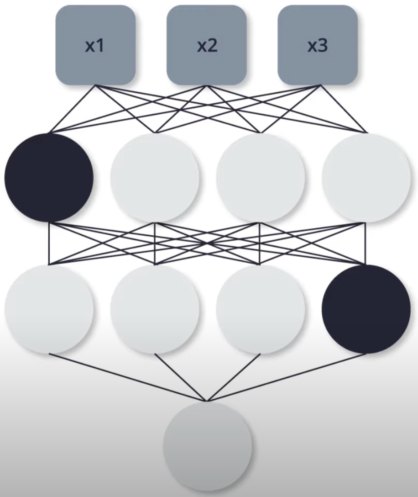

# Welcome to the Course

Introduction course on Deep Learning with TensorFlow for software developers

- Machine learning can very math-heavy

- TensorFlow and Keras, high level API of Deep Learning which encapsulate much of the complexity

- Keep things as simple as possible without going into the details behind machine learning (underlying math and technical details)

- Understand how deep learning neural networks work

- Build and train your own deep neural network with TensorFlow and Keras

- How to deploy your model on different platform

## Artificial intelligence, machine learning, neural network, and deep learning


**Artificial Intelligence:** A field of computer science that aims to make computers achieve human-style intelligence. There are many approaches to reaching this goal, including machine learning and deep learning.

- **Machine Learning:** A set of related techniques in which computers are trained to perform a particular task rather than by explicitly programming them.

- **Neural Network:** A construct in Machine Learning inspired by the network of neurons (nerve cells) in the biological brain. Neural networks are a fundamental part of deep learning

- **Deep Learning:** A subfield of machine learning that uses multi-layered neural networks. Often, “machine learning” and “deep learning” are used interchangeably.

Machine learning and deep learning also have many subfields, branches, and special techniques. A notable example of this diversity is the separation of **Supervised Learning** and **Unsupervised Learning**.

## Application of Machine Learning

- Detect skin cancer (trained on hundreds of thousands of skin images)
- Autonomous vehicles that can drive themself using only the data from various sensors
- Teach computer how to play games
- Writing software that can potentially change the lives of people all over the world

## Prerequisites

Programming language: Python (numpy)

Develop environment: Google's Colab (Colab is a virtual machine)[examples/courses/udacity_intro_to_tensorflow_for_deep_learning/l01c01_introduction_to_colab_and_python.ipynb at master · tensorflow/examples · GitHub](https://github.com/tensorflow/examples/blob/master/courses/udacity_intro_to_tensorflow_for_deep_learning/l01c01_introduction_to_colab_and_python.ipynb)

# Introduction to Machine Learning

## Interview with Sebastin

- Co-funded Udacity, founded Google-X, professor at Stanford

- Stay open-minded

- Machine learning is actually simpler than programming computers

- Train the computer using examples and computer finds its own rules

## What is Machine Learning?

Figure out the relationship between particular inputs and outputs


In Machine learning, the algorithm has to be learned


Machine Learning uses neural network to learn the relation between these inputs and outputs

Neural network: 

- A stack of layers where each layer consists of some predefined Math and internal variables

- Tuning the internal variables in the layers until the network learns to produce the output givens the inputs through thousands or even millions of iterations over the input and output data

- There are many types of neural network architectures. However, no matter what architecture you choose, <u>the math it contains (what calculations are being performed, and in what order) is not modified during training. Instead, it is the internal variables (“weights” and “biases”) which are updated during training</u>.

You can think of Machine learning algorithm as a function that can tune variables in order to correctly map some inputs and some outputs

## Colab: Converting Celsius to Fahrenheit

[examples/courses/udacity_intro_to_tensorflow_for_deep_learning/l02c01_celsius_to_fahrenheit.ipynb at master · tensorflow/examples · GitHub](https://github.com/tensorflow/examples/blob/master/courses/udacity_intro_to_tensorflow_for_deep_learning/l02c01_celsius_to_fahrenheit.ipynb)

### Import dependencies

```python
import tensorflow as tf
import numpy as np
import logging
```

### Some Machine Learning terminology

- **Feature** — The input(s) to our model.

- **Labels** — The output our model predicts.

- **Example** — A pair of inputs/outputs used during training.

### Create the model

We will use the simplest possible model we can, a <u>Dense network</u>. Since the problem is straightforward, this network will require only a <u>single layer</u>, with a <u>single neuron</u>.

#### Build a layer

`input_shape=[1]` — This specifies that the input to this layer is a single value.

`units=1` — This specifies the number of neurons in the layer. The number of neurons defines how many internal variables the layer has to try to learn how to solve the problem. (In a multi-layered network, the size and shape of the layer would need to match the `input_shape` of the next layer.)

```python
l0 = tf.keras.layers.Dense(units=1, input_shape=[1])
```

#### Assemble layers into the model

The Sequential model definition takes a list of layers as an argument, specifying the calculation order from the input to the output.

```python
model = tf.keras.Sequential([l0])
```

### Compile the model, with loss and optimizer functions

Before training, the model has to be compiled. When compiled for training, the model is given:

- **Loss function** — A way of measuring how far off predictions are from the desired outcome. (The measured difference is called the "loss".)

- **Optimizer function** — A way of adjusting internal values in order to reduce the loss.

These are used during training (`model.fit()`, below) to first calculate the loss at each point, and then improve it.

```python
model.compile(loss='mean_squared_error',
              optimizer=tf.keras.optimizers.Adam(0.1))
```

The loss function ([mean squared error](https://en.wikipedia.org/wiki/Mean_squared_error)) and the optimizer ([Adam](https://machinelearningmastery.com/adam-optimization-algorithm-for-deep-learning/)) used here are standard for simple models like this one, but many others are available. It is not important to know how these specific functions work at this point.

Learning rate (`0.1` in the code above) is the step size taken when adjusting values in the model. 

- If the value is too small, it will take too many iterations to train the model. 

- Too large, and accuracy goes down.

- Finding a good value often involves some trial and error, but the range is usually within 0.001 (default), and 0.1

### Train the model

During training, the model takes in Celsius values, performs a calculation using the current internal variables (called "weights") and outputs values which are meant to be the Fahrenheit equivalent. Since <u>the weights are initially set randomly</u>, the output will not be close to the correct value. The difference between the actual output and the desired output is calculated using the **loss function**, and the **optimizer function** directs how the weights should be adjusted.

- The first argument is the inputs

- the second argument is the desired outputs.

- The `epochs` argument specifies <u>how many times this cycle should be run.</u>

- the `verbose` argument controls how much output the method produces.

```python
history = model.fit(celsius_q, fahrenheit_a, epochs=500, verbose=False)
print("Finished training the model")
```

### Display training statistics

The `fit` method returns a history object. We can use this object to plot how the loss of our model goes down after each training epoch. A high loss means that the Fahrenheit degrees the model predicts is far from the corresponding value in `fahrenheit_a`.

```python
import matplotlib.pyplot as plt
plt.xlabel('Epoch Number')
plt.ylabel("Loss Magnitude")
plt.plot(history.history['loss'])
```

As you can see, our model improves very quickly at first, and then has a steady, slow improvement until it is very near "perfect" towards the end.


### Use the model to predict values

Summary

- We created a model with a Dense layer
- **We trained it with 3500 examples (7 pairs, over 500 epochs).**

Our model tuned the variables (weights) in the Dense layer until it was able to return the correct Fahrenheit value for any Celsius value. (Remember, 100 Celsius was not part of our training data.)

```python
print(model.predict([100.0]))
```

### Looking at the layer weights

Since the form is the same, the variables should converge on the standard values of 1.8 and 32, which is exactly what happened.

With additional neurons, additional inputs, and additional outputs, the formula becomes much more complex, but the idea is the same.

```python
print("These are the layer variables: {}".format(l0.get_weights()))

## Output:
## These are the layer variables: [array([[1.8235865]], dtype=float32), array([28.957005], dtype=float32)]
```

### More Dense layers with different units

```python
l0 = tf.keras.layers.Dense(units=4, input_shape=[1])
l1 = tf.keras.layers.Dense(units=4)
l2 = tf.keras.layers.Dense(units=1)
model = tf.keras.Sequential([l0, l1, l2])
model.compile(loss='mean_squared_error', optimizer=tf.keras.optimizers.Adam(0.1))
model.fit(celsius_q, fahrenheit_a, epochs=500, verbose=False)
print("Finished training the model")
print(model.predict([100.0]))
print("Model predicts that 100 degrees Celsius is: {} degrees Fahrenheit".format(model.predict([100.0])))
print("These are the l0 variables: {}".format(l0.get_weights()))
print("These are the l1 variables: {}".format(l1.get_weights()))
print("These are the l2 variables: {}".format(l2.get_weights()))
```

## Recap


```python
l0 = tf.keras.layers.Dense(units=1, input_shape=[1]) 
model = tf.keras.Sequential([l0])
model.compile(loss='mean_squared_error', optimizer=tf.keras.optimizers.Adam(0.1))
history = model.fit(celsius_q, fahrenheit_a, epochs=500, verbose=False)
model.predict([100.0])
```

### The Training Process

The training process (happening in `model.fit(...)`) is really about <u>tuning the internal variables of the networks to the best possible values</u>, so that they can map the input to the output. This is achieved through an <u>optimization process</u> called **Gradient Descent,** which uses Numeric Analysis to find the best possible values to the internal variables of the model.

To do machine learning, you don't really need to understand these details. But for the curious: <u>gradient descent iteratively adjusts parameters, nudging them in the correct direction a bit at a time until they reach the best values</u>. In this case “best values” means that nudging them any more would make the model perform worse. The function that measures how good or bad the model is during each iteration is called the “loss function”, and the goal of each nudge is to “minimize the loss function.”

The training process starts with a forward pass, where the input data is fed to the neural network (see Fig.1). Then the model applies its internal math on the input and internal variables to predict an answer ("Model Predicts a Value" in Fig. 1).

In our example, the input was the degrees in Celsius, and the model predicted the corresponding degrees in Fahrenheit.


Once a value is predicted, the difference between that predicted value and the correct value is calculated. This difference is called the loss, and it's a measure of how well the model performed the mapping task. The value of the loss is calculated using a loss function, which we specified with the loss parameter when calling `model.compile()`.

After the loss is calculated, the internal variables (weights and biases) of all the layers of the neural network are adjusted, so as to minimize this loss — that is, to make the output value closer to the correct value (see Fig. 2).


**This optimization process is called Gradient Descent**. The specific algorithm used to calculate the new value of each internal variable is specified by the optimizer parameter when calling `model.compile(...)`. In this example we used the `Adam` optimizer.

It is not required for this course, but if you're interested in learning more details about how the training process works, you can look at the [lesson on reducing loss in Google’s machine learning crash course](https://developers.google.com/machine-learning/crash-course/reducing-loss/video-lecture).

By now you should know what the following terms are:

- **Feature:** The input(s) to our model
- **Examples:** <u>An input/output pair used for training</u>
- **Labels:** The output of the model
- **Layer:** A collection of nodes connected together within a neural network.
- **Model:** The representation of your neural network
- **Dense and Fully Connected (FC):** Each node in one layer is connected to each node in the previous layer.
- **Weights and biases:** The internal variables of model
- **Loss:** The discrepancy between the desired output and the actual output
- **MSE:** Mean squared error, a type of loss function that counts a small number of large discrepancies as worse than a large number of small ones.
- **Gradient Descent:** An algorithm that changes the internal variables a bit at a time to gradually reduce the loss function.
- **Optimizer:** **A specific implementation of the gradient descent algorithm**. (There are many algorithms for this. In this course we will only use the “Adam” Optimizer, which stands for *ADAptive with Momentum*. It is considered the best-practice optimizer.)
- **Learning rate:** The “step size” for loss improvement during gradient descent.
- **Batch:** The set of examples used during training of the neural network
- **Epoch:** A full pass over the entire training dataset
- **Forward pass:** The computation of output values from input
- **Backward pass (backpropagation):** The calculation of internal variable adjustments according to the optimizer algorithm, starting from the output layer and working back through each layer to the input.

## Dense Layers

A neural network is a stack of layers, where each layer is made up of units (neurons). The neurons in each layer can be connected to neurons in the following layer.


```python
hidden = keras.layer.Dense(unit=2, input_shape=[3])
output = keras.layer.Dense(unit=1)
model = tf.keras.Sequential( [ hidden, output ] )
```

A layer has math that's applied to internal variables (weights and biases) in it. The internal variables are. The internal variables get adjusted durning the training process to enable the model to best match the inputs and outputs. **What's important to note however, is that the math never changes.** The training process only changes `w` and `b` variables to be able to match the input and output.


We can never match the variables against the target algorithm. How could we? We don't even know the target algorithm. That's why we use machine learning in the first place. Otherwise, we could just hard code the algorithm as a function. Without knowing the target algorithm, we would just give a model a number of layers and weights to tune. Then, we just hope the model will be able to figure out how to tune the model algorithm to match the input and output.

In general, when we do machine learning, we typically just try different neural networks with different numbers of layers and neurons in a trial and error away and see if the model is able to solve the problem during the training phase.

===========================================

=============== Section 1 end ================

===========================================

# Your First Model - Fashion MNIST

## Interview with Sebastin

- More general intelligence training in network to do more than one task

- Bring it to market

- The great vision of machine learning it that it allows computer to observe experts with their work, and pick up the patterns and help other people to be as good as the best experts. Could be in law, in medicine, in driving cars

- Deep learning is another tool can help you accomplish a task

- Every network can be connected differently

## Introduction

- Create a neural network that can recognize items of clothing and images

- **Input data** is called **Features**. (input image)

- **Output** data is called **Labels**. (correct output that specifies the piece of clothing the image depicts)

- We need lots of examples (feature-label pairs) to train neural network to recognize the articles of clothing

- **Fashion MNIST** dataset

## Fashion MNIST Dataset

- **Fashion MNIST** dataset consists of 28 * 28 pixel grey-scale images of clothing
- All 10 different items of clothing
- In total, Fashion MNIST dataset contains 70,000 images


We'll use 60,000 images to train the neural networks **(Training Data)**. Then, we'll use the remaining 10,000 images to test how well our neural network can recognize the items of clothing **(Test Data)**.


## Neural Network

- **Input** is an array of length 784 because each image in dataset is 28 pixels in height and 28 pixels in width. Since neural network takes in a vector as input, these 28 by 28 images are converted into a one dimensional array of 28 by 28, so 784 **units**.

- The process of converting a 2D image into a vector is called flattening and code. This is perform through a flattened layer. This layer transforms each image from a 2D array of 28 by 28 pixels, each having a single byte for the grey-scale, to a 1D array of 784 pixels

- The input will be fully connected to the first dense layer of the network where we've chosen 128 units. We use the Rectified Linear Unit (ReLU) here because the problem is more difficult to solve than converting Celsius to Fahrenheit ReLU is a mathematical function which give network more power. In essence, it's a small mathematical extension to our dense layer that allows network to solve more complex problem

- Finally, the last layer also known as output layer, contains 10 units (10 types of article of clothing). Each of these output values will specify the probability that the images of that specific type of clothing. These number describe the confidence the model has that an input image is one of 10 different articles of clothing. For example, the model has 85% certain that this is a shirt. Since these 10 output values refer to probabilities, if you sum them up, the result will be one. These 10 numbers are also called probability distribution or a distribution of probabilities for each of the output classes of clothing.

- We need the output layer to create these probability values for each of our classes.

- Create these probabilities using **softmax** statement

 The ReLU function gives an output of 0 if the input is negative or zero, and if input is positive, then the output will be equal to the input.

ReLU gives the network the ability to solve nonlinear problems.

ReLU is a type of activation function. There several of these functions (ReLU, Sigmoid, tanh, ELU), but ReLU is used most commonly and serves as a good default. To build and use models that include ReLU, you don’t have to understand its internals. But, if you want to know more, see [this article on ReLU in Deep Learning](https://www.kaggle.com/dansbecker/rectified-linear-units-relu-in-deep-learning).

Let’s review some of the new terms that were introduced in this lesson:

- **Flattening:** The process of converting a 2d image into 1d vector
- **ReLU:** An activation function that allows a model to solve nonlinear problems
- **Softmax:** A function that provides probabilities for each possible output class
- **Classification:** A machine learning model used for distinguishing among two or more output categories

## Training and Testing

When training a Machine Learning model, you always need to split your dataset into at least two different partitions

- The data you use for training

- The data you use for testing

Once the neural network has been trained, we want to test on data that it hasn't seen before to see how well it performs. (Not to memory but have learned the general way)

You show some data that is representative of the problem you're trying to solve. we want to test its performance on images it has never seen before. If we don't do this, we wouldn't know if the neural network has decided to memorize the images it saw during training, or it has truly been able to understand the difference between these items of clothing

[TensorFlow Datasets](https://medium.com/tensorflow/introducing-tensorflow-datasets-c7f01f7e19f3) provides a collection of datasets ready to use with TensorFlow.

Datasets are typically split into different subsets to be used at various stages of training and evaluation of the neural network. In this section we talked about:

- **Training Set:** The data used for training the neural network.
- **Test set:** The data used for testing the final performance of our neural network.

The test dataset was used to try the network on data it has never seen before. This enables us to see how the model generalizes beyond what it has seen during training, and that it has not simply memorized the training examples.

In the same way, it is common to use what is called a **Validation dataset**. <u>This dataset is not used for training. Instead, it it used to test the model during training.</u> This is done after some set number of training steps, and gives us an indication of how the training is progressing. For example, if the loss is being reduced during training, but accuracy deteriorates on the validation set, that is an indication that the model is memorizing the test set.

<u>The validation set is used again when training is complete to measure the final accuracy of the model.</u>

You can read more about all this in the [Training and Test Sets lesson of Google’s Machine Learning Crash Course](https://developers.google.com/machine-learning/crash-course/training-and-test-sets/video-lecture).

## Colab: Fashion MNIST

[examples/courses/udacity_intro_to_tensorflow_for_deep_learning/l03c01_classifying_images_of_clothing.ipynb at master · tensorflow/examples · GitHub](https://github.com/tensorflow/examples/blob/master/courses/udacity_intro_to_tensorflow_for_deep_learning/l03c01_classifying_images_of_clothing.ipynb)

### Install and import dependencies

```shell
!pip install -U tensorflow_datasets


## Local
pip3 install -U tensorflow_datasets
```

```python
import tensorflow as tf
```

```python
# Import TensorFlow Datasets
import tensorflow_datasets as tfds
tfds.disable_progress_bar()

# Helper libraries
import math
import numpy as np
import matplotlib.pyplot as plt
```

```python
import logging
logger = tf.get_logger()
logger.setLevel(logging.ERROR)
```

### Import the Fashion MNIST dataset

This guide uses the [Fashion MNIST](https://github.com/zalandoresearch/fashion-mnist) dataset, which contains 70,000 grayscale images in 10 categories. The images show individual articles of clothing at low resolution (28 × 28 pixels).


Loading the dataset returns metadata as well as a *training dataset* and *test dataset*.

- The model is trained using `train_dataset`.
- The model is tested against `test_dataset`.

```python
dataset, metadata = tfds.load('fashion_mnist', as_supervised=True, with_info=True)
train_dataset, test_dataset = dataset['train'], dataset['test']
```

The images are 28 × 28 arrays, with pixel values in the range `[0, 255]`. The *labels* are an array of integers, in the range `[0, 9]`. These correspond to the *class* of clothing the image represents:

| Label | Class       |
| ----- | ----------- |
| 0     | T-shirt/top |
| 1     | Trouser     |
| 2     | Pullover    |
| 3     | Dress       |
| 4     | Coat        |
| 5     | Sandal      |
| 6     | Shirt       |
| 7     | Sneaker     |
| 8     | Bag         |
| 9     | Ankle boot  |

Each image is mapped to a single label. Since the *class names* are not included with the dataset, store them here to use later when plotting the images:

```python
class_names = metadata.features['label'].names
print("Class names: {}".format(class_names))

# Class names: ['T-shirt/top', 'Trouser', 'Pullover', 'Dress', 'Coat', 'Sandal', 'Shirt', 'Sneaker', 'Bag', 'Ankle boot']
```

```python
num_train_examples = metadata.splits['train'].num_examples
num_test_examples = metadata.splits['test'].num_examples
print("Number of training examples: {}".format(num_train_examples))
print("Number of test examples:     {}".format(num_test_examples))

# Number of training examples: 60000
# Number of test examples:     10000
```

### Preprocess the data

The value of each pixel in the image data is an integer in the range `[0,255]`. For the model to work properly, these values need to be normalized to the range `[0,1]`. So here we create a normalization function, and then apply it to each image in the test and train datasets.

```python
def normalize(images, labels):
  images = tf.cast(images, tf.float32)
  images /= 255
  return images, labels

# The map function applies the normalize function to each element in the train
# and test datasets
train_dataset =  train_dataset.map(normalize)
test_dataset  =  test_dataset.map(normalize)

# The first time you use the dataset, the images will be loaded from disk
# Caching will keep them in memory, making training faster
train_dataset =  train_dataset.cache()
test_dataset  =  test_dataset.cache()
```

### Explore the processed data

```python
# Take a single image, and remove the color dimension by reshaping
for image, label in test_dataset.take(1):
  break
image = image.numpy().reshape((28,28))

# Plot the image - voila a piece of fashion clothing
plt.figure()
plt.imshow(image, cmap=plt.cm.binary)
plt.colorbar()
plt.grid(False)
plt.show()
```

Display the first 25 images from the *training set* and display the class name below each image. Verify that the data is in the correct format and we're ready to build and train the network.

```python
plt.figure(figsize=(10,10))
for i, (image, label) in enumerate(train_dataset.take(25)):
    image = image.numpy().reshape((28,28))
    plt.subplot(5,5,i+1)
    plt.xticks([])
    plt.yticks([])
    plt.grid(False)
    plt.imshow(image, cmap=plt.cm.binary)
    plt.xlabel(class_names[label])
plt.show()
```

### Build the model

#### Setup the layers

This network has three layers:

- **input** `tf.keras.layers.Flatten` — This layer transforms the images from a 2d-array of 28 × 28 pixels, to a 1d-array of 784 pixels (28*28). Think of this layer as unstacking rows of pixels in the image and lining them up. This layer has no parameters to learn, as it only reformats the data.

- **"hidden"** `tf.keras.layers.Dense`— A densely connected layer of 128 neurons. Each neuron (or node) takes input from all 784 nodes in the previous layer, weighting that input according to hidden parameters which will be learned during training, and outputs a single value to the next layer.

- **output** `tf.keras.layers.Dense` — A 128-neuron, followed by 10-node *softmax* layer. Each node represents a class of clothing. As in the previous layer, the final layer takes input from the 128 nodes in the layer before it, and outputs a value in the range `[0, 1]`, representing the probability that the image belongs to that class. The sum of all 10 node values is 1.

```python
model = tf.keras.Sequential([
    tf.keras.layers.Flatten(input_shape=(28, 28, 1)),
    tf.keras.layers.Dense(128, activation=tf.nn.relu),
    tf.keras.layers.Dense(10, activation=tf.nn.softmax)
])
```

#### Compile the model

Before the model is ready for training, it needs a few more settings. These are added during the model's *compile* step:

- *Loss function* — An algorithm for measuring how far the model's outputs are from the desired output. The goal of training is this measures loss.
- *Optimizer* —An algorithm for adjusting the inner parameters of the model in order to minimize loss.
- *Metrics* —Used to monitor the training and testing steps. The following example uses *accuracy*, the fraction of the images that are correctly classified.

```python
model.compile(optimizer='adam',
              loss=tf.keras.losses.SparseCategoricalCrossentropy(),
              metrics=['accuracy'])
```

#### Train the model

First, we define the iteration behavior for the train dataset:

1. Repeat forever by specifying `dataset.repeat()` (the `epochs` parameter described below limits how long we perform training).
2. The `dataset.shuffle(60000)` randomizes the order so our model cannot learn anything from the order of the examples.
3. And `dataset.batch(32)` tells `model.fit` to <u>use batches of 32 images and labels when updating the model variables.</u>

Training is performed by calling the `model.fit` method:

1. Feed the training data to the model using `train_dataset`.
2. The model learns to associate images and labels.
3. The `epochs=5` parameter limits training to 5 full iterations of the training dataset, so a total of 5 * 60000 = 300000 examples.

```python
BATCH_SIZE = 32
train_dataset = train_dataset.cache().repeat().shuffle(num_train_examples).batch(BATCH_SIZE)
test_dataset = test_dataset.cache().batch(BATCH_SIZE)
```

```python
model.fit(train_dataset, epochs=5, steps_per_epoch=math.ceil(num_train_examples/BATCH_SIZE))

# steps_per_epoch: Total number of steps (batches of samples) before declaring one epoch finished and starting the next epoch.

# Epoch 1/5
# 1875/1875 [==============================] - 6s 3ms/step - loss: 0.2728 - accuracy: 0.9003
# Epoch 2/5
# 1875/1875 [==============================] - 6s 3ms/step - loss: 0.2676 - accuracy: 0.9017
# Epoch 3/5
# 1875/1875 [==============================] - 6s 3ms/step - loss: 0.2564 - accuracy: 0.9044
# Epoch 4/5
# 1875/1875 [==============================] - 6s 3ms/step - loss: 0.2417 - accuracy: 0.9086
# Epoch 5/5
# 1875/1875 [==============================] - 6s 3ms/step - loss: 0.2392 - accuracy: 0.9117
# <keras.callbacks.History at 0x7f13d0766fe0> 
```

As the model trains, the loss and accuracy metrics are displayed.

#### Evaluate accuracy

Compare how the model performs on the test dataset

```python
test_loss, test_accuracy = model.evaluate(test_dataset, steps=math.ceil(num_test_examples/32))
print('Accuracy on test dataset:', test_accuracy)
```

As it turns out, the accuracy on the test dataset is smaller than the accuracy on the training dataset. This is completely normal, since the model was trained on the `train_dataset`. When the model sees images it has never seen during training, (that is, from the `test_dataset`), we can expect performance to go down.

#### Make predictions and explore

```python
for test_images, test_labels in test_dataset.take(1): # take the first batch
  test_images = test_images.numpy()
  test_labels = test_labels.numpy()
  predictions = model.predict(test_images)
```

```python
predictions.shape

# (32, 10)
```

```python
predictions[0]

# array([1.9581352e-05, 7.3813733e-09, 1.9421440e-02, 1.8915347e-05,
#       9.5107049e-01, 6.7366539e-09, 2.9468466e-02, 1.0025023e-14,
#       1.0883246e-06, 7.5907652e-10], dtype=float32)
```

A prediction is an array of 10 numbers. These describe the "confidence" of the model that the image corresponds to each of the 10 different articles of clothing. <u>We can see which label has the highest confidence value</u>:

```python
np.argmax(predictions[0])

# 4
```

```python
test_labels[0]

# 4
```

We can graph this to look at the full set of 10 class predictions

```python
def plot_image(i, predictions_array, true_labels, images):
  predictions_array, true_label, img = predictions_array[i], true_labels[i], images[i]
  plt.grid(False)
  plt.xticks([])
  plt.yticks([])

  plt.imshow(img[...,0], cmap=plt.cm.binary)

  predicted_label = np.argmax(predictions_array)
  if predicted_label == true_label:
    color = 'blue'
  else:
    color = 'red'

  plt.xlabel("{} {:2.0f}% ({})".format(class_names[predicted_label],
                                100*np.max(predictions_array),
                                class_names[true_label]),
                                color=color)

def plot_value_array(i, predictions_array, true_label):
  predictions_array, true_label = predictions_array[i], true_label[i]
  plt.grid(False)
  plt.xticks([])
  plt.yticks([])
  thisplot = plt.bar(range(10), predictions_array, color="#777777")
  plt.ylim([0, 1]) 
  predicted_label = np.argmax(predictions_array)

  thisplot[predicted_label].set_color('red')
  thisplot[true_label].set_color('blue')
```

Let's look at the 0th image, predictions, and prediction array.

```python
i = 0
plt.figure(figsize=(6,3))
plt.subplot(1,2,1)
plot_image(i, predictions, test_labels, test_images)
plt.subplot(1,2,2)
plot_value_array(i, predictions, test_labels)
```

Let's plot several images with their predictions. Correct prediction labels are blue and incorrect prediction labels are red. The number gives the percent (out of 100) for the predicted label. Note that it can be wrong even when very confident.

```python
# Plot the first X test images, their predicted label, and the true label
# Color correct predictions in blue, incorrect predictions in red
num_rows = 5
num_cols = 3
num_images = num_rows*num_cols
plt.figure(figsize=(2*2*num_cols, 2*num_rows))
for i in range(num_images):
  plt.subplot(num_rows, 2*num_cols, 2*i+1)
  plot_image(i, predictions, test_labels, test_images)
  plt.subplot(num_rows, 2*num_cols, 2*i+2)
  plot_value_array(i, predictions, test_labels)
```

## Celsius vs MNIST


Different kind of neural network can solve different kind of problems

- Regression: Predict single number from an input e.g. converting Celsius to Fahrenheit

- Classification: Given the input, the model will give us output a probability distribution, specifying the confidence the input is of a certain class


All of the main takeaway point is that all of our machine learning models is one of these categories. A regression or classification model.

## Summary

In this lesson we trained a neural network to classify images of articles of clothing. To do this we used the Fashion MNIST dataset, which contains 70,000 greyscale images of articles of clothing. We used 60,000 of them to train our network and 10,000 of them to test its performance. In order to feed these images into our neural network we had to flatten the 28 × 28 images into 1d vectors with 784 elements. Our network consisted of a fully connected layer with 128 units (neurons) and an output layer with 10 units, corresponding to the 10 output labels. These 10 outputs represent probabilities for each class. The softmax activation function calculated the probability distribution.

We also learned about the differences between regression and classification problems.

- **Regression:** A model that outputs a single value. For example, an estimate of a house’s value.
- **Classification:** A model that outputs a probability distribution across several categories. For example, in Fashion MNIST, the output was 10 probabilities, one for each of the different types of clothing. Remember, we use Softmax as the activation function in our last Dense layer to create this probability distribution.

# Introduction to CNNs

## Interview with Sebastian

- Build in CNN is called invariance 
  
  - location variance is hard coded using Convolutional neural networks

- I have learned never to say never

- Convolutional neural networks were invented in 1989
  
  - Data make it different

- Focus on find the right data

## Introduction

- Convolutional neural network, which is commonly abbreviated as CNNs

- CNNs have proven to achieve higher accuracies when classifying images than simple pure dense neural networks

- Convolutional neural network is an the primary reason for breakthroughs in computer vision application using machine learning

- We'll create a CNN-base image classifier from scratch  using TensorFlow and Keras

- Two main concepts in Convolutional neural network are convolutions and maxpooling

## Convolutions

- Assume this greyscale image was 6 pixel in height and 6 pixels in width

- Computer interpret this image as a two-dimensional array of pixels

- Since this image is greyscale, every pixel will have a value between zero to 255 (zero being black and 255 corresponding to white)


As you know, when we process this image in our neural network, the pixel value will be normalized to a value between zero and one.

The idea of convolutional layer is to create another grid of numbers called the kernel or filter (three by three matrix).


Then we can scan this kernel across this image. The image size is six by six and the kernel is three by three. A convolutional layer applies to kernel over the regions of the input image.

Performing a kernel convolution on this pixel value of 25. The first step is to center our kernel over the pixel that we want


We take each corresponding image and kernel value, multiply them together and then we sum up the whole thing and assign it to the green pixel in convoluted image


However, what happens to the pixels on the edges? There are a couple of options:

- Not using this pixel in the convolution (you'll lose information about the image because the convoluted image will become much smaller than the original image)

- Common option is do something called zero-padding: add pixels with zero around the original image (without losing information)


A kernel convolution is just this process of applying the kernel or filter across different areas of the input image. Convolutions are another type of Keras layer we will use.

## Max Pooling

In short, max pooling is just the process of reducing the size of the input image by summarizing regions.

In order to perform max pooling, we need to select two things:

- a grid, which is the pool size

- a stride, which determines the number of pixels to slide the window across the image


Select the pixel with the greatest value, then slide the grid two pixels at each step and continue this process until we cover the entire convoluted image


The result will be a new image that's smaller than the original image and you can see we down-sampled the original image. We end with a new image that's half the size of original image. The size of this new image will vary depending on your choice of the grid size and stride.


## Recap

We just learned about convolutions and max pooling.

A convolution is the process of applying a filter (“kernel”) to an image. Max pooling is the process of reducing the size of the image through downsampling.

As you will see in the following Colab notebook, convolutional layers can be added to the neural network model using the `Conv2D` layer type in Keras. This layer is similar to the Dense layer, and has weights and biases that need to be tuned to the right values. The `Conv2D` layer also has kernels (filters) whose values need to be tuned as well. So, in a `Conv2D` layer the values inside the filter matrix are the variables that get tuned in order to produce the right output.

Here are some of terms that were introduced in this lesson:

- **CNNs:** Convolutional neural network. That is, a network which has at least one convolutional layer. A typical CNN also includes other types of layers, such as pooling layers and dense layers.
- **Convolution:** The process of applying a kernel (filter) to an image
- **Kernel / filter:** A matrix which is smaller than the input, used to transform the input into chunks
- **Padding:** Adding pixels of some value, usually 0, around the input image
- **Pooling** The process of reducing the size of an image through downsampling.There are several types of pooling layers. For example, average pooling converts many values into a single value by taking the average. However, maxpooling is the most common.
- **Maxpooling**: A pooling process in which many values are converted into a single value by taking the maximum value from among them.
- **Stride:** the number of pixels to slide the kernel (filter) across the image.
- **Downsampling:** The act of reducing the size of an image

## Colab: Fashion MNIST with CNNs

https://github.com/tensorflow/examples/blob/master/courses/udacity_intro_to_tensorflow_for_deep_learning/l04c01_image_classification_with_cnns.ipynb

(Same as previous **Colab: Fashion MNIST**)

### Build the model

```pyhton
model = tf.keras.Sequential([
    tf.keras.layers.Conv2D(32, (3,3), padding='same', activation=tf.nn.relu,
                           input_shape=(28, 28, 1)),
    tf.keras.layers.MaxPooling2D((2, 2), strides=2),
    tf.keras.layers.Conv2D(64, (3,3), padding='same', activation=tf.nn.relu),
    tf.keras.layers.MaxPooling2D((2, 2), strides=2),
    tf.keras.layers.Flatten(),
    tf.keras.layers.Dense(128, activation=tf.nn.relu),
    tf.keras.layers.Dense(10, activation=tf.nn.softmax)
])
```

This network layers are:

- **"convolutions"** `tf.keras.layers.Conv2D and MaxPooling2D`— Network start with two pairs of Conv/MaxPool. The first layer is a Conv2D filters (3,3) being applied to the input image, retaining the original image size by using padding, and creating 32 output (convoluted) images (so this layer creates 32 convoluted images of the same size as input). After that, the 32 outputs are reduced in size using a MaxPooling2D (2,2) with a stride of 2. The next Conv2D also has a (3,3) kernel, takes the 32 images as input and creates 64 outputs which are again reduced in size by a MaxPooling2D layer. So far in the course, we have described what a Convolution does, but we haven't yet covered how you chain multiples of these together. We will get back to this in lesson 4 when we use color images. At this point, it's enough if you understand the kind of operation a convolutional filter performs

- **output** `tf.keras.layers.Dense` — A 128-neuron, followed by 10-node *softmax* layer. Each node represents a class of clothing. As in the previous layer, the final layer takes input from the 128 nodes in the layer before it, and outputs a value in the range `[0, 1]`, representing the probability that the image belongs to that class. The sum of all 10 node values is 1.

> Note: Using `softmax` activation and `SparseCategoricalCrossentropy()` has issues and which are patched by the `tf.keras` model. A safer approach, in general, is to use a linear output (no activation function) with `SparseCategoricalCrossentropy(from_logits=True)`.

### Compile the model

```python
model.compile(optimizer='adam',
              loss=tf.keras.losses.SparseCategoricalCrossentropy(),
              metrics=['accuracy'])
```

Train the model

```python
BATCH_SIZE = 32
train_dataset = train_dataset.cache().repeat().shuffle(num_train_examples).batch(BATCH_SIZE)
test_dataset = test_dataset.cache().batch(BATCH_SIZE)

model.fit(train_dataset, epochs=10, steps_per_epoch=math.ceil(num_train_examples/BATCH_SIZE))
```

## Summary

### A Comprehensive Guide to Convolutional Neural Networks — the ELI5 way

https://towardsdatascience.com/a-comprehensive-guide-to-convolutional-neural-networks-the-eli5-way-3bd2b1164a53

#### Why ConvNets over Feed-Forward Neural Nets?

- A ConvNet is able to **successfully capture the Spatial and Temporal dependencies** in an image through the application of relevant filters.

#### Input Image


- You can imagine how computationally intensive things would get once the images reach dimensions, say 8K (7680×4320). The role of ConvNet is to reduce the images into a form that is easier to process, without losing features that are critical for getting a good prediction.

- This is important when we are to design an architecture that is not only good at learning features but also scalable to massive datasets.

#### Convolutional layer - The kernel

- The objective of the Convolution Operation is to **extract the high-level features** such as edges, from the input image. ConvNets need not be limited to only one Convolutional Layer. Conventionally, the first ConvLayer is responsible for capturing the Low-Level features such as edges, color, gradient orientation, etc. With added layers, the architecture adapts to the High-Level features as well, giving us a network that has a wholesome understanding of images in the dataset, similar to how we would.
- There are two types of results to the operation — one in which the convolved feature is reduced in dimensionality as compared to the input, and the other in which the dimensionality is either increased or remains the same.
  - When we augment the 5x5x1 image into a 6x6x1 image and then apply the 3x3x1 kernel over it, we find that the convolved matrix turns out to be of dimensions 5x5x1. Hence the name — **Same Padding**.
  - On the other hand, if we perform the same operation without padding, we are presented with a matrix that has dimensions of the Kernel (3x3x1) itself — **Valid Padding**.
- [GitHub - vdumoulin/conv_arithmetic: A technical report on convolution arithmetic in the context of deep learning](https://github.com/vdumoulin/conv_arithmetic)

#### Pooling layer

- Similar to the Convolutional Layer, the Pooling layer is responsible for reducing the spatial size of the Convolved Feature. This is to **decrease the computational power required to process the data** through dimensionality reduction. Furthermore, it is useful for **extracting dominant features** which are rotational and positional invariant, thus maintaining the process of effectively training the model.

- There are two types of Pooling: Max Pooling and Average Pooling. **Max Pooling** returns the **maximum value** from the portion of the image covered by the Kernel. On the other hand, **Average Pooling** returns the **average of all the values** from the portion of the image covered by the Kernel.

- The Convolutional Layer and the Pooling Layer, together form the i-th layer of a Convolutional Neural Network. Depending on the complexities in the images, the number of such layers may be increased for capturing low-level details even further, but at the cost of more computational power.

- After going through the above process, we have successfully enabled the model to understand the features.

#### Classification — Fully Connected Layer (FC Layer)


- Adding a Fully-Connected layer is a (usually) cheap way of learning non-linear combinations of the high-level features as represented by the output of the convolutional layer. The Fully-Connected layer is learning a possibly non-linear function in that space.

- Flatten the image into a column vector

- Over a series of epochs, the model is able to distinguish between dominating and certain low-level features in images and classify them using the **Softmax Classification** technique.

# Going Further With CNNs

## Interview with Sebastian

Overfitting is a result of something called the bias-variance trade-off, a network that has very few weights, can't learn that  much stuff, that's commonly called bias in machine learning. A network that has very many parameters can randomly pick a solution that you don't like because there's too many parameters and the variance of the solution might pick based on the data called variance. But the simple rule is, the more parameters you have relative to data, the more likely you are able to pick just a complete event solution as opposite to the good solution. There is two solutions:

- Holdout sets: you can divide the data. 90% for training and 10% for testing and do what's called cross validation where you check the performance on the testing set that you're training on it and when that error goes up, you stop training

- Constraint your network:put biases around your weights and I want to put them all as close to zero as possible and the more you constrained these weight or you feel you have, the lesser the overfit

- Training, test and validation dataset: if you touch your test dataset at many, many times, then eventually you'll start overfitting your test set, and that is really bad

Getting data in shape is really hard! 90% percent of your work is cleaning up data:)

## Introduction

In real application, we usually have to deal with high resolution color images of different sizes. One of the great advantage of CNNs is that they can also work with color images.

## Dogs and Cats Dataset

We're going to use cat and dog images from Microsoft image dataset. Each image in this dataset is labeled with either a one (dog) or a zero (cat). Even though Microsoft image dataset contains over three million labeled images of cats and dogs, only 25000 of them are public available. Training our CNN on this 25000 image will take a very long time. Therefore, in order to decrease the training time, we'll only use a small subset of images to training our CNNs. Our subset contains 2000 training images and 1000 validation images. Out of the 2000 training images, 1000 of them are dog images and 1000 of them are cat images. Two main challenges:

- Working with images of different sizes

- Working with color images

## Images of Different Sizes

Our first challenge will be dealing with images of different sizes. This is because of a neural network needs a fixed size input. Just flatten the images of different sizes won't work. When doing image classification, we always solve this problem by resizing all the images to the same size.


In this lesson, we'll choose to resize all images in dogs and cats dataset to be 150 pixels in height and 150 pixels in width. By resizing all images to the same size, this will guarantee  that when we flatten the images, they will result in 1D arrays of the same size


## Color Images Part 1

Computer interpret grey scale images as two-dimensional arrays. This two-dimensional arrays contain the corresponding pixel values of the grey scale images. The width and height of the two-dimensional array will be determined by size of the image


In a similar manner, computer interprets color images as three-dimensional arrays. The width and height of the three-dimensional array will be determined by the width and height of the image and the depth will be determined by the number of color channels.


Most of color images can be represented by three color channels. Namely, red, green and blue (RGB images). Altogether, these three channels combine to create a single image.


In RGB images, each color channel is represented by its own two-dimensional array. Since we have three channels, we end up with three two-dimensional arrays.


Therefore, in the case of RGB images, the depth of the three-dimensional array is just the stack of these two-dimensional arrays corresponding to the red, green and blue color channels.


Five pixels in height, five pixels in width and a depth of three.

## Color Images Part 2


## Convolutions with Color Images

We'll start by choosing a filter of particular size. The only different now is that the filter itself will be three-dimensional. The depth of the filter will be chosen to match the number of color channels and our color image. This is because we're going to convolve each color channel with its own two-dimensional filter. Therefore, if we're working with RGB  images, our 3D filter will have a depth of three.


For simplicity, let's assume that our RGB image is five by five pixels. We'll add zero padding to each of these arrays in order to avoid loosing information when performing the convolution.


The convolution will be carried out in exactly the same way as for greyscales images. The only difference is that now we have to perform three convolutions instead of one.


The resulting convolutional output is a two-dimensional array with the same width and height of the RGB image.


As we can see, a convolution with a single 3D filter produces a single convoluted output.


However, when working with CNNs, it's customary to use more than one 3D filter. If we use more than one filter, then we'll get one convoluted output per filter. For example, if we use three filters, then we'll get three convoluted outputs. Therefore, we can think of the convoluted output as being three-dimensional where the depth will correspond to the number of filters. Similarly, if you have 16 filters, the depth of the convolutional output will be 16


In code, we can control how many outputs a con2D layer creates by specifying the number of filters. We can also specify the size of the 3D filters by using the kernel size argument


Remember that when we train the CNN, the values in the three-dimensional kernels will be updated so as to minimize the loss function.

## Max Pooling with Color Images

Perform max-pooling in three-dimensional convoluted output. In essence, max-pooling works the same way as it did for grey-scale images. The only difference is that now ew have to perform max-pooling on each convoluted output.


We end up with 3 two-dimensional arrays where each two-dimensional array is half the size of its corresponding convoluted output.


We get a 3D array that is half the width and height of convoluted output, but has the same depth.

## Colab: Cats and Dogs

https://github.com/tensorflow/examples/blob/master/courses/udacity_intro_to_tensorflow_for_deep_learning/l05c01_dogs_vs_cats_without_augmentation.ipynb

In this tutorial, we will discuss how to classify images into pictures of cats or pictures of dogs. We'll build an image classifier using `tf.keras.Sequential` model and load data using `tf.keras.preprocessing.image.ImageDataGenerator`.

### importing packages

- os — to read files and directory structure
- numpy — for some matrix math outside of TensorFlow
- matplotlib.pyplot — to plot the graph and display images in our training and validation data

```python
import tensorflow as tf
from tensorflow.keras.preprocessing.image import ImageDataGenerator

import os
import matplotlib.pyplot as plt
import numpy as np

import logging
logger = tf.get_logger()
logger.setLevel(logging.ERROR)
```

### Data Loading

The dataset we are using is a filtered version of [Dogs vs. Cats](https://www.kaggle.com/c/dogs-vs-cats/data) dataset from Kaggle (ultimately, this dataset is provided by Microsoft Research). In this Colab however, we will make use of the class `tf.keras.preprocessing.image.ImageDataGenerator` which will read data from disk. We therefore need to directly download *Dogs vs. Cats* from a URL and unzip it to the Colab filesystem.

```python
_URL = 'https://storage.googleapis.com/mledu-datasets/cats_and_dogs_filtered.zip'
zip_dir = tf.keras.utils.get_file('cats_and_dogs_filterted.zip', origin=_URL, extract=True)
```

The dataset we have downloaded has the following directory structure.

```
cats_and_dogs_filtered
|__ train
    |______ cats: [cat.0.jpg, cat.1.jpg, cat.2.jpg ...]
    |______ dogs: [dog.0.jpg, dog.1.jpg, dog.2.jpg ...]
|__ validation
    |______ cats: [cat.2000.jpg, cat.2001.jpg, cat.2002.jpg ...]
    |______ dogs: [dog.2000.jpg, dog.2001.jpg, dog.2002.jpg ...]
```

```python
base_dir = os.path.join(os.path.dirname(zip_dir), 'cats_and_dogs_filtered')
train_dir = os.path.join(base_dir, 'train')
validation_dir = os.path.join(base_dir, 'validation')

train_cats_dir = os.path.join(train_dir, 'cats')  # directory with our training cat pictures
train_dogs_dir = os.path.join(train_dir, 'dogs')  # directory with our training dog pictures
validation_cats_dir = os.path.join(validation_dir, 'cats')  # directory with our validation cat pictures
validation_dogs_dir = os.path.join(validation_dir, 'dogs')  # directory with our validation dog pictures
```

### Understanding our data

Let's look at how many cats and dogs images we have in our training and validation directory

```python
num_cats_tr = len(os.listdir(train_cats_dir))
num_dogs_tr = len(os.listdir(train_dogs_dir))

num_cats_val = len(os.listdir(validation_cats_dir))
num_dogs_val = len(os.listdir(validation_dogs_dir))

total_train = num_cats_tr + num_dogs_tr
total_val = num_cats_val + num_dogs_val

print('total training cat images:', num_cats_tr)
print('total training dog images:', num_dogs_tr)

print('total validation cat images:', num_cats_val)
print('total validation dog images:', num_dogs_val)
print("--")
print("Total training images:", total_train)
print("Total validation images:", total_val)
```

### Setting Model Parameters

```python
BATCH_SIZE = 100  # Number of training examples to process before updating our models variables
IMG_SHAPE  = 150  # Our training data consists of images with width of 150 pixels and height of 150 pixels
```

### Data Preparation

Images must be formatted into appropriately pre-processed floating point tensors before being fed into the network. The steps involved in preparing these images are:

1. Read images from the disk
2. Decode contents of these images and convert it into proper grid format as per their RGB content
3. Convert them into floating point tensors
4. Rescale the tensors from values between 0 and 255 to values between 0 and 1, as neural networks prefer to deal with small input values.

Fortunately, all these tasks can be done using the class **tf.keras.preprocessing.image.ImageDataGenerator**.

We can set this up in a couple of lines of code.

```python
train_image_generator      = ImageDataGenerator(rescale=1./255)  # Generator for our training data
validation_image_generator = ImageDataGenerator(rescale=1./255)  # Generator for our validation data
```

After defining our generators for training and validation images, **flow_from_directory** method will load images from the disk, apply rescaling, and resize them using single line of code.

```python
train_data_gen = train_image_generator.flow_from_directory(batch_size=BATCH_SIZE,
                                                           directory=train_dir,
                                                           shuffle=True,
                                                           target_size=(IMG_SHAPE,IMG_SHAPE), #(150,150)
                                                           class_mode='binary')
```

```python
val_data_gen = validation_image_generator.flow_from_directory(batch_size=BATCH_SIZE,
                                                              directory=validation_dir,
                                                              shuffle=False,
                                                              target_size=(IMG_SHAPE,IMG_SHAPE), #(150,150)
                                                              class_mode='binary')
```

#### Visualizing Training images

We can visualize our training images by getting a batch of images from the training generator, and then plotting a few of them using `matplotlib`.

```python
sample_training_images, _ = next(train_data_gen) 
```

The `next` function returns a batch from the dataset. One batch is a tuple of (*many images*, *many labels*). For right now, we're discarding the labels because we just want to look at the images.

```python
# This function will plot images in the form of a grid with 1 row and 5 columns where images are placed in each column.
def plotImages(images_arr):
    fig, axes = plt.subplots(1, 5, figsize=(20,20))
    axes = axes.flatten()
    for img, ax in zip(images_arr, axes):
        ax.imshow(img)
    plt.tight_layout()
    plt.show()
```

```python
plotImages(sample_training_images[:5])  # Plot images 0-4
```

### Model Creation

The model consists of four convolution blocks with a max pool layer in each of them. Then we have a fully connected layer with 512 units, with a `relu` activation function. The model will output class probabilities for two classes — dogs and cats — using `softmax`.

```python
model = tf.keras.models.Sequential([
    tf.keras.layers.Conv2D(32, (3,3), activation='relu', input_shape=(150, 150, 3)),
    tf.keras.layers.MaxPooling2D(2, 2),

    tf.keras.layers.Conv2D(64, (3,3), activation='relu'),
    tf.keras.layers.MaxPooling2D(2,2),

    tf.keras.layers.Conv2D(128, (3,3), activation='relu'),
    tf.keras.layers.MaxPooling2D(2,2),

    tf.keras.layers.Conv2D(128, (3,3), activation='relu'),
    tf.keras.layers.MaxPooling2D(2,2),

    tf.keras.layers.Flatten(),
    tf.keras.layers.Dense(512, activation='relu'),
    tf.keras.layers.Dense(2)
])
```

### Compile the model

As usual, we will use the `adam` optimizer. Since we output a softmax categorization, we'll use `sparse_categorical_crossentropy` as the loss function. We would also like to look at training and validation accuracy on each epoch as we train our network, so we are passing in the metrics argument.

```python
model.compile(optimizer='adam',
              loss=tf.keras.losses.SparseCategoricalCrossentropy(from_logits=True),
              metrics=['accuracy'])
```

### Model Summary

Let's look at all the layers of our network using **summary** method.

```python
model.summary()
```

### Train the model

Since our batches are coming from a generator (`ImageDataGenerator`), we'll use `fit_generator` instead of `fit`.

```python
EPOCHS = 100
history = model.fit_generator(
    train_data_gen,
    steps_per_epoch=int(np.ceil(total_train / float(BATCH_SIZE))),
    epochs=EPOCHS,
    validation_data=val_data_gen,
    validation_steps=int(np.ceil(total_val / float(BATCH_SIZE)))
)
```


### Visualizing results of the training

```python
acc = history.history['accuracy']
val_acc = history.history['val_accuracy']

loss = history.history['loss']
val_loss = history.history['val_loss']

epochs_range = range(EPOCHS)

plt.figure(figsize=(8, 8))
plt.subplot(1, 2, 1)
plt.plot(epochs_range, acc, label='Training Accuracy')
plt.plot(epochs_range, val_acc, label='Validation Accuracy')
plt.legend(loc='lower right')
plt.title('Training and Validation Accuracy')

plt.subplot(1, 2, 2)
plt.plot(epochs_range, loss, label='Training Loss')
plt.plot(epochs_range, val_loss, label='Validation Loss')
plt.legend(loc='upper right')
plt.title('Training and Validation Loss')
plt.savefig('./foo.png')
plt.show()
```


As we can see from the plots, training accuracy and validation accuracy are off by large margin and our model has achieved only around **70%** accuracy on the validation set (depending on the number of epochs you trained for).

This is a clear indication of overfitting. Once the training and validation curves start to diverge, our model has started to memorize the training data and is unable to perform well on the validation data.

## Softmax and Sigmoid

Notice that our last layer (our classifier) consists of a `Dense` layer with `2` output units and a `softmax` activation function, as seen below:

```python
tf.keras.layers.Dense(2, activation='softmax')
```

Another popular approach when working with binary classification problems, is to use a classifier that consists of a `Dense` layer with `1` output unit and a `sigmoid` activation function, as seen below:

```python
tf.keras.layers.Dense(1, activation='sigmoid')
```

Either of these two options will work well in a binary classification problem. However, you should keep in mind, that if you decide to use a `sigmoid` activation function in your classifier, you will also have to change the `loss` parameter in the `model.compile()` method, from `'sparse_categorical_crossentropy'` to `'binary_crossentropy'`, as shown below:

```python
model.compile(optimizer='adam', 
              loss='binary_crossentropy',
              metrics=['accuracy'])
```

## Validation

When we use CNN-based model to classify the images from fashion MNST dataset, we got 97% accuracy on the training set but only 92% accuracy on the test set. This was our CNN was overfitting. In other word, it was memorizing the training set. But we only became aware of this big difference after we finished training our CNN because it was only after we finished training our CNN that we were able to compare the accuracy on the test set with accuracy achieved at the end of training.

To avoid this issue, we often introduce a validation set. During training, the neural network will only look at the training set in order to decide how to modify its weights and biases. Then after every training epoch, **we check how the model is doing by looking at the training loss the the loss in validation set**. <u>It's important to note that the model does not use any part of the validation set to tune the weights and biases</u>. <u>The validation step only tell us if the model is doing well on the validation set</u>. In this way, it gives us an idea of how well the model generalizes to a new set of data that is separate from the training set. The idea is that since the neural network doesn't use the validation set for deciding its weights and biases, then it can tell us if we're overfitting the training set


Very high accuracy on training set and a much lower on the validation set. This is a clear sign of overfitting. The network has memorized the training set so it performs really well on it. But when tested on the validation dataset which it has not been trained on, it performs poorly.

One way to avoid overfitting is by taking a look at the plot of training and validation loss as a function of epochs. We can see after some epochs, the validation loss starts to increase, while the training loss keeps decreasing. We also see that when we finish training, the validation loss is very high, and the training loss is very small. This is actually an indication that neural network is overfitting the training data because it's not generalizing well enough to also perform well on the validation set. In other word, this plot is telling us that after just a few epochs, our neural network is just memorizing the training data and it is not generalizing well to the data in the validation set. As we can see, the validation set can help us determine the number of epochs we should train our CNN for, such that out network is accurate but it's not overfitting.


This kind of process can also prove useful if we have multiple potential architectures to choose from. For example, if you're deciding on the number of layers to put in your neural network, you can create various models with different architectures and then compare them using validation set. The architecture that gives you the lowest validation loss will be the best model


You might also be wondering why we must create a validation set after all if we have the test set. Couldn't we just use the test set for validation? The problem is that even though we don't use the validation set to tune the weights and biases during training, we ultimately end up tuning our models such that it performs well on both the validation set and training set. Therefore, our neural network will end up being biased in favor of validation set. We need a separate test set to really see how our model generalizes and performs when given new data it has never seen before.


We just saw how we can use validation set to prevent overfitting

## Image Augmentation

When training CNN to recognize particular objects in images, you want your CNN to be able to detect these objects regardless of their size or position in the image.


Image augmentation works by creating new training images by applying a number of random image transformations to the images in the original training set.


By applying this new transformed images to our training set, we are ensuring that our CNN sees a lot of different examples during training. Consequently, our CNN will generalize better to unseen data and avoid overfitting.

## Dropout

Another technique that can also help us avoid overfitting. We learned that during training and neural network adjusts its weight and biases to minimize the loss function. One problem that can sometimes occur during training is that one part of the network ends up with very large weights while other parts end up with very small weights. This results in the parts having the larger weights playing a major role in training process while the other parts with smaller weights won't play much of role and they don't get trained very much.


One way to avoid this happening is to perform dropout. Dropout consists of randomly turning off some of the neurons in network durning training. By turning off some neurons durning training, this forces other neurons to pick up the slack and to take a more active part in the training. So as we go through the epochs durning training, we'll randomly turn off some neurons.


For example, let's suppose in the first epoch we choose not to use these two neurons. So we do our feedforward and our backpropagation passes without using these neurons. In the second epoch, we choose not to use these three neurons. Again, we do feed forward and back-propagation passes without using those neurons, and then in the third epoch, which is not to use these two neurons. we do feed forward and back-propagation passes without using those neurons and so on. 



By training our network in this way, we can avoid overfitting. You can say that the network becomes more resistant, because it can not rely on all of the neurons being there to solve the problem. Consequently, other neurons will have to set up and also be able to do the job. In practice, we specify the probability that each neuron gets dropped out at each training epoch. Notice, that since we specify a probability. Some neurons may get turned off more than others and some may never get turned off at all. However, it is not a problem, because we're doing it many many times over. Therefore on average, each neuron will get the same chance of being turned off.

## Colab: Cats and Dogs Revisited

https://github.com/tensorflow/examples/blob/master/courses/udacity_intro_to_tensorflow_for_deep_learning/l05c02_dogs_vs_cats_with_augmentation.ipynb

- *Data Augmentation* and *Dropout* - Key techniques to fight overfitting in computer vision tasks that we will incorporate into our data pipeline and image classifier model.

### Data augmentation

#### Flipping the image horizontally

```python
image_gen = ImageDataGenerator(rescale=1./255, horizontal_flip=True)

train_data_gen = image_gen.flow_from_directory(batch_size=BATCH_SIZE,
                                               directory=train_dir,
                                               shuffle=True,
                                               target_size=(IMG_SHAPE,IMG_SHAPE))
```

#### Rotating the image

```python
image_gen = ImageDataGenerator(rescale=1./255, rotation_range=45)

train_data_gen = image_gen.flow_from_directory(batch_size=BATCH_SIZE,
                                               directory=train_dir,
                                               shuffle=True,
                                               target_size=(IMG_SHAPE, IMG_SHAPE))
```

#### Applying Zoom

```python
image_gen = ImageDataGenerator(rescale=1./255, zoom_range=0.5)

train_data_gen = image_gen.flow_from_directory(batch_size=BATCH_SIZE,
                                               directory=train_dir,
                                               shuffle=True,
                                               target_size=(IMG_SHAPE, IMG_SHAPE))
```

#### Putting it all together

```python
image_gen_train = ImageDataGenerator(
      rescale=1./255,
      rotation_range=40,
      width_shift_range=0.2,
      height_shift_range=0.2,
      shear_range=0.2,
      zoom_range=0.2,
      horizontal_flip=True,
      fill_mode='nearest')

train_data_gen = image_gen_train.flow_from_directory(batch_size=BATCH_SIZE,
                                                     directory=train_dir,
                                                     shuffle=True,
                                                     target_size=(IMG_SHAPE,IMG_SHAPE),
                                                     class_mode='binary')
```

Generally, we only apply data augmentation to our training examples, since the original images should be representative of what our model needs to manage. So, in this case we are only rescaling our validation images and converting them into batches using ImageDataGenerator.

### Model Creation

The model consists of four convolution blocks with a max pool layer in each of them.

Before the final Dense layers, we're also applying a Dropout probability of 0.5. It means that 50% of the values coming into the Dropout layer will be set to zero. This helps to prevent overfitting.

Then we have a fully connected layer with 512 units, with a `relu` activation function. The model will output class probabilities for two classes — dogs and cats — using `softmax`.

```python
model = tf.keras.models.Sequential([
    tf.keras.layers.Conv2D(32, (3,3), activation='relu', input_shape=(150, 150, 3)),
    tf.keras.layers.MaxPooling2D(2, 2),

    tf.keras.layers.Conv2D(64, (3,3), activation='relu'),
    tf.keras.layers.MaxPooling2D(2,2),

    tf.keras.layers.Conv2D(128, (3,3), activation='relu'),
    tf.keras.layers.MaxPooling2D(2,2),

    tf.keras.layers.Conv2D(128, (3,3), activation='relu'),
    tf.keras.layers.MaxPooling2D(2,2),

    tf.keras.layers.Dropout(0.5),
    tf.keras.layers.Flatten(),
    tf.keras.layers.Dense(512, activation='relu'),
    tf.keras.layers.Dense(2)
])
```

## Other Techniques to Prevent Overfitting

In this lesson we saw three different techniques to prevent overfitting:

- **Early Stopping**: In this method, we track the loss on the validation set during the training phase and use it to determine when to stop training such that the model is accurate but not overfitting.

- **Image Augmentation**: Artificially boosting the number of images in our training set by applying random image transformations to the existing images in the training set.

- **Dropout**: Removing a random selection of a fixed number of neurons in a neural network during training.

However, these are not the only techniques available to prevent overfitting. You can read more about these and other techniques in the link below:

[Memorizing is not learning! — 6 tricks to prevent overfitting in machine learning](https://hackernoon.com/memorizing-is-not-learning-6-tricks-to-prevent-overfitting-in-machine-learning-820b091dc42)

## Summary

In this lesson we learned how Convolutional Neural Networks work with color images and saw various techniques that we can use to avoid overfitting . The main key points of this lesson are:

CNNs with RGB Images of Different Sizes:

- **Resizing**: When working with images of different sizes, you must resize all the images to the same size so that they can be fed into a CNN.

- **Color Images**: Computers interpret color images as 3D arrays.

- **RGB Image**: Color image composed of 3 color channels: Red, Green, and Blue.

- **Convolutions**: When working with RGB images we convolve each color channel with its own convolutional filter. Convolutions on each color channel are performed in the same way as with grayscale images, *i.e.* by performing element-wise multiplication of the convolutional filter (kernel) and a section of the input array. The result of each convolution is added up together with a bias value to get the convoluted output.

- **Max Pooling**: When working with RGB images we perform max pooling on each color channel using the same window size and stride. Max pooling on each color channel is performed in the same way as with grayscale images, *i.e.* by selecting the max value in each window.

- **Validation Set**: We use a validation set to check how the model is doing during the training phase. Validation sets can be used to perform Early Stopping to prevent overfitting and can also be used to help us compare different models and choose the best one.

Methods to Prevent Overfitting:

- **Early Stopping**: In this method, we track the loss on the validation set during the training phase and use it to determine when to stop training such that the model is accurate but not overfitting.

- **Image Augmentation**: Artificially boosting the number of images in our training set by applying random image transformations to the existing images in the training set.

- **Dropout**: Removing a random selection of a fixed number of neurons in a neural network during training.

You also created and trained a Convolutional Neural Network to classify images of Dogs and Cats with and without Image Augmentation and Dropout. You were able to see that Image Augmentation and Dropout greatly reduces overfitting and improves accuracy. As an exercise, you were able to apply everything you learned in this lesson to create your own CNN to classify images of flowers.
