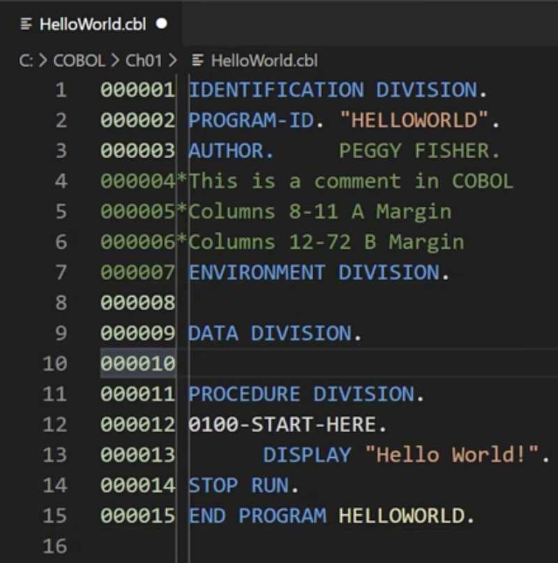

# COBOL Essential Training

## Source

https://www.linkedin.com/learning/cobol-essential-training?u=101662490

## Concept

- Procedure language

- Read/Write file

- Mainframe system

## JCL

- Job control language

- The script used to execute COBOL language

## Install COBOL compiler

```bash
brew install gnu-cobol
```

## VSCode plugin for COBOL

- COBOL Themes

- COBOL

## Syntax

### Column

- Column 1-6: Optional, either sequence numbers or line numbers.

- Column 7: comments (asterisk `*`) or continuation of a non-numeric literal (hyphen `-`)

- Column 8-11: **A Margin**. This is where you'll write **division headers**, **section headers**, **paragraph names** and  **file descriptions**

- Column 12-72: **B Margin**

- Statements end with a period `.` in COBOL.



### Divisions

- IDENTIFICATION DIVISION
  
  - The only mandatory division
  
  - Must contain **program ID** (program name, 1 to 30 characters)

- ENVIRONMENT DIVISION

- DATA DIVISION
  
  - WORKING-STORAGE SECTION: Declare variable
    
    -  `01 NAME PIC A(20).`
      
      - `01`: level number
      
      - `NAME`: variable name
      
      - `PIC A(20)`: type of data and how many characters or how many numbers can be in. e.g. `A`: alphabet, `9`: numeric, `X`: Alphanumeric etc.
    
    - `PIC 999.`: 0-999
    
    - `PIC 999V99`: decimal to two digits

- PROCEDURE DIVISION

- STOP RUN

- END PROGRAM: Optional, mean no more lines of code

### Compile

The GnuCOBOL compiler takes the original source code and converts it from text to machine language. The next step, it takes the newly compiled object code and combines or links it with any previously written sub-routines and any other object modules to produce the load module. And the last step is the execution of the compiled and linked module, which in our case printed out, Hello World!

```bash
$ cobc -x HelloWorld.cbl
// More information refer to https://open-cobol.sourceforge.io
```

### Command

Print to console

```cobol
DISPLAY "HI~".  
DISPLAY "HI~", NAME. // concatenate string with variable NAME
```

Input data

```cobol
ACCEPT NAME.
```

Compute with variable

```cobol
COMPUTE A = B + C.
```


