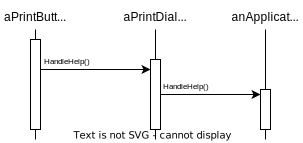

# Chain of  Responsibility

## Intent

- Avoid coupling the sender of a request to its receiver by giving more than one object a chance to handle the request

- Chain the receiving objects and pass request along the chain until an object handles it

## Motivation

Consider a context-sensitive help facility for a graphical user interface. The user can obtain help information on any part of the interface just by clicking on it. The help that's provided depends on the part of the interface that's selected and its context; for example, a button widget in a dialog box might have different help information than a similar button in the main window.

The problem here is that the object ultimately *provides* the help isn't known explicitly to the object (e.g., the button) that *initiates* the help request. What we need is a way to decouple the button that initiates the help request from the objects that might provide help information.

**The idea of this pattern is to decouple senders and receivers by giving multiple objects a chance to handle a request**. The request gets passed along a chain of objects until one of them handles it.

The first object in the chain receives the request and either handle it or forwards it to the next candidate on the chain. The request has an **implicit receiver**. The client that issued the request has no direct reference to the object that ultimately fulfills it.

To forward the request along the chain, and to ensure receivers remain implicit, each object on the chain shares a common interface for handling requests and for accessing its **successor** on the chain.

HelpHandler's HandleHelp operation forwards the request to the successor by default. Subclasses can override this operation to provide help under the right circumstances; otherwise they can use the default implementation to forward the request.

## Applicability

- more than one object may handle a request

- you want to issue a request to one of several objects without specifying the receiver explicitly

- the set of objects that can handle a request should be specified dynamically

## Structure

## Collaborations

When a client issues a request, the request propagates along the chain until a ConcreteHandler object takes responsibility for handling it

## Consequences

1. *Reduced coupling*. An object only has to know that a request will be handled "appropriately". As a result, Chain of Responsibility can simplify object interconnections. Instead of objects maintaining references to all candidate receivers, they keep a single reference to their successor.

2. *Added flexibility in assigning responsibilities to objects*. Chain of Responsibility gives you added flexibility distributing responsibilities among objects.

3. Since a request has no explicit receiver, there's no guarantee it'll be handled

## Implementation

1. *Implementing the successor chain*
   
   (a) Define new links
   
   (b) Use existing links

2. *Connecting successors*

3. *Representing requests*. We can use separate request objects that bundle request parameters. A Request class can represent requests explicitly, and new kinds of requests can be defined by subclassing.
