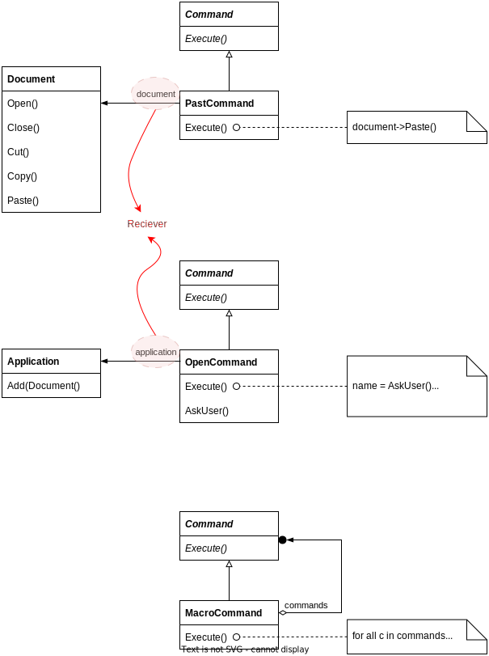

# Command

## Intent

Encapsulate a request as an object, thereby letting you parameterize clients with different requests, queue or log requests, and support undoable operations.

## Motivation

Sometimes it's necessary to issue requests to objects without knowing anything about the operation being requested or the receiver of the request. For example, a user interface toolkits include objects like buttons that carry out a request in response to user input. But the toolkits can't implement the request explicitly in the button, because only applications that use the toolkit know what should be done on which object.

The key to this pattern is an abstract Command class, which declares an interface for executing operations.

MenuItem don't know which subclass of Command they use, Command subclass store the receiver of the request and invoke one or more operations on receiver. Sometimes a MenuItem needs to execute a sequence of commands.

- Command pattern decouples the object that invokes the operation from the one having the knowledge to perform it

- Share an instance of the same concrete Command subclass

- Support command scripting by composing commands into larger ones

- The object that issues a request only needs to know how to issue it; it doesn't need to know how the request will be carried out

## Applicability

- parameterize objects by an action to perform. Commands are an object-oriented replacement for callbacks

- specify, queue, and execute requests at different times. A command object can have a lifetime independent of the original request

- support undo

- support logging changes so that they can be reapplied in case of a system crash

- structure a system around high-level operations built on primitives operations

## Structure

## Collaborations

- The **client** <u>creates</u> a **ConcreteCommand object** and specifies its receiver

- An **Invoker object** <u>stores</u> the **ConcreteCommand object**

- The **invoker** <u>issues</u> **a request** by calling Execute on the command

- The **ConcreteCommand object** <u>invokes</u> **operations on its receiver to carry out the request**

## Consequences

1. Command decouples the object that invokes the operation from the one that knows how to perform it.

2. You can assemble commands into a composite command.

3. It's easy to add new Commands, because you don't have to change existing classes.

## Implementation

1. How intelligent should a command be?

2. Supporting undo and redo
   
   - An undoable must be copied before it can be places on the history

3. Avoiding error accumulation in the undo process
