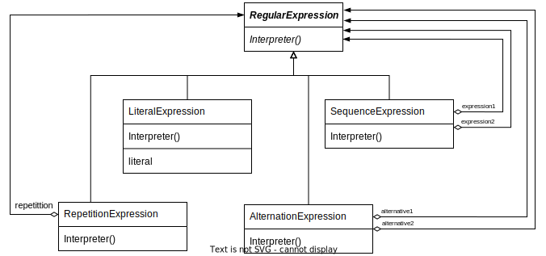

# Interpreter

## Intent

Given a language, define a representation for its grammar along with an interpreter that uses the representation to interpret sentences in the language.

## Motivation

- If a particular kind of problem *occurs often enough*, then it might be worthwhile to express instances of the problem as sentences in a simple language. Fo example, searching for strings that match a pattern is a common problem

- The interpreter pattern describes how to **define** a grammar for simple languages, represent **sentences** in the language, and **interpret** these sentences

- Interpreter takes as an argument the context in which to interpret the expression

- The context contains the input string and information on how much of it has been matched so far

- Each sub class of **RegularExpression** implements `Interpret` to match the next part of the input string based on the current context

## Applicability

The Interpreter pattern works best when

- the grammar is simple. *For complex grammars, the class hierarchy for the grammar becomes large and unmanageable. Tools such as parser generators are a better alternative in such case*

- efficiency is not a critical concern. The most efficient interpreters are usually not implemented by interpreting parse trees directly but by first translating them into another form. For example, regular expressions are often transformed into state machines. But even then, the *translator* can be implemented by the Interpreter pattern, so the pattern is still applicable

## Structure

## Collaborations

- The client builds the sentence as an abstract syntax tree of **NonterminalExpression** and **TerminalExpression** instances

- The `Interpret` operation of each **TerminalExpression** defines the base case in the recursion.

- The `Interpret` operations at each node use the **Context** to store and access the state of the interpreter

## Consequences

- It's easy to change and extend the grammar

- Implementing the grammar is easy, too

- Complex grammars are hard to maintain. *when the grammar is very complex, other techniques such as parser or compiler generator are more appropriate.*

- Adding new ways to interpret expressions

## Implementation

- Creating the abstract syntax tree. The abstract syntax tree can be created by a table-driven parser, by hand-crafted parser, or directly by client

- Defining the Interpret operation. It would be more likely to use a visitor to avoid defining these operations on every grammar class

- Sharing terminal symbols with the Flyweight pattern
