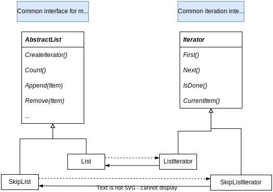

# Iterator

## Intent

Provide a way to access the elements of an aggregate object sequentially without exposing its underlying representation.

## Motivation

- An aggregate object such as a list should give you a way to access its elements without exposing its internal structure

- Traverse the list in different ways

- Don't want to bloat the List interface with operations for different traversals

- The key idea in this pattern is to take the responsibility for access and the traversal out of the list object and put it into an **iterator**

- Separating the traversal mechanism from the List object lets us define iterators for different traversal policies without enumerating them in the List interface

- We make the list objects responsible for creating their corresponding iterator

- `CreateIterator` is an example of a factory method. The Factory Method approach give rise to two class hierarchies, one for lists and another for iterators. It "connects" the two hierarchies

## Applicable

- To access an aggregate object's contents without exposing its internal representation

- to support multiple traversals of aggregate objects

- to provide a uniform interface for traversing different aggregate structures

## Structure

## Collaborations

A ConcreteIterator keeps track of the current object in the aggregate and can compute the succeeding object in the traversal.

## Consequences

- It supports variations in the traversal of an aggregate

- Iterators simplify the Aggregate interface

- More than one traversal can be pending on an aggregate. You can have more than one traversal in progress at once

## Implementation

- Who controls the iteration?

- Who defines the traversal algorithm?

- How robust is the iterator?

- Additional Iterator operations

- Iterators may have privileged access

- Iterators for composites

- Null iterators
