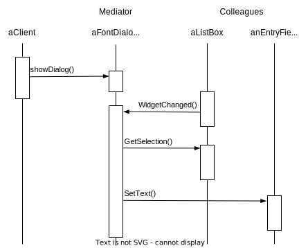

# Mediator

## Intent

Define an object that encapsulates how a set of objects interact. Mediator promotes loose coupling by keeping objects from referring to each other explicitly, and it lets you vary their interaction independently.

## Motivation

Object-oriented design encourages the distribution of behavior among objects. Such distribution can result in an object structure with many connections between objects; in the worst case, every object ends up knowing about every other.

Lots of interconnections make it less likely that an object can work without the support of others—the system acts as though it were monolithic.

You can avoid these problems by encapsulating collective behavior in a separate **mediator** object. A mediator is responsible for controlling and coordinating the interactions of a group of objects. The mediator serves as an intermediary that keeps objects in the group from referring to each other explicitly. <u>The objects only know the mediator, thereby reducing the number of interconnections</u>.

It acts as a hub of communication for widgets:

Note how the director mediates between the list box and the entry field. Widgets communicate with each other only indirectly, through the director. They don't have to know about each other; all they know is the director.

## Applicability

- a set of objects communicate in well-defined but complex ways. The resulting interdependencies are unstructured and difficult to understand.

- reusing an object is difficult because it refers to and communicates with many other objects.

- a behavior that's distributed between several classes should be customizable without a lot of subclassing.

## Structure

## Collaborations

Colleagues send an receive requests from a Mediator object. The mediator implements the cooperative behavior by routing requests between the appropriate colleague(s).

## Consequences

1. It limits subclassing

2. It decouples colleagues

3. It simplifies object protocol. On-to-many relationships are easier to understand, maintain and extends

4. It abstracts how objects cooperate

5. It centralizes control. The Mediator pattern trades complexity of interaction for complexity in the mediator. The can make the mediator itself a monolith that's hard to maintain.

## Implementation

- Omitting the abstract Mediator class

- Colleague-Mediator communication
  
  - implement the Mediator as an Observer using the Observer pattern. Colleague classes act as Subjects, sending notifications to the mediator whenever they change state. The mediator responds by propagating the effects of the change to other colleagues.
  
  - define a specialized notification interface in Mediator that lets colleagues be more direct in their communication. When communicating with the mediator, a colleague passes itself as an argument, allowing the mediator to identify the sender.
