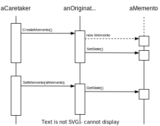

# Memento

## Intent

Without violating encapsulation, capture and externalize an object's internal state so that the object can be restored to this state later.

## Motivation

Sometimes it's necessary to record the internal state of an object. This is required when implementing checkpoints and undo mechanisms that let users back out of tentative operations or recover from errors.

Exposing this state would violate encapsulation, which can compromise the application's reliability and extensibility.

We can solve this problem with the Memento pattern. A **memento** is an object that stores a snapshot of the internal state of another object—the memento's **originator**. The undo mechanism will request a memento from the originator when it needs to checkpoint the originator's state. Only the originator can store and retrieve information from the memento—the memento is "opaque" to other objects.

This arrangement lets the ConstraintSolver entrust other objects with the information it needs to revert a previous state without exposing its internal structure and representations.

## Applicability

Use the Memento pattern when

- a snapshot of (some portion of) an object's state must be saved so that it can be restored to that state later

- a direct interface to obtaining the state would expose implementation details and break the object's encapsulation

## Structure

## Participants

- **Memento**
  
  - stores internal state of the Originator object
  
  - protects against access by objects other than the originator. Mementos have effectively two interfaces *narrow* interface and *wide* interface.

- **Originator**
  
  - creates a memento
  
  - uses the memento to restore its internal state

- **Caretaker**
  
  - is responsible for the memento's safekeeping
  
  - never operates on or examines the contents of a memento

## Collaborations

**Consequences**

- Preserving encapsulation boundaries

- It simplifies Originator

- Using mementos might expensive

- Defining narrow and wide interfaces

- Hidden costs in caring for mementos
