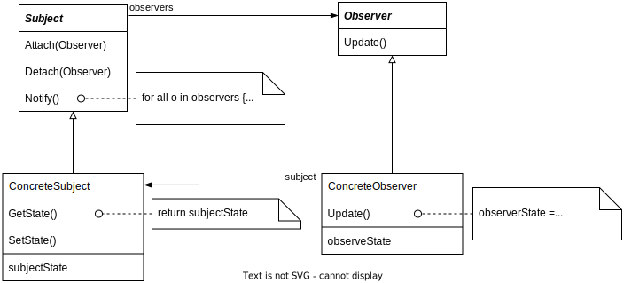

# Observer

## Intent

Define a one-to-many dependency between objects so that when one object changes state, all its dependents are notified and updated automatically.

## Motivation

A common side-effect of partitioning a system into a collection of cooperating classes is the need to maintain consistency between related objects. You don't want to achieve consistency by making the classes tightly coupled, because that reduces their reusability.

For example, many graphical user interface toolkits separate the presentational aspects of the user interface from the underlying application data. Classes defining application data and presentations can be reused independently. They can work together, too.

The Observer pattern describes how to establish these relationships. The key objects in this pattern are **subject** and **observer**. A subject may have any number of dependent observers. All observers are notified whenever the subject undergoes a change in state. In response, each observer will query the subject to synchronize its state with the subject's state.

This kind of interaction is also known as **publish-subscribe**. The subject is the publisher of notifications. It sends out these notifications without having to know who its observers are. Any number of observers can subscribe to receive notifications.

## Applicability

- When an abstraction has two aspects, one dependent on the other. Encapsulating these aspects in separate objects lets you vary and reuse them independently.

- When a change to one object requires changing others, and you don't know how many objects need to be changed.

- When an object should be able to notify other objects without making assumptions about who these objects are. In other words, you don't want these objects tightly coupled.

## Structure

## Collaborations

- ConcreteSubject notifies its observers whenever a change occurs that could make its observe state inconsistent with its own.

- After being informed of a change in the concrete subject, a ConcreteObserver object may query the subject for information. ConcreteObserver uses this information to reconcile its state with that of the subject.

- Not how Observer object that initiates the change request postpones its update until it gets a notification from the subject. Notify is not always called by the subject. I can be called by an observer or by another kind of object entirely.

## Consequences

The Observer pattern lets you vary subjects and observers independently. You can reuse subjects without reusing their observers, and vice versa. It lets you add observers without modifying the subject or other observers.

1. *Abstract coupling between Subject and Observer*. Because Subject and Observer aren't tightly coupled, they can belong to different layers of abstraction in a system. A lower-level subject can communicate and inform a higher-level observer, thereby keeping the system's layering intact.

2. *Support for broadcast communication*.

3. *Unexpected updates*. Because observers have no knowledge of each other's presence, they can be blind to the ultimate cost of changing the subject. A seemingly innocuous operation on the subject may cause a cascade of updates to observers and their dependent objects. Moreover, dependency criteria that aren't well-defined or maintained usually lead to spurious updates, which can be hard to tack down.

## Implementation

1. *Mapping subjects to their observers*.

2. *Observing more than one subject*.

3. *Who triggers the update*.
   
   1. Have state-setting operations on Subject call Notify after they change the subject's state
   
   2. Make clients responsible for calling Notify at the right time

4. *Dangling references to delete subjects*. One way to avoid dangling references is to make subject notify its observers as it is deleted so that they can reset their reference to it

5. *Making sure Subject state is self-consistent before notification*. You can avoid this by sending notification from template methods in abstract Subject classes. Define a primitive operation for subclasses to override and make Notify the last operation in the template method, which will ensure that the object is self-consistent when subclasses override Subject operations.

6. *Avoiding observer-specific update protocols*. The subject passes information as an argument to Update. The amount of information may vary widely.
   
   - Push model: the subject sends observers detailed information about the change
   
   - Pull model: the subject sends nothing but the minimal notification, and observers ask for details explicitly thereafter

7. *Specifying modifications of interest explicitly*

8. *Encapsulating complex update semantics*. When the dependency relationship between subjects and observers is particular complex, an object that maintains these relationships might be required. We call such an object a **ChangeManager**.
