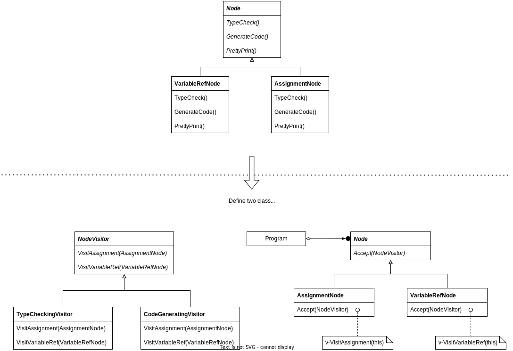
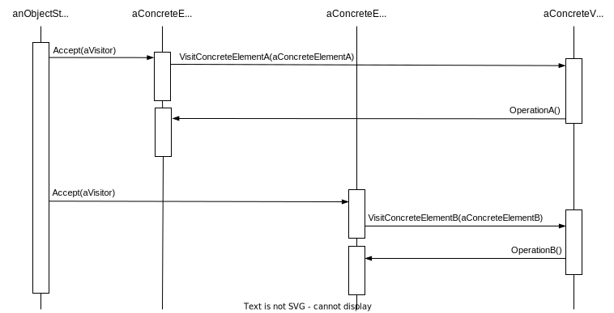

## Visitor

## Intent

Represent an <u>operation</u> to be performed on the <u>elements</u> of an object structure. Visitor lets you define a new <u>operation</u> without changing the classes of the <u>elements</u> on which it operates.

## Motivation

This dialog shows part of the Node class hierarchy. The problem here is that distributing all these operations across the various node classes leads to a system that's hard to understand, maintain, and change. It will be confusing to have type-checking code mixed with pretty-printing code or flow analysis code. Moreover, adding a new operation usually requires recompiling all of these classes.

It would be better if each new operation could be aded separately, and the node classes were independent of the operations that apply to them.

We can have both by packaging related operations from each class in a separate object, called a **visitor**, and passing it to elements of the abstract syntax tree as it's traversed. <u>When an element "accepts" the visitor, it sends a request to the visitor that encodes the element's class. It also includes the element as an argument. The visitor will then execute the operation for that element — the operation that used to be in the class of the element.</u>

With the Visitor pattern, you define two class hierarchies:

- One for the **elements** being operated on (the Node hierarchy)

- One for the visitors that define **operations** on the elements (the NodeVisitor hierarchy)



## Applicability

- many distinct and unrelated operations need to be performed on objects in an object structure, and you want to avoid "polluting" their classes with these operations. **Visitor lets you keep related operations together by defining them in on class**.

- **The classes defining the object structure rarely change, but you often want to define new operations over the structure**. Changing the object structure classes requires redefining the interface to all visitors, which is potentially costly. IF the object structure classes change often, then it's probably better to define the operations in those classes.

## Structure


## Collaborations

When an element is visited, it calls the Visitor operation that corresponds to its class. The element supplies itself as an argument to this operation to let the visitor access its state, if necessary.



## Consequences

1. *Visitor makes adding new operations easy*
   
   - Visitors make it easy to add operations that depend on the components of complex objects. You can define a new operation over an object structure simply by adding  new visitor
   
   - In contrast, if you spread functionality over many classes, then you must change each class to define a new operation

2. *A visitor gathers related operations and separates unrelated ones*
   
   - Related behavior isn't spread over the classes defining the object structure; it's localized in a visitor

3. *Adding new ConcreteElement classes is hard*
   
   - Each new ConcreteElement gives rise to a new abstract operation on Visitor and a corresponding implementation in every ConcreteVisitor class

4. *Visiting across class hierarchies*
   
   - It can visit objects that don't have a common parent class. You can add any type of object to a Visitor interface.

5. *Accumulating state*
   
   - Visitors can accumulate state as they visit each element in the object structure.
   
   - Without a visitor, this state would be passed as extra arguments to the operations that perform the traversal, or they might appear as global variables.

6. *Breaking encapsulation*
   
   - Visitor's approach assumes that the ConcreteElement is powerful enough to let visitors to do their job. As a result, the pattern often forces you to provide public operations that access an element's internal state, which may compromise its encapsulation

## Implementation

ConcreteVisitor classes override each Visit operation to implement visitor-specific behavior for the corresponding ConcreteElement class.

```c
class Visitor {
public:
    virtual void VisitElementA(ElementA*)
    virtual void VisitElementB(ElementB*)
protected:
    Visitor();
}
```

Each class of ConcreteElement implements an `Accept` operation that calls the matching `Visit...` operation on the visitor for that ConcreteElement. (or we could we function overloading to give these operations the same name, like `Visit`, since the operations are already differentiated by the parameter they're passed.)

```c
class Element {
public:
    virtual ~Element();
    virtual void Accept(Visitor&) = 0;
protected:
    Element();
}

class ElementA : public Element {
public:
    virtual void Accept(Visitor& v ) = { v.VisitELementA(this)};
}

class ElementB : public Element {
public:
    virtual void Accept(Visitor& v ) = { v.VisitELementB(this)};
}
```

A CompositeElement class might implement `Accept` like this:

```c
class CompositeElement : public Element {
public:
    virtual void Accept(Visitor&);
private:
    List<Element*>* _children;
}

void CompositeElement::Accept(Visitor& v) {
    ListIterator<Element*> i(_children);
    for (i.First(); !i.IsDone(); i.Next()) {
        i.CurrentItem()->Accept(v);
    }
    v.VisitCompositeElement(this);
}
```

Here are two other implementation issues:

1. *Double dispatch*.
   
   - This is the key to the Visitor pattern: The operation that gets executed depends on both the type of Visitor and the type of Element it visits.
   
   - Instead of binding operations statically into the Element interface, you can consolidate the operations in a Visitor and use `Accept` to do the binding at run-time.

2. *Who is responsible for traversing the object structure*?
   
   1. in object structure
   
   2. in the visitor
   
   3. in a separate iterator object


