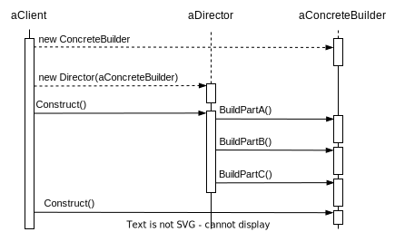

# Builder

## Intent

Separate the construction of a complex object from its representation so that the same construction process can create different representations.

## Motivation

A reader for document exchange format should be able to convert to many text formats. The problem, however, is that the number of possible conversions is open-ended. So it should be easy to add new conversion without modifying the reader.

## Applicability

- the algorithm for creating a complex object should be independent of the parts that make up the object and how they're assembled.

- the construction process must allow different representations for the object that's constructed.

## Structure

## Collaborations

## Consequence

- The Builder object provides the director with an abstract interface for constructing the product. The interface lets the builder hide the representation and internal structure of the product. It also hides how the product gets assembled.

- It isolates code for construction and representation. The Builder pattern improves modularity by encapsulating the way a complex object is constructed and represented.

- It gives you finer control over the construction process. The Builder interface reflects the process of constructing the product more than other creational pattern.
