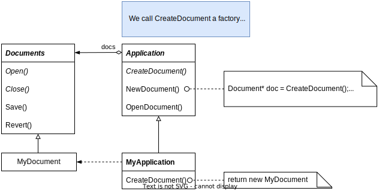

# Factory Method

## Intent

Define an interface for creating an object, but let subclasses decide which class to instantiate. Factory Method lets a class defer instantiation to subclasses.

## Motivation

Application only knows *when* a new document should be created, not *what kind* of Document to create.

## Applicability

- a class can't anticipate the class of objects it must create.

- a class wants its subclass to specify the object it creates.

- classes delegate responsibility to one of several helper subclasses, and you want to localize the knowledge of which helper subclass is the delegate.

## Structure

## Collaborations

Creator relies on its subclasses to define the factory method so that it returns an instance of the appropriate ConcreteProduct.

## Consequences

Factory methods eliminate the need to bind application-specific classes into your code. The code only deals with the Product interface; therefore it can work with any user-defined ConcreteProduct classes.

Additional consequences:

1. Provide hooks for subclasses

2. Connect parallel class hierarchies

## Implementation

1. Two major varieties. (1) Creator is an abstract class without default implementation, and (2) Creator is a concrete class with default implementation

2. Parameterized factory methods. The factory method takes a parameter that identifies the kind of object to create. Overriding a parameterized method lets you easily and selectively extend or change the products that a Creator produces.
