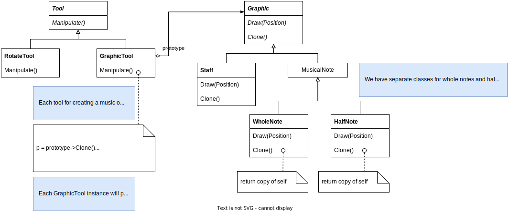
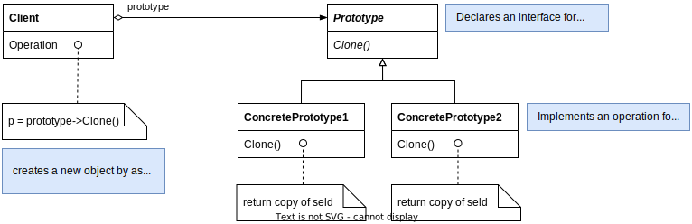

# Prototype

## Intent

Specify the kinds of objects to create using a prototypical instance, and create new objects by copying this prototype.

## Motivation

To build an editor for music scores by customizing a general framework for graphic editors, there will be a palette of tools for adding music objects. We assume that the framework already provides an abstract `Graphic` class for graphical components, an abstract `Tool` class for defining tools in palette and a predefined `GraphicTool` subclass for tools that create instances of graphical objects and add them to document.

We could subclass `GraphicTool` for each kind of music object, but that would produce lots of subclasses that differ only in the kind of music object they instantiate. **We know object composition is a flexible alternative to subclassing**.

*How can the framework use object composition to parameterize instances of `GraphicTool` by class of Graphic they're supposed to create?*

> The solution lies in making `GraphicTool` create new `Graphic` by copying or "cloning" and instance of a `Graphic` subclass. We call this instance a **prototype**.
> 
> `GraphicTool` is parameterized by the prototype it should clone and add to the document.

## Applicability

Use the Prototype pattern when a system should be independent of how its products are created, composed and represented

- when the classes to instantiate are specified at run-time

- to avoid building a class hierarchy of factories that parallels the class hierarchy of products

- when instances of class can have one of only a few different combinations of state. It may be more convenient to install a corresponding number of prototypes and clone them rather than instantiating the class manually, each time with the appropriate state.

## Structure

## Collaborations

A client asks a prototype to clone itself.

## Consequences

- Hides the concrete product classes from client, thereby reducing the number of names clients know about

- Let client work with application-specific classes without modification

- Adding and removing products at run-time by registering a prototypical instance with the client

- Specifying new objects by varying values
  
  - Highly dynamic systems let you <u>define new behavior through object composition</u>, and not by defining new classes.
  
  - You effectively <u>define new kinds of objects by instantiating existing classes and registering the instances</u> as prototypes of client objects

- Specifying new objects by varying structure: Clone as a deep copy

- Reduced subclassing
  
  - Prototype pattern lets you clone a prototype instead of asking a factory method to make a new object
  
  - Don't need a Creator class hierarchy

- Configuring an application with classes dynamically

## Implementation

- Using a prototype manager. A prototype manager is an associative store that returns the prototype matching a given key

- Implementing the Clone operation.
  
  - The hardest part of the Prototype pattern
  
  - Cloning prototypes with the complex structures usually requires a deep copy, because the clone an the original must be independent
  
  - Cloning forces you to decide what if anything will be shared

- Initializing clones.
  
  - Passing parameters in the Clone operation precludes a uniform cloning interface
  
  - Introduce an `Initialize` operation that takes initialization parameters as arguments and sets the clone's internal state accordingly
