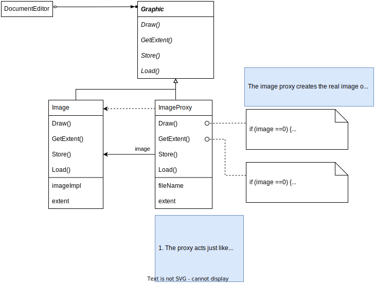
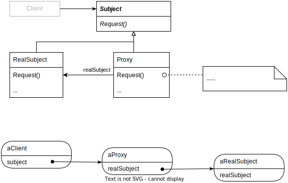

# Proxy

## Intent

Provide a surrogate or placeholder for another object ti control access to it.

## Motivation

- Controlling access to an object is to defer the full cost of its creation and initialization until we actually need to use it.

- Creating each expensive object *on demand*

## Applicability

Proxy is applicable whenever there is a need for  more versatile sophisticated reference to an object than a simple pointer.

- Remote proxy: Provides a local representative for an object in a different address space

- Virtual proxy: Create expensive objects on demand

- Protection proxy: Control access to the original object

- Smart reference: Counting the number of references so that it can be freed automatically when no more reference (also called smart pointers)

## Structure

## Participants

- Proxy
  
  - Maintains a reference that lets the proxy access the real subjects
  
  - An interface identical to `Subject`'s so that a proxy can be substituted for the real subject
  
  - Control access to the real subject and may be responsible for creating and deleting it

- Subject
  
  - Define the common interface for `RealSubject` and `Proxy` so that a proxy can be used anywhere a `RealSubject` expected

- RealSubject
  
  - Define the real object that the proxy represents

## Collaborations

Proxy forwards requests to `RealSubject` when appropriate, depending on the kind of proxy.

## Consequences

The Proxy pattern introduces a level of indirection when accessing an object:

- A remote proxy can hide the fact that an object resides in a different address space

- A virtual proxy can perform optimizations such as creating an object on demand

- Both protection proxies and smart references allow additional housekeeping tasks when an object is accessed

- **Copy-on-write**: Creation on demand. Copy-on-write can reduce the cost of copying heavyweight subjects significantly
