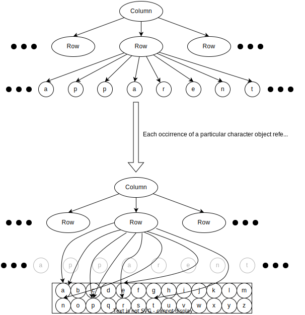
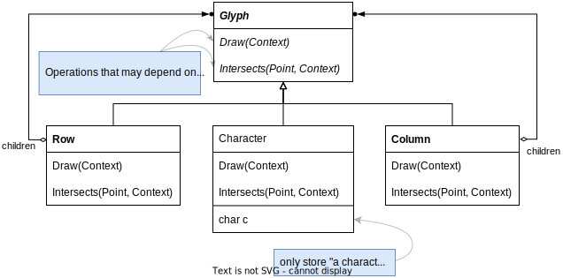
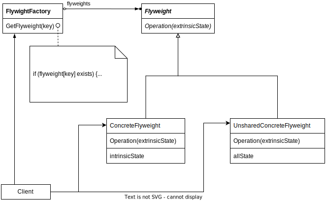

# Flyweight

## Intent

Use sharing to support large numbers of fine-grained objects efficiently.

## Motivation

- Some applications could benefit from using objects throughout their design, but a naive implementation would be prohibitively expensive.

- Even moderate sized documents may required hundreds of thousands of character objects, which will consume lots of memory and may incur unacceptable run-time overhead.

- The **Flyweight** pattern describes how to share objects to allow their use at fine granularities without prohibitive cost.

- A **flyweight** is a shared object that can be used in multiple contexts simultaneously.

- The key concept here is the distinction between **intrinsic** and **extrinsic** state.
  
  - Intrinsic state: (1) stored in the flyweight (2) independent of the flyweight's context, thus make it shareable
  
  - Extrinsic state: depends on context, thus Client objects are responsible for passing extrinsic state to flyweight

## Applicability

When *all* of the following are true

- A large number of objects

- Storage costs are high because of quantity of objects

- Most object state can be made extrinsic

- Many groups of objects my be replaced by relatively few shared objects once extrinsic state is removed

- The application doesn't depend on object identity

## Structure

## Collaborations

- Extrinsic state is stored or computed by `Client` objects

- Client should not instantiate `ConcreteFlyweights` directly. Client must obtain `ConcreteFlyweights` from `FlyweightFactory` object to ensure they are shared properly

## Consequences

- Storage savings

- The Flyweight patter is often combined with Composite patter to represent the hierarchical structure as a graph with shared leaf nodes

## Implementation

- Remove extrinsic state: The pattern's applicability is determined largely by how easy it is to identify extrinsic state and remove it from shared objects

- Managing shared objects: Because objects are shared, clients shouldn't instantiate them directly.
