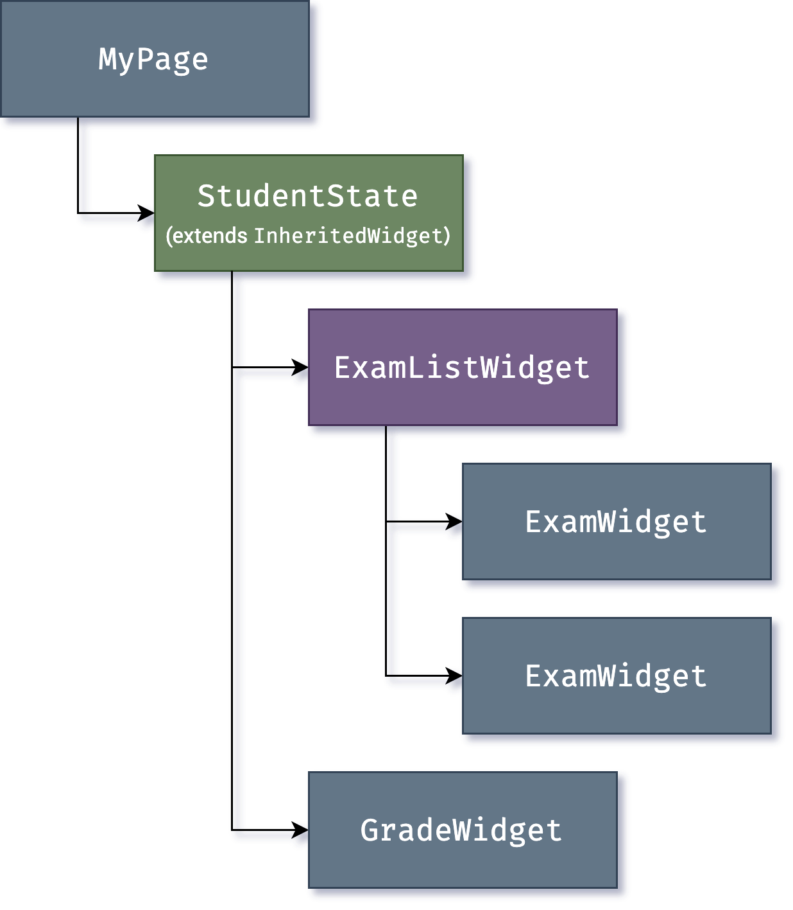

# Flutter architectural overview (Part-1)

- Flutter is a cross-platform UI toolkit that is designed to allow code reuse across operating systems such as iOS and Android, while also allowing applications to interface directly with underlying platform services.

- During development, Flutter apps run in a VM that offers stateful hot reload of changes without needing a full recompile. For release, Flutter apps are compiled directly to machine code, whether Intel x64 or ARM instructions, or to JavaScript if targeting the web.

## Source

[Flutter architectural overview | Flutter](https://docs.flutter.dev/resources/architectural-overview)

## Architectural layers

#### 

- Reactive paradigm of UI development. 

- **Widgets** are composed together and converted into **objects** that can be rendered as part of an application. 

## Reactive user interfaces

Flutter is [a reactive, pseudo-declarative UI framework](https://docs.flutter.dev/resources/faq#what-programming-paradigm-does-flutters-framework-use), in which the developer provides a mapping from application state to interface state, and the framework takes on the task of updating the interface at runtime when the application state changes:

| Technique                                   | Description                                                                                                                                                                                                                                                                                                                                      | Example                                                                                                                                                                                                                                                                                                                                                                                                                                               |
| ------------------------------------------- | ------------------------------------------------------------------------------------------------------------------------------------------------------------------------------------------------------------------------------------------------------------------------------------------------------------------------------------------------ | ----------------------------------------------------------------------------------------------------------------------------------------------------------------------------------------------------------------------------------------------------------------------------------------------------------------------------------------------------------------------------------------------------------------------------------------------------- |
| Composition                                 | using small objects with narrow scopes of behavior, composed together to obtain more complicated effects, sometimes called *aggressive composition*.                                                                                                                                                                                             | Material TextButton class is built using an IconTheme, an InkWell, a Padding, a Center, a Material, an AnimatedDefaultTextStyle, and a ConstrainedBox.                                                                                                                                                                                                                                                                                                |
| Functional programming                      | describe how arguments map to other functions, bottoming out in primitives that compute layouts or paint graphics                                                                                                                                                                                                                                | the Icon widget is essentially a function that maps its arguments (color, icon, size) into layout primitives.                                                                                                                                                                                                                                                                                                                                         |
|                                             |                                                                                                                                                                                                                                                                                                                                                  | Dart’s Iterable API, which makes heavy use of the functional style (map, reduce, where, etc), is frequently used to process lists of values in the framework.                                                                                                                                                                                                                                                                                         |
| Event-driven programming                    | User interactions are represented by event objects that are dispatched to callbacks registered with event handlers                                                                                                                                                                                                                               | Screen updates are triggered by a similar callback mechanism                                                                                                                                                                                                                                                                                                                                                                                          |
| Class-based object-oriented programming     | Most of the APIs of the framework are built using classes with inheritance.                                                                                                                                                                                                                                                                      | Render objects have a base class (RenderObject) that is agnostic regarding the coordinate system, and then we have a subclass (RenderBox) that introduces the opinion that the geometry should be based on the Cartesian coordinate system (x/width and y/height).                                                                                                                                                                                    |
| Prototype-based object-oriented programming | This lets the system compose, for example, paging physics with platform-specific physics, without the platform having to be selected at compile time.                                                                                                                                                                                            | The ScrollPhysics class chains instances to compose the physics that apply to scrolling dynamically at runtime.                                                                                                                                                                                                                                                                                                                                       |
| Imperative programming                      | Straightforward imperative programming, usually paired with state encapsulated within an object, is used where it provides the most intuitive solution.                                                                                                                                                                                          | tests are written in an imperative style, first describing the situation under test, then listing the invariants that the test must match, then advancing the clock or inserting events as necessary for the test.                                                                                                                                                                                                                                    |
| Reactive programming                        | The widget and element trees are sometimes described as reactive, because new inputs provided in a widget’s constructor are immediately propagated as changes to lower-level widgets by the widget’s build method, and changes made in the lower widgets (for example, in response to user input) propagate back up the tree via event handlers. | Widgets with <u>build methods that consist of just an expression describing how the widget reacts to changes in its configuration</u> are **functional reactive widgets** (for example, the Material Divider class)<br/>Widgets whose <u>build methods construct a list of children over several statements</u>, describing how the widget reacts to changes in its configuration, are **imperative reactive widgets** (for example, the Chip class). |
| Declarative programming                     | The build methods of widgets are often a single expression with multiple levels of nested constructors, written using a strictly declarative subset of Dart                                                                                                                                                                                      | the UserAccountsDrawerHeader widget has a long build method (20+ lines), consisting of a single nested expression<br/>This can also be combined with the imperative style to build UIs that would be harder to describe in a pure-declarative approach                                                                                                                                                                                                |
| Generic programming                         | Types can be used to help developers catch programming errors early                                                                                                                                                                                                                                                                              | the State class is parameterized in terms of the type of its associated widget, so that the Dart analyzer can catch mismatches of states and widgets.                                                                                                                                                                                                                                                                                                 |
| Concurrent programming                      | Flutter makes heavy use of Futures and other asynchronous APIs.                                                                                                                                                                                                                                                                                  | the animation system reports when an animation is finished by completing a future. <br/>The image loading system similarly uses futures to report when a load is complete.                                                                                                                                                                                                                                                                            |
| Constraint programming                      | The layout system in Flutter uses a weak form of constraint programming to determine the geometry of a scene.                                                                                                                                                                                                                                    | <u>Constraints </u>(for example, for cartesian boxes, a minimum and maximum width and a minimum and maximum height) are <u>passed from parent to child</u>, and *the child selects a resulting geometry* (for example, for cartesian boxes, a size, specifically a width and a height)* that fulfills those constraints*. By using this technique, ***Flutter can usually lay out an entire scene with a single pass.***                              |

- With React-style APIs, you only create the UI description, and the framework takes care of using that one configuration to both create and/or update the user interface as appropriate.

- In Flutter, **widgets** (akin to components in React) are represented by <u>immutable classes</u> that are used to *configure a tree of **objects***.

- These **widgets** are used to <u>manage</u> a separate tree of **objects** for layout, which is then used to manage a separate tree of objects for compositing.

- ***<u>Flutter is, at its core, a series of mechanisms for efficiently walking the modified parts of trees, converting trees of objects into lower-level trees of objects, and propagating changes across these trees.</u>***

- ***<u>A widget declares its user interface by overriding the `build()` method, which is a function that converts state to UI:</u>***
  
  ```
  UI = f(state)
  ```

- ***<u>The `build()` method is by design fast to execute and should be free of side effects, allowing it to be called by the framework whenever needed (potentially as often as once per rendered frame).</u>***
  
  ***<u>This approach relies on certain characteristics of a language runtime (in particular, fast object instantiation and deletion). Fortunately, [Dart is particularly well suited for this task](https://medium.com/flutter/flutter-dont-fear-the-garbage-collector-d69b3ff1ca30).</u>***

## Widgets

- Flutter emphasizes **widgets** as a unit of composition.

- **Widgets** are the building blocks of a Flutter app’s user interface.

- each **widget** is an immutable declaration of part of the user interface.

- **Widgets** form a hierarchy based on composition. 

- Each **widget** nests inside its parent and can <u>receive context from the parent</u>

- ***<u>Apps update their user interface in response to events (such as a user interaction) by telling the framework to replace a widget in the hierarchy with another widget</u>***. ***<u>The framework then compares the new and old widgets, and efficiently updates the user interface</u>***.

- Flutter has its own implementations of each UI control, rather than deferring to those provided by the system:
  
  - Provides for unlimited extensibility
  
  - Avoids a significant performance bottleneck by allowing Flutter to composite the entire scene at once, without transitioning back and forth between Flutter code and platform code.
  
  - Decouples the application behavior from any operating system dependencies. The application looks and feels the same on all versions of the OS, even if the OS changed the implementations of its controls.

### Composition

Widgets are typically composed of many other small, <u>single-purpose</u> widgets that combine to produce powerful effects.

Where possible, the number of design concepts is kept to a minimum while allowing the total vocabulary to be large.

| Layer           | example                                                                                                                                                                                      |
| --------------- | -------------------------------------------------------------------------------------------------------------------------------------------------------------------------------------------- |
| Widgets layer   | Flutter uses the same core concept (a Widget) to represent drawing to the screen, layout (positioning and sizing), user interactivity, state management, theming, animations, and navigation |
| Animation layer | a pair of concepts, Animations and Tweens, cover most of the design space.                                                                                                                   |
| Rendering layer | RenderObjects are used to describe layout, painting, hit testing, and accessibility                                                                                                          |

- In each of these cases, the corresponding vocabulary ends up being large: there are hundreds of widgets and render objects, and dozens of animation and tween types.

- The class hierarchy is deliberately shallow and broad to <u>maximize the possible number of combinations, focusing on small, composable widgets that each do one thing well</u>.

Core features are abstract, with even basic features like padding and alignment being implemented as separate components rather than being built into the core.

### Building widgets

- you determine the visual representation of a widget by overriding the [`build()`](https://api.flutter.dev/flutter/widgets/StatelessWidget/build.html) function to return a new **element tree**.

- As needed, the framework recursively asks each widget to build until the tree is entirely described by [concrete renderable objects](https://api.flutter.dev/flutter/widgets/RenderObjectWidget-class.html).

- The framework then stitches together the renderable objects into a renderable object tree.

- A widget’s build function should be free of side effects. Whenever the function is asked to build, the widget should return a new tree of widgets[1](https://docs.flutter.dev/resources/architectural-overview#a1), regardless of what the widget previously returned. The framework does the heavy lifting work to determine which build methods need to be called based on the render object tree (described in more detail later). More information about this process can be found in the [Inside Flutter topic](https://docs.flutter.dev/resources/inside-flutter#linear-reconciliation). <- Important

- <u>On each rendered frame</u>, Flutter can *recreate just the parts of the UI where the state has changed* by calling that widget’s `build()` method. Therefore it is important that build methods should return quickly, and heavy computational work should be done in some asynchronous manner and then stored as part of the state to be used by a build method.

- While relatively naïve in approach, this automated comparison is quite effective, enabling high-performance, interactive apps. And, the design of the build function simplifies your code by focusing on declaring what a widget is made of, rather than the complexities of updating the user interface from one state to another.

### Widget state

The framework introduces two major classes of widget: *stateful* and *stateless* widgets.

| Type            | Description                                                                                                                                                                                                                                                                                                                                                                                                                       |
| --------------- | --------------------------------------------------------------------------------------------------------------------------------------------------------------------------------------------------------------------------------------------------------------------------------------------------------------------------------------------------------------------------------------------------------------------------------- |
| StatelessWidget | have no mutable state: they don’t have any properties that change over time                                                                                                                                                                                                                                                                                                                                                       |
| StatefulWidget  | Widget itself is immutable<br/>They store mutable state in a separate class that subclasses State. <br/>StatefulWidgets don’t have a build method; instead, their user interface is built through their State object.<br/>Whenever you mutate a State object (for example, by incrementing the counter), you must call setState() to signal the framework to update the user interface by calling the State’s build method again. |

Having <u>separate state and widget objects</u> lets other widgets treat both stateless and stateful widgets in exactly the same way.

Instead of needing to hold on to a child to preserve its state, **the parent can create a new instance of the child at any time without losing the child’s persistent state.** The framework does all the work of *finding and reusing existing state objects when appropriate*.

### State management

You can use a constructor in a widget to initialize its data, so a `build()` method can ensure that any child widget is instantiated with the data it needs

As widget trees get deeper, however, passing state information up and down the tree hierarchy becomes cumbersome. So, a third widget type, [`InheritedWidget`](https://api.flutter.dev/flutter/widgets/InheritedWidget-class.html), provides an easy way to grab data from a shared ancestor.



```dart
final studentState = StudentState.of(context);
```
