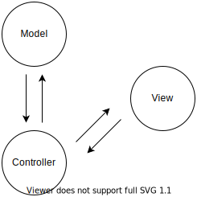

## UIKit Essentials — Creating a List View

## Section 1 Create a Project

Choose "Storyboard" interface

## Section 2 Add a Collection View Controller

Adding a **view controller** to a **storyboard**. **View controller**s act as a bridge between **view**s and your **data model**s. Each **view controller** is responsible for managing a view hierarchy, updating the content in views, and responding to events in the user interface.

1. Create "collection view controller" from "Library"
2. In the Attributes inspector, select the **Is Initial View Controller checkbox** to set the scene as the storyboard entry point.

You’ll use **Interface Builder** to create a **collection view controller**. Collection views can display **cell**s in grids, columns, rows, or tables.

## Section 3 Create a Reminder Model

You’ll structure your app on the **Model-View-Controller** (MVC) design pattern, a common design pattern for UIKit apps.

- **View controller**
  
  - Managing a view hierarchy
  
  - Updating content in views
  
  - Responding to events in the user interface

- **View object**s provide visual representations of your data.

- **Model object**s manage the app’s data and business logic.
  
  - Manage the app’s data and business logic.

You’ve created the **view controlle**r that ensures that the model doesn’t directly modify a view and that a view doesn’t directly affect a model. Now, you’ll create a data model to represent reminders in your list.

## Section 4 Configure the Collection as a List

You’ll begin configuring the collection view appearance using compositional layout. Compositional layout lets you construct views by combining different components: sections, groups, and items. 

A section represents the outer container view that surrounds a group of items.

- `UICollectionViewController`

- `UICollectionLayoutListConfiguration` creates a section in a list layout `UICollectionViewCompositionalLayout`.

## Section 5 Configure the Data Source

You’ve created a list section in the **collection view** using **compositional layout**. In this section, you’ll register the **cell**s in the collection view, use a **content configuration** to define the appearance of the cells, and connect the cells to a data source. You’ll use a diffable data source, which updates and animates the user interface when the data changes.

- `collectionView`

- `UICollectionView.CellRegistration`

- `DataSource`

## Section 6 Apply a Snapshot

**Diffable data sources** manage the state of your data with snapshots. 

A **snapshot** represents the state of your data at a specific point in time. To display data using a snapshot, you’ll create the snapshot, populate the snapshot with the state of data that you want to display, and then apply the snapshot in the user interface.

In this section, you’ll create and apply a snapshot that displays the list of sample reminders in the list view.

- `NSDiffableDataSourceSnapshot`

## Compositional layout

- A group is the second-largest visual component in a compositional layout.

- An item is the smallest unit of data in a compositional layout.

- A section is the largest visual component in a compositional layout.

## Snapshot

- You can generate the current state of the data and display the data in the user interface by constructing and applying a snapshot.

## Hot key

- `Shift` + `Command` + `L` = Library

## Touble shooting

### A build only device cannot be used to run this target.

[ios - A build only device cannot be used to run this target - Stack Overflow](https://stackoverflow.com/questions/33747828/a-build-only-device-cannot-be-used-to-run-this-target)

Select project -> General -> Deployment Info -> Deployment Target -> choose a lower version

## Untrusted developer

[Where in Settings can I allow apps… | Apple Developer Forums](https://developer.apple.com/forums/thread/660288)

Settings > General > VPN & Device Management > Develop App
