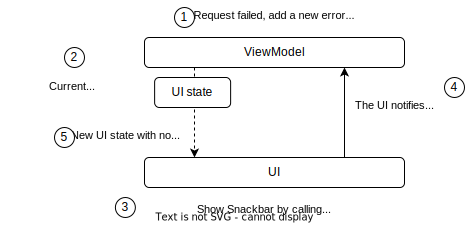

# Architecture: Handling UI events - MAD Skills

## Source

[Architecture: Handling UI events - MAD Skills - YouTube](https://www.youtube.com/watch?v=lwGtp0Yr0PE&list=PLWz5rJ2EKKc8GZWCbUm3tBXKeqIi3rcVX&index=4)

## UI events

- UI events are actions that should be handled in the UI ledger

- **User events**: are produced by users when they interact with the app, for example, by tapping a button on the screen

- **ViewModel events**: are actions that we want the UI to take that originate from the ViewModel

## User Events

```kotlin
class HomeScreens {

    @Composable
    private fun HomeScreenWithList(
        onRefreshPosts: () -> Unit,
        ...
    ) {
        ...
        TextButton(
            onClick = onRefreshPosts,
            modifier.fillMaxSize()
        ) {
            Text(
                stringResource(id = R.string.home_tap_to_load_content),
                textAlign = TextAlign.Center
            )
        }
    }


}
```

`Compose` uses functions as a way to propagate events up to the UI hierarchy until we reach a `Composable` that knows how to handled them

As refreshing content is business logic, we delegate that logic to the ViewModel. Going up the UI hierarchy we end up here in the `HomeRoute` `Composable` present in the `homeRoute` file

```kotlin
class HomeScreens {

    @Composable
    fun HomeRoute(
        homeViewModel: HomeViewModel,
        ...
    ) {
        HomeRoute(
            ...
            onRefreshPosts = { homeViewModel.refreshPosts() },
        )
    }
}
```

`HomeViewModel` exposes functions that handles business logic for the UI to the call when needed:

```kotlin
class HomeViewModel(...) : ViewModel() {
    val uiState = ...

    fun refreshPosts() { ... }

    fun toggleFavourite(postId: String) { ... }

    fun selectArticle(postId: String) { ... }

    fun onSearchInputChanged(searchInput: String) { ... }

    fun errorShown(errorId: Long) { ... }
}
```

## ViewModel Events

- ViewModel events are actions you want the UI to take that originate from ViewModel class, for example, telling the user that there is no internet connection or that a request failed

- Even though some of these actions produce transient UI updates such as showing messages on the screen. They should also be modeled as part of the UI state

- These events should always result in a UI state update since that's the way we communicate with UI

```kotlin
sealed interface HomeUiState {
    val isLoading: Boolean
    // As all ViewModel events should be modeled as part of UI state
    val errorMessage: List<Int>
    val searchInput: String
    ...
}

// Note that the ViewModel is agnostic of the UI implementation!!
class HomeViewModel(...) : ViewModel {

    // It is exposed state flow which is an observable data holder type
    // As alternatives, you could use LiveData or ComposeState APIs
    // such as mutable state
    val uiState: StateFlow<HomeUiState> = ...
}
```



```kotlin
class HomeViewModel(...) : ViewModel() {
    ...
    fun refreshPosts() {
        // update the Ui indicate to the UI that the data is loading.
        // It refers to the current UI state which is a mutable so we
        // make a copy of it and update is loading
        _uiState.update { it.copy(isLoading = true) }

        // Launch a new Corroutine
        viewModelScope.launch {
            // Call the suspend functions from Repository
            val result = postsRepository.getPostsFeed()
            _uiState.update {
                when (result) {
                    is Result.Success -> {
                        it.copy(postsFeed = result.data, isLoading = false)
                    }
                    is Result.Error -> {
                        // Add the loading error to the queue
                        val errorMessages = it.errorMessages + R.string.load_error
                        // Update UI state with a copy that contains the new messages and the loading flag to false
                        it.copy(erorrMessages = errorMessages, is Loading = false)
                    }
                }
            }
        }
    }
}
```

```kotlin
class HomeScreen {

    @Composable
    private fun HomeScreenWithList(
        uiState: HomeUiState,
        scaffoldState: ScaffoldState,
        onRefreshPosts: () -> Unit,
        onErrorDismiss: (Int) -> Unit
       ...
    )  {
        ...
        if (uiState.errorMessages.isNotEmpty()) {
            val errorMessageText = stringResource(uiState.errorMessage[0])
            val retryMessageText = stringResource(id = R.string.retry)
            ...
            // We need to call the suspend show snack bar function available in
            // the snack bat host state. Since show snack bar is a suspend function, we need to call it in the context of Corroutine
            // `LaunchedEffect` is a composable design for exactly this purpose
            // `errorMessageText`, `retryMessageText` and `scaffoldState` are used as keys by the launch effect and if any of their values change, the Corroutine will be cancled and restarted so that the UI always displays displays the most up-to-date information
            LaunchedEffect(errorMessageText, retryMessageText, scaffoldState) {
                // It suspends the Corroutine until snack bar result is available which is either when the user taps retry or the snack bar is dismissed after a certain amount of time
                val snackbarResult = scaffoldState.snackbarHostState.showSnackbar(
                    message = errorMessageText,
                    actionLabel = retryMessageText
                )
                // User tapped the retry button
                if (snackbarResult == SnackbarResult.ActionPerformed) {
                    on RefreshPostes()
                }
                // the message is no longer shown on the screen. Therefore we call the lambda with the message ID to notify that the error was dismissed
                onErrorDismiss(uiState.errorMessage[0])
            }
        }
    }
}
```

```kotlin
@Composable
fun HomeRoute(
    homeViewModel: HomeViewModel,
    ...
) {
    // Snack bar will be shown whenever the ViewModel adds a new message
    // to the error messages list. Up in our UI hierarchy, we end up in the
    // HomeRoute Composable that is in charge of interacting with the ViewModel
    HomeRoute(
        ...
        onRefreshPosts = { homeViewModel.refreshPosts() }
        // Here we give a value to the onErrorDismiss lambda that tells the ViewModel that
        // the error has been shown to the user
        onErrorDismiss= { homeViewModel.errorShown(it) },
    )
}
```

```kotlin
class HomeViewModel(...) : ViewModel() {
    ...
    fun errorShown(messageId: Int) {
        _uiState.update { currentUiState ->
            val errorMessages = currentUiState.errorMessages
                .filterNot { it == messageId }

            currentUiState.copy(errorMessages = errorMessages)
        }
    }
}
```

## Read more

https://developer.android.com/topic/architecture/ui-layer/events
