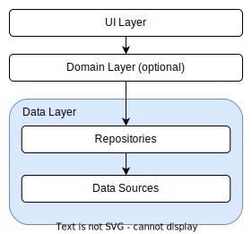

# Architecture: The data layer - MAD Skills

## Source

[Architecture: The data layer - MAD Skills - YouTube](https://www.youtube.com/watch?v=r5AseKQh2ZE&list=PLWz5rJ2EKKc8GZWCbUm3tBXKeqIi3rcVX&index=2)

## Data Layer



- Contains application data and business logic

- Business logic is what gives value to your app. It determines how application data must be created, stored and unchanged.

- The data layer is made of repositories that each can interact with zero, one or more data sources

## Data source

- Data sources are responsible for providing data the app needs to function

- They may present data from the network, a local database files or even from memory

- They should have responsibility of working only with one source of data which typically holds a unit of business logic e.g. articles, users or movies

## Repository

- Classes are used by all the layers in your app to interact with your data layer

- Responsible for exposing data to the reset of the app but also for centralizing changes

- Resolving conflicts between multiple data sources

- Contains business logic

## One repository per data type

- You should create a repository class for each different type of data you handle in your app e.g. `MoviesRepository` for movies or `PaymentsRepository` for payments

## Dependencies

- Repositories can combine different data sources and they're responsible for solving any potential conflicts between them if there's a clash between the data in your local database and the server.

## Exposing data and receiving events

- All the layers in your app should never depend on data sources directly

- The entry points to the data layer are always the repository classes

- A common pattern in repositories is to perform on-shot calls which can be implemented with `suspend`functions in Kotlin but also you can be notified of data changes over time by exposing a data stream, for example, using Kotlin's `flow`:
  
  - Create
  
  - Read
  
  - Update
  
  - Delete

## Source of truth

Choose a source of truth and make sure that it's always in a consistent state.

```kotlin
// local database depends on a room database
class LocalNewsDataSource(news: NewsDao) {
    suspend fun fetchNews(): List<Article>{ ... }
    suspend fun updateNews(news: List<Article>) { ... }
}

// remote news data source depends on an api client e.g. Retrofit client
class RemoteNewsDataSource(apiClient: ApiClient) {
    suspend fun fetchNews(): List<Article>{ ... }
}
```

```kotlin
class NewsRepository (
    val localNewsDataSource: LocalNewsDataSource,
    val remoteNewsDataSource: RemoteNewsDataSource
) {
    suspend fun fetchNews() : List<Article>{
        try {
            val news = remoteNewsDataSource.fetchNews()
            localNewsDataSource.updateNews(news)
        } catch (exception: RemoteDataSourceNotAvailableException) {
            Log.d("NewsRepository", "Connection failed, using local data source")
        }
        // returns the result from the database since it is our source of truth
        return localNewsDataSource.fetchNews()
    }
}
```

Some libraries can consume remote APIs and remote databases such as `FileStore` have caching mechanisms and they can deal with conflicts.

## Immutability

- Data exposed by the data layer should be immutable so that all the classes cannot tamper with it.

- This would risk putting its values into an inconsistent state

- It can safely handled by multiple threads

- Koltin's `data class` is perfect for this

- We should consider that the model returned by database or the remote API might not be what the other layers need. We should create different model for UI layer. This is not only makes your code neater it and provides better separation of concerns. Letting each layer define what model it needs

## Threading

- Calling data sources and repositories should be main save. Save to call from main thread. This means that the repositories or data sources are responsible for moving the execution of their logic to the appropriate thread when performing long running or blocking operations

```kotlin
suspend fun fetchDataFromNetwork() {
    withContext(Dispachers.IO) {
        fetch()
    }
}
```

## Errors

- Data operations won't always succeed

- It's important to somehow propagate information about a failure to the other layers

```kotlin
// use try-catch from ui or domain layer
try {
    moviesRepository.setFavorite(id, isFavourite)
} catch (exception: Exception) {
    // handle exception
}


// use catch of flows
movies.catch { exception ->
    // handle exception
}.collect {
    // collect data
}


// catch these errors in the data layer and expose data that can contain
// either a success or a failure with a more meaningful exception
```

## Multiple levels of repositories

- Repository can depend on multiple data sources.

- In some cases you might want to have multiple levels of repositories


## Testing repositories

- The data layer is typically easy to test.

- Repositories are unit tested normally. You replace the data sources with fakes or mocks and verify your repositories is correctly handling data and calling data sources we need

- Testing data sources can be slightly tricky because it depends on databases or API clients. The libraries that let you do that usually provide test artifacts or mechanisms for testing. For example, `Room` provides an in-memory database implementation that can help you to test the code in data source

## Big tests

- In end-to-end or big tests, you test all the layers in your app at the same time

- Use fake data to make your test more faster and reliable 
  
  - if you use dependencies injection, you are able to replace data sources or repositories with fake implementation
  
  - You can also fake your network calls with popular libraries such as `wiremock` or `mock web server`

## Read more

https://developer.android.com/topic/architecture
