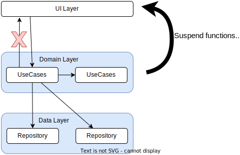

# Architecture: The Domain Layer - MAD Skills

## Source

[Architecture: The Domain Layer - MAD Skills - YouTube](https://www.youtube.com/watch?v=gIhjCh3U88I&list=PLWz5rJ2EKKc8GZWCbUm3tBXKeqIi3rcVX&index=5)

## App Architecture

- Domain layer is an optional layer which sits between data and UI layers

- Why do I need another layer in my APP?
  
  - The domain layer can actually simplify your architecture
  
  - Making it easier to understand as well as more scalable and simpler to test

- The domain layer holds business logic, a set of rules and actions that make your APP valuable

- Business logic is different to UI logic
  
  - UI logic defines how to display things on screen
  
  - Business logic defines what to do with events and data change

- The domain layer only contains **business logic**

- The domain layer is made up of classes known as interactor or use cases and a use case represents a single task which the user can do or which the app performs on on the user's behalf


## UseCase naming

```kotlin
// verb in present tense + noun/what + UseCase suffix
GetLatestNewsUseCase
```

## UseCase guidelines

- Simple

- Lightweight

- Immutable

## UseCase dependencies

- Use cases can be dependent on lower layers such as repositories in the data layer and on other use cases but it should not dependent on higher layers such as view models

- They should expose data and operations to the UI layer. The same way that repositories do using suspend functions or flow in Kotlin



## Examples

- Use cases contain reusable logic so they can also be used by other use cases and it's perfectly normal to have multiple levels of use cases in domain layer


## Making UseCases callable

```kotlin
class FormatDataUseCase() {
    operator fun invoke(date: Date): Stirng {
        return myformatter.format(data)
    }
}

class MyViewModel(formatDataUseCase: FormatDataUseCase) : ViewModel() {
    init {
        val today = Calender.getInstense()
        val todaysDate = formatDateUseCase(today)
    }
}
```

## Lifecycle

- Use cases don't have their own lifecycle instead they're scoped to the class that uses them

- Use cases don't contain mutable data, you can safely create a new instance of use case every time you pass it as a dependency

## Threading

- Use cases should be main safe as in it should be safe to call a use case from the main or UI thread

- If a use case is performing a long-running blocking operation then move it to a background thread but consider whether that blocking operation would be better handled in the data layer so that the result can be cached

## Common tasks

- Encapsulate reusable business logic. If you have logic which is used by multiple view models then place this logic inside a use case
  
  - util classes are usually hard to find and can become a space for miscellaneous functions without a clearly defined purpose
  
  - moving this type of logic to a use case

- Combine data from multiple repositories
  
  ```kotlin
  class GetLatestNewsWithAuthorsUseCase(
      private val newsRepository: NewsRepository,
      private val authorsRepository: AuthorsRepository
      // for background work
      private val defaultDispatcher: CoroutineDispatch = Dispatchers.Default
  ) {
      suspend operator fun invoke(): List<ArticleWithAuthor> = 
          withContext(defaultDispatcher) {
              val news = newsRepository.fetchLatestNews()
              return buildList {
                  val author = authorsRepository.getAuthor(article.authorId)
                  add(ArticleWithAuthor(article, author))
              }
          }
  }
  ```

## Does access restrictions?

Should we still allow direct access to the data layer from UI layer? or force everything through the domain layer?

- Advantage:
  
  - Stop domain layer logic being bypassed
  
  - Can make unit testing ViewModel easier

- Disadvantage:
  
  - Forces UseCases everywhere

In most of cases it makes sense to add use cases only when needed allowing UI layer to access the data layer as required

## Summary

- Reduce complexity of UI layer

- Avoid duplication by extracting logic used by multiple view models into a single use case

- Improve testability. Logic is much easier to test when it's contained in small classes which only do one thing

## Find out more

http://d.android.com/jetpack/guide
