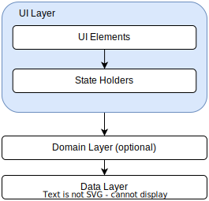

# Architecture: The UI layer - MAD Skills

## Source

[Architecture: The UI layer - MAD Skills - YouTube](https://www.youtube.com/watch?v=p9VR8KbmzEE&list=PLWz5rJ2EKKc8GZWCbUm3tBXKeqIi3rcVX&index=3)

## App architecture



- The role of the UI is to display the application data on screen and serve as the primary point of user interaction

- Whenever the data changes, the UI should update and reflect those changes

- This could be due to user interaction such as pressing a button or external input like a network response

- The UI is a visual representation of the application state in the data layer

## UI

- UI elements such a activities and fragments that display data independent of the APIs that used to do this such as views or `Jetpack compose`

## UI Layer Pipeline

1. Convert APP data to UI specific data

2. Update UI elements to reflect UI specific data

3. Process user input events that cause UI changes

4. Repeat all the above as long as necessary

## UI Layer Concepts

- Define UI state

- How to manage the production of UI state

- How to expose the UI state with observable data types according to unidirectional data flow principles

- How to implement a UI that consumes the observable UI state

## What is UI

- UI Elements + UI State = UI

- UI is the visual representation of the UI state. The UI immediately reflects any changes to the state

## Example of UI State

The information required to fully render the UI can be encapsulated in the `NewsUiState` data class:

```kotlin
data class NewsUiState(
    val newsItems: List<NewsItemUiState>
    val userMessages: List<Message>
)
```

- `NewsUiState` data class is immutable. thus frees UI up to focus on a singular role to read the state and update its UI elements accordingly

- You should never modify the UI state in the UI directly unless the UI itself is the sole source of its data. Violating this principle results in multiple sources of truth for the same piece of information leading to data inconsistencies and subtle bugs

## ViewModel as a state holder

App data changes over time due either to data updates or user actions. It is therefore often beneficial to delegate the management of the UI state to a separate type. This prevents UI from being both the UI and state manager.

The separate type is called a state holder.


## ViewModel and UI pipeline

1. ViewModel holds and exposes UI state to be consumed by the UI

2. The UI notifies the ViewModel of user events

3. The ViewModel handles the user actions and updates the state. The updated state is then fed back to the UI to render

4. The above is repeated for any event that causes a mutation or state

## Bookmarking with unidirectional data flow

- Events go in and state comes out

- Unidirectional data Flow example:
  
  1. The ViewModel first transforms data from the data layer for UI to display
  
  2. When use bookmarks an article, the ViewModel replays this to the data layer
  
  3. After the data layer processes the request, the UI consumes the new UI state and display it to the user


*How does the UI know that the UI state has changed? The key to this is observable data

## UI state exposure

The UI state should be exposed in an observables data holder like `StateFlow` or `LiveData`. This allows the UI to react to any changes in the states without manually pulling the data directly from the View Model.

```kotlin
class NewsViewModel(...) : ViewModel() {
    val uiState: StateFlow<NewsUiState> = ...
}
```

These observable data types also have the latest versions of UI state cached. This is useful for quick state restoration after configuration changes. In `Jetpack composed apps`, you can also use composer's observable state APIs such as `mutable state` of or `snapshot flow` for the exposure of UI state


User events cause the ViewModel to mutable state. Since the UI is observing the UI state, it always sees the most up-to-date version

## UI state production

```kotlin
// We want to fetch news for a category
class NewsViewMdel(...) : ViewModel() {
    
    private val _uiState = MutableStateFlow(NewsUiState())
    val uiState = _uiState.asStateFlow()
    
    // keep a reference to a job for fetching the news
    private var fetchJob: Job? = null
    
    fun fetchArticles(category: String) {
        fetchJob?.cancel()
        fetchJob = viewModelScope.launch {
            try {
                val newsItems = repository.newsItemsFor(category)
                _uiState.update {
                    it.copy(newsItems = newsItems)
                }
            } catch (ioe: IOException) {
                // Handle the erorr and notify the UI when appropriate
                _uiState.update {
                    val messages = getMessagesFromThrowable(ioe)
                    it.copy(userMessages = messages)
                }
            }
        }
    }
}

```

## UI state consumption

```kotlin
viewModel.uiState.collect {
    // Update UI elements
}
```

- Consuming UI state is done with the terminal operator on the observable data type. With `LiveData`, this is the `observe` method and the `flow` it's the `collect` method

```kotlin
class NewsActivity : ComponentActivity() {
    
    private val viewModel: NewsViewModel by viewModels()

    override fun onCreate(savedInstanceState: Bundle?) {
        super.onCreate(savedInstanceState)
        // Observing UI state in the UI is the life cycle of the UI
        // Oftentimes stakeholders like ViewModels live much longer than
        // the UIs that observe them so can be taking to ensure that
        // they are not observing UI state when they can not be seen
        lifecycleScope.launch {
            repeatOnLifecycle(Lifecycle.State.STARTED) {
                viewModel.uiState.collect {
                    // Update UI elements
                }
            }
        }
    }
}
```

## Read more

https://developer.android.com/topic/architecture/ui-layer
