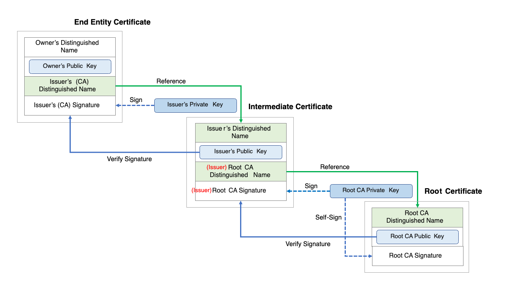

# PKI CA Implementation

## Source

[Learning SSL/TLS Online Class | LinkedIn Learning, formerly Lynda.com](https://www.linkedin.com/learning/learning-ssl-tls/)

## Configure a Linux OpenSSL PKI environment

Install OpenSSL

```bash
apt install openssl
```

Generate private key (better to have password)

```bash
# Linux
openssl genrsa -aes256 --out CAprivate.key 2048

# Mac
openssl genrsa -aes256 -out CAprivate.key 2048
```

Create CA certificate

```bash
# -sha256: CA digitally sign the certifcate that they issue and that's to establish a chain of trust
openssl req -new -x509 -key CAprivate.key -sha256 -days 365 -out FakeDomain2CA.pem
```

Below is the content of generated certificate:


## Trust of chain



## Reference

- https://en.wikipedia.org/wiki/Root_certificate
