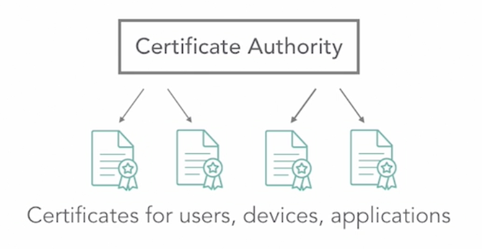
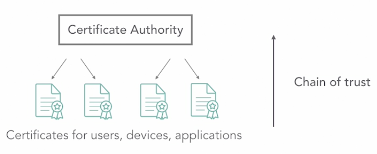

# PKI Overview

## Source

https://www.linkedin.com/learning/learning-ssl-tls/

## Note

- Public key infrastructure (PKI)

- Encryption, hashing and digital signatures

- Secure Sockets Layer (SSL)

## Cryptography overview

- Method of securing data such that it's trusted and that it's viewable only by authorized parties.

- Cryptographic key storage
  
  - Public key infrastructure (PKI) certificate
  
  - Smart card/Common Access Card (CAC)
  
  - File
  
  - Trusted Platform Module (TPM)
  
  - Token device

- General Encryption process
  
  - Plaintext is fed into an encryption algorithm
  
  - A key is also used with the encryption algorithm
  
  - The encryption algorithm results in encrypted data (ciphertext)
  
  - Only those parties with decryption key can decrypt the ciphertext

- Where is Cryptography used?
  
  - Mobile device encryption
  
  - File system encryption
  
  - Network traffic encryption
  
  - File hashing
  
  - Cryptocurrency blockchain transaction

## Symmetric and asymmetric encryption

### Symmetric encryption

- Using a single "secret"" key

- The secret key encrypts and decrypts

- All parties require the key

- If the key is compromised, all encrypted data is compromised

- Symmetric encryption algorithm: AES, RC4, 3DES, Blowfish

### Asymmetric encryption

- Uses two mathematically related keys

- Public key

- Private key

- Used by PKI

- Asymmetric encryption algorithm: RSA, Diffie-Hellman, ElGamal, ECC

### Asymmetric Email Encryption

### SSL/TLS Network Security

## PKI hierarchy

- Hierarchy of digital security certificates

- Certificates always contain public keys

- Certificates can contain private keys

- Private keys can also be stored in a separate file

### PKI Components

| Component                                                                      | Description                                                                    |
| ------------------------------------------------------------------------------ | ------------------------------------------------------------------------------ |
| Certificate Authority (CA)                                                     | Issues, renews, revokes certificates; maintains CRL; should be taken offline   |
| Registration Authority (RA)                                                    | Also called a subordinate CA; should be used to manage certificates            |
| Certificate Revocation List (CRL) or Online Certificate Status Protocol (OCSP) | Verification of certificate validity using a serial number                     |
| Certificate Template                                                           | Blueprint used when issuing certificates                                       |
| Certificate                                                                    | Contains subject name, signature of CA, expire information, public/private key |

### Single-Tier PKI Hierarchy

### Multi-Tier PKI Hierarchy

## Certificate authorities

### Certificate/Registration Authority (CA/RA)

- Has a longer validity period than issued certificates (10 years vs. 2 years)

- Issue, renews, revokes certificates

- Publishes a certificate revocation list (CRL)

- CAs issue certificates to RAs;  RA issue entity certificates

- A compromised top-level CA (Root CA) means all subordinate certificates are compromised

### Single-Tire PKI Hierarchy

### Multi-Tire PKI Hierarchy

Root CA must be *kept offline*.

Registration Authority is for:

- Departments

- Projects

- Child companies

- Geographic regions

### Chain of Trust

- CAs must be trusted authorities, otherwise PKI is meaningless

- Certificates contain the digital signature of the issuing CA

- Digital signatures that are created with a private key are not easily spoofed

- Digital signature are verified using the related public key

#### Self-signed CAs

- Self-signed CAs can be used within an organization

- Nothing will trust a self-signed CA by default

- CA certificates can be added to a device trusted certificate store to suppress messages

## PKI certificates

- SSL and TLS are directly related to PKI certificates. In other words, you can't have SSL or TLS without PKI.

- However, we want be careful not to call certificates SSL certificates or TLS certificates. Technically, this is a misnomer.

- **It's a PKI certificate that can be used for either SSL or TLS securing of network communications**

### Name of PKI certificates

- PKI certificate

- Digital certificate, a security certificate

- x.509 certificate because it adheres to the x.509 standard, which is what this is all about

### PKI Certificates

- Issued to users, devices, applications

- Have specific uses such a file encryption, securing network traffic using SSL, code signing; defined in certificate template

- Can be stored in files on devices, on smart cards, in firmware (TPM)

### What's in a PKI Certificate?

- Version number: defines x.509 or PLI version number

- Serial number: used to track the certificates such as through CRLs

- CA digital signature and algorithm used: used to establish the chain of trust because if you trust the Certificate Authority, then you trust this certificate

- Validity period

- Certificate usage details such as for file encryption

- Subject name (subject to which it was issued), URL, email address

- Public/private key

### Wildcard SSL/TLS Certificate

- Can be used for multiple DNS second-level domains via the Subject Alternative Name (SAN) field

- Certificate is issued to the top-level DNS domain

- *.fakecorp.com

### Certificate Revocation List

- CRL

- Published by the CA

- List of revoked certificate serial numbers

- Revocation reasons: lost or compromised device, employee termination

- App using certificates should retrieve the CRL before using certificates

### Online Certificate Status Protocol

- OCSP

- Consists of client component and a server-side responder component

- Allows querying of the status of specific certificates

- Unlike CRL, the entire list does not have to be downloaded

### OCSP Stapling

- Certificate owner checks the CA for its status periodically, such as a wen server with an SSL/TLS certificate

- Clients connecting to the secured website receive OCSP status for that website

- Clients do not have to query the OCSP responder for website certificate status separately

### Public Key Pinning (PKP)

- Though the HTTP header, trusting devices download a trusted copy of a server's certificate, which includes the public key (it is "pinned" locally)

- RFC 7469: "Key pinning is a trust-on-first-use (TOFU) mechanism"

- Upon future connections to the server, clients require that the server provide a fingerprint that has been previously pinned

- Mitigates certificates issued to known hosts from unauthorized CAs such as mail.google.com being issued a certificate from attacker's self signed CA

## Certificate lifecycle management

### Certificate Management

- Crucial for larger enterprises

- Legal and regulatory compliance

- Centralized and decentralized strategies

- Plan for rapid certificate replacement due to compromise

### Certificate Lifecycle

1. Certificate request

2. Certificate issuance

3. Certificate usage

4. Certificate revocation

5. Certificate renewal

6. Certificate expiry

### Certificate Request

- A public and private key pair is generated first

- Private keys can be copied or made available to trusted third parties (key escrow)

- Certificate signing request (CSR) is generated next, which includes a unique public key, commonly is PKCS #10 format (PKCS stands for public key cryptography standards)

- CSR is sent to a certificate authority for signing

### Certificate Signing Request

- Additional items are required

- Locale information

- Subject common name, such as www.fakesite.com . For example, if we generate a certificate here for a secured website, we have to include the subject fully qualified domain name (DNS name for the website). It has to be matched with what user will enter into the URL line when connecting

- Email address
- Simple Certificate Enrollment Protocol (used for automation)

## Certificate Issuance

- Process can be manual, which could require administrator approval before certificate is issued

- Process could be automated for new devices, such as computers joining a Microsoft Active Directory Domain or smartphones connecting to an MDM system

- The certificate is stored in the device-trusted certificate store or other media such as a smart card

## Certificate Usage

- Defined in the certificate details

- Email encryption and signing

- File system encryption

- Code signing

- Apps can first verify the validity of a certificate before using them (CRL and OCSP)

### Certificate Revocation

- Certificate compromise

- Employee leaving the organization

- The certificate serial number for revoked certificates can be acquired via the CRL or the OCSP

### Certificate Renewal

- Certificate  expiry is a security mechanism

- Time frame varies depending on issuer; the norm is two years

- Manual or automated (automation such as through SCEP)

- Public CAs notify subscriber via email

- Renewal must occur before certificate expiration

### Certificate Expiry

- The certificate is no longer usable

- The norm is a 90 day notification prior to expiry

- Websites with expired SSL/TLS certificates: user web browsers no longer trust the site
