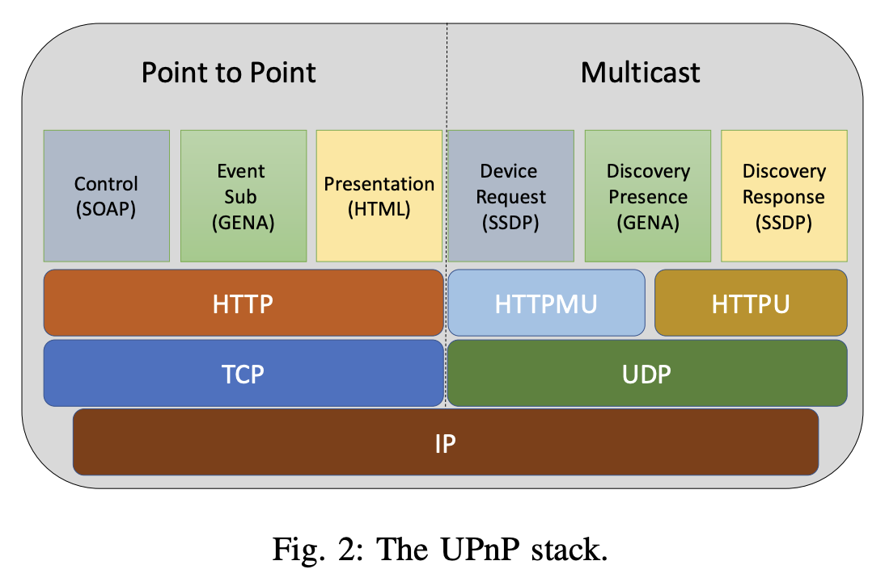
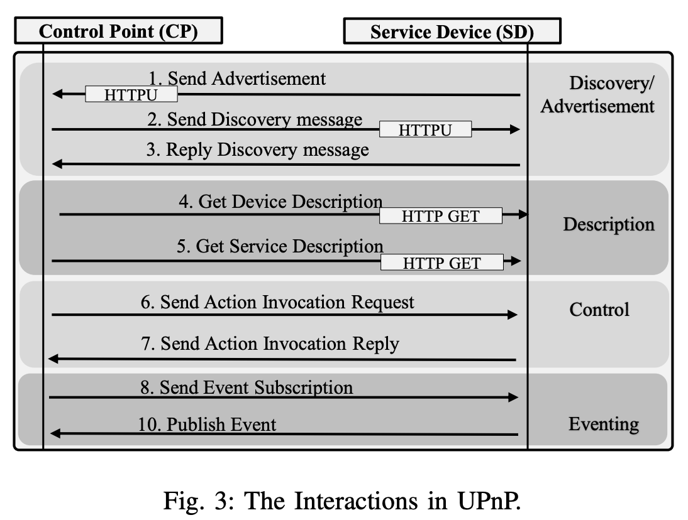
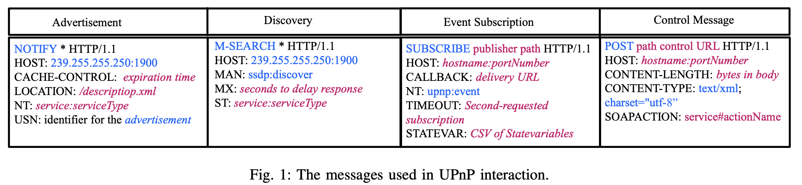
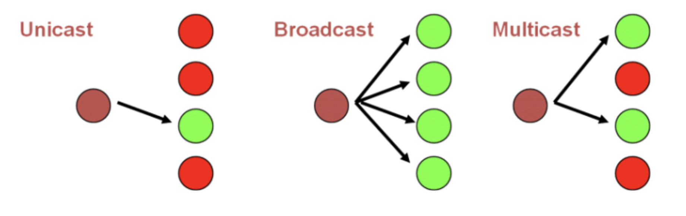

# Universal Plug and Play (UPnP) protocol

The Universal Plug and Play (UPnP) protocol has been widely accepted and used in the IoT domain to support interactions among heterogeneous IoT devices, in part due to zero configuration implementation which makes it feasible for use in large-scale networks.

## UPnP Device Architecture and Interactions

Universal Plug and Play (UPnP) leverages several popular protocols such as IP, TCP, UDP, HTTP, XML or JSON to support seamless configuration and automatic discovery of services.

UPnP devices are classified in two categories:

- service device (SD): The service devices (SD) are basically servers that are responsible to delivering a service. For example, smart thermostat.

- control points (CP): The control points (CP) are the clients that consume the services provided by the SDs. A CP can be an application running on a device. For example, mobile application from smart phone.

The interactions between SD and CP are divided into three layers of UPnP stack.

### Discovery Layer

Discovery is the initial step of UPnP networking. This layer allows the SDs to advertise their services and enables the CPs to search for a UPnP service in the network. UPnP devices use Simple Service Discovery Protocols (SSDP) for device discovery or advertisement.

After joining the network an SD periodically sends advertisement messages to the network by *multi-casting a `SSDP NOTIFY` message to a standard address and port (239.255.255.250:1900) as shown in Figure 1. The `NT` field specify the service advertise by the `NOTIFY` message. Similarly, a CP sends a multicast discovery request with `SSDP M-SEARCH` method on the reserved address and port (239.255.255.250:1900). The format of the discovery `M-SEARCH` message is shown in Figure 1. The `ST` field mention the targeted service of the discovery message. Note that UPnP adopted HTTP over UDP protocol to send the discovery and advertise messages.

*multi-casting: Multicast is communication between a single sender and multiple receivers on a network. Typical uses include the updating of mobile personnel from a home office and the periodic issuance of online newsletters

How multi-casting works?

### Description Layer

After discovering a service the CP has very little information about it. To use the service a CP needs to retrieve the description of the service and the device such as the attributes of the SD, the actions that can be invoked in the service, the state variables of the service, and couple of URLs to send the action invocation request and to subscribe to a state change event of the service.

The CP sends a `HTTP GET` request to the SD to retrieve the <u>device description document</u>. The device description exposes the physical and logical container of the SD such as the device serial number, the services provided by it. From the device description documents the CP gets a URL location to retrieve the service description document and sends another `HTTP GET` to fetch the <u>service description document</u>. The service description document defines actions that are accessible by a CP and their arguments. It also defines a list of state variables and their data type, range, and event characteristics. The state variable represents device state in a given time. Besides, the service description also provide two URLs for a service to <u>invoke the actions</u> and <u>subscribe to a state change event of the service</u>.

### Control & Eventing Layer

Once the CP has the information about the SD and its services, it can invoke actions from these services. To invoke an action, the CP sends a control message to the control URL of the service. Similarly, to track the state change of the service, the CP sends a event subscription message to the event URL. The event subscription message includes a `CALLBACL` URL (See Figure 1), where the SD will publish the events.

## Security

By design UPnP does not consider the security aspects of service discovery, advertisement, action invocation, and event subscription. (See [1] for complete analysis)

## Terminology

|                                                | Description                                                                                                                           |
| ---------------------------------------------- | ------------------------------------------------------------------------------------------------------------------------------------- |
| Simple Service Discovery Protocol (SSDP)       | A network protocol based on the Internet protocol suite for advertisement and discovery of network services and presence information. |
| Generic Event Notification Architecture (GENA) | An HTTP notification architecture that transmits notifications between HTTP resources.                                                |
| Simple Object Access Protocol (SOAP)           | A messaging protocol specification for exchanging structured information in the implementation of web services in computer networks.  |

## Auditing UPnP

[miranda-upnp](https://code.google.com/archive/p/miranda-upnp/downloads)

## Reference

[1] [An Overview of UPnP-based IoT Security: Threats, Vulnerabilities, and Prospective Solutions](https://arxiv.org/pdf/2011.02587.pdf)

[2] [SSDP: How to find local devices](https://medium.com/@danny.jamesbuckley/ssdp-how-to-find-local-devices-a24f73ce4262)

[3] [UPnP：自動化網路設定](http://speed.cis.nctu.edu.tw/~ydlin/miscpub/survey_UPnP.pdf)

[4] [UPnP youtube](https://www.youtube.com/watch?v=rseMaljMcBY)
